## Het probleem

Sinds begin augustus 2026 meldden meerdere collega's — onder wie Marisa Cornegge, Linde de Rijke en Giuliano Brunelli — dat een link uit een e-mail in Outlook niet meer in **Microsoft Edge** opent. In plaats daarvan zoekt het toestel naar **Google Chrome**. Chrome staat terecht niet in het Android-werkprofiel: dat werkprofiel is bewust beperkt tot beheerde, goedgekeurde apps.

Het gedrag viel in twee smaken, afhankelijk van wat er verder op het toestel stond:

| Situatie op het toestel | Wat de collega ziet |
| --- | --- |
| Chrome staat nergens op het toestel | Een vraag om Chrome te installeren |
| Chrome staat wel in het privédeel | De melding "Niet toegestaan" — het werkprofiel mag geen gegevens naar een privé-app sturen |

&#9670; Handmatig opgelost, maar niet houdbaar

Bij de gemelde collega's is het probleem lokaal, handmatig verholpen. Dat lost de klacht op, maar niet de oorzaak: de volgende collega die op een link tikt, loopt tegen dezelfde melding aan. De instelling moet centraal via Intune staan, niet per toestel.

## Hoe een link normaal zijn weg vindt

Een Android-werkprofiel wordt door Intune op twee onafhankelijke manieren beheerd: **apparaatbeleid** (device restrictions, hoe het toestel zich gedraagt) en **app-beveiligingsbeleid** (app protection policy, ook wel MAM genoemd, hoe beheerde apps met werkgegevens omgaan). Welke app een link mag openen, wordt **niet** bepaald door de standaardbrowser-instelling van het toestel, maar door een instelling binnen het app-beveiligingsbeleid: **"Restrict web content transfer with other apps"**. Die instelling bepaalt naar welke apps beheerde apps (Outlook, Teams, Word, en meer) een link mogen doorgeven.

```mermaid
flowchart TD
    classDef qHighlight fill:#fff7f0,stroke:#ee7214,stroke-width:2px,color:#161a20
    classDef qBlocked fill:#fdf1f1,stroke:#e11d48,stroke-width:2px,stroke-dasharray:5 3,color:#7a1a1a
    classDef qSuccess fill:#f0f9f2,stroke:#16a34a,stroke-width:2px,color:#14532d
    classDef qInfo fill:#eef3fc,stroke:#03295a,stroke-width:2px,color:#161a20
    subgraph NU["Nu — Any app"]
        A1[Outlook<br/>beheerd] --> A2["Restrict web content<br/>transfer = Any app"]
        A2 --> A3[OS/werkprofiel bepaalt<br/>de browser]
        A3 --> A4["Chrome — niet in werkprofiel<br/>installeren? / niet toegestaan"]
    end
    subgraph STRAKS["Straks — Microsoft Edge"]
        B1[Outlook<br/>beheerd] --> B2["Restrict web content<br/>transfer = Microsoft Edge"]
        B2 --> B3[Microsoft Edge<br/>beheerd]
        B3 --> B4[Link opent direct<br/>geen installatievraag]
    end
    class A2 qHighlight
    class A4 qBlocked
    class B2 qHighlight
    class B4 qSuccess
```

*Dezelfde link, twee uitkomsten — het verschil zit in één instelling van het app-beveiligingsbeleid.*

## Wat we hebben uitgesloten

We zijn niet direct bij de juiste instelling uitgekomen. Twee plekken in Intune leken voor de hand te liggen, maar bleken het niet te zijn. Die uitsluiting is zelf nuttig: de volgende keer hoeft niemand die twee schermen nog te doorzoeken.

<ol class="phases">
<li><b>App-configuratiebeleid voor Outlook</b> (Apps > Configuration, "Axians Android - Outlook Configuratie"). Dit beleid regelt in-app voorkeuren zoals Focused Inbox, contacten opslaan en agenda-synchronisatie. Er zit geen instelling in voor welke browser links opent.</li>
<li><b>Apparaatbeperkingen</b> (Devices > Android > Configuration, device restrictions voor het werkprofiel). Dit beleid regelt toestelgedrag: wachtwoordbeleid, Bluetooth, schermopname, VPN. Ook hier geen browserinstelling.</li>
<li><b>App-beveiligingsbeleid</b> (Apps > Protection, "Axians - Android MAM Baseline with PIN") — hier bleek de instelling wel te zitten, zie het volgende hoofdstuk.</li>
</ol>

&#9670; Waarom dit de verwarring verklaart

De naam "App-configuratiebeleid" klinkt als de plek waar je apps configureert, en "Apparaatbeperkingen" klinkt als de plek waar je toestelgedrag regelt. Beide zijn logische eerste gokken. De instelling zit toch in een derde, apart onderdeel van Intune: <b>Apps > Protection</b>, niet <b>Devices</b>.

## De root cause

In het App-beveiligingsbeleid **"Axians - Android MAM Baseline with PIN"**, onder **Data protection**, stond de instelling **"Restrict web content transfer with other apps"** op **Any app**. Bij die waarde bepaalt het besturingssysteem zelf welke app een link opent. Zonder een geldige, beheerde browserkeuze valt dat kennelijk terug op Chrome — die niet in het werkprofiel staat en dus faalt.

Microsoft bevestigt dit gedrag in de eigen documentatie over het beheren van Edge op mobiel:

&#9670; Uit de Microsoft-documentatie

"One of the settings related to browsers is 'Restrict web content transfer with other apps'. In Enterprise enhanced data protection (Level 2), the value of this setting is configured to Microsoft Edge. When Outlook and Microsoft Teams are protected by app protection policies, those apps open links in Microsoft Edge, ensuring that the links are secure and protected."

## De oplossing

Beide wijzigingen vinden plaats in hetzelfde beleid: **Apps > Protection > Axians - Android MAM Baseline with PIN**.

<ol class="phases">
<li>Open <b>Apps > Protection</b> in het Intune admin center (niet Devices — dat is een andere sectie).</li>
<li>Open het beleid <b>"Axians - Android MAM Baseline with PIN"</b> en ga naar <b>Properties</b>.</li>
<li>Bij <b>Apps > Edit</b>, voeg <b>Microsoft Edge</b> toe aan de lijst met Public apps. Edge staat al in de Android-appcatalogus (Managed Google Play, toegewezen) — hij hoeft dus niet eerst nog uitgerold te worden.</li>
<li>Bij <b>Data protection > Edit</b>, wijzig <b>"Restrict web content transfer with other apps"</b> van <b>Any app</b> naar <b>Microsoft Edge</b>.</li>
<li>Sla op. De wijziging bereikt toestellen bij de eerstvolgende app-check-in, meestal binnen enkele uren.</li>
</ol>

&#9670; Volgorde maakt uit

Voeg Edge eerst toe als beschermde app, vóór je de "Restrict web content transfer"-instelling wijzigt. Zonder Edge als beschermde app in hetzelfde beleid werkt de doorverwijzing niet betrouwbaar.

## Wat er verandert

De instelling geldt voor **alle apps** in dit beleid, niet alleen Outlook: Outlook, Teams, Word, Excel, PowerPoint, OneNote, Planner, OneDrive en Viva Engage sturen links voortaan allemaal naar Edge. Links die nu nog naar een losse native app deep-linken — bijvoorbeeld een YouTube-link vanuit een Teams-chat naar de YouTube-app — openen straks in Edge, tenzij de doelapp op de uitzonderingslijst staat.

| App / situatie | Effect na de wijziging |
| --- | --- |
| Outlook, Teams, Word, Excel, PowerPoint, OneNote, Planner, OneDrive, Viva Engage | Links openen voortaan altijd in Microsoft Edge |
| Google Maps, Google Earth, Cisco Webex Meetings, SMS/MMS-apps, de LNH-viewer-app | Al uitgezonderd — blijven werken zoals nu, geen wijziging |
| Overige deep-linkbare apps (bijvoorbeeld YouTube, LinkedIn) | Openen voortaan in Edge in plaats van de eigen app |
| Microsoft Edge zelf | Wordt een beschermde app: eerste gebruik met het werkaccount vraagt om een PIN, zoals nu al bij Outlook |

&#9670; Geen risico op dataverlies

Dit is een gedragswijziging in linkafhandeling, geen wijziging aan apparaten of data. De instelling is op elk moment terug te draaien naar de oude waarde.

&#9670; Bevestig de reikwijdte

Het beleid heet "Baseline" — dat suggereert dat het de standaardinrichting is voor (bijna) alle Android-werkprofielgebruikers bij LNH, niet alleen de drie gemelde collega's. Bevestig dat voor je breed uitrolt.

## Aanbevolen uitrol

<ol class="phases">
<li>Rol de wijziging eerst uit naar een kleine pilotgroep — bijvoorbeeld Marisa Cornegge, Linde de Rijke en Giuliano Brunelli, of een aparte testgroep.</li>
<li>Monitor enkele dagen op meldingen over weggevallen deep-links naar andere apps (bijvoorbeeld YouTube of LinkedIn vanuit Teams).</li>
<li>Rol daarna pas breed uit naar de volledige groep <b>"AG_Android MAM Baseline with PIN"</b>.</li>
</ol>

Dit voorstel is ter goedkeuring voorgelegd aan Dimitri; de wijziging staat nog niet live.

## Bronnen

- [Manage Microsoft Edge on iOS and Android With Intune](https://learn.microsoft.com/en-us/intune/intune-service/apps/manage-microsoft-edge)
- [Open links in default app - Android / iOS](https://techcommunity.microsoft.com/t5/microsoft-intune/open-links-in-default-app-android-ios/td-p/3934135)
