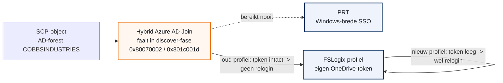

## Het symptoom

Medewerkers van NUNC Capital en COBBS Industries werken in Exact Globe en Elvy DS op een Azure Virtual Desktop (AVD). Bestanden die zij daar opslaan, syncen automatisch naar hun lokale OneDrive - maar alleen zolang ze in de AVD-sessie ingelogd blijven bij OneDrive.

Steven Rooijers (NUNC Capital) meldde dat gebruikers ongeveer drie keer per dag opnieuw moeten inloggen bij OneDrive in de AVD-sessie. Later bleek hijzelf hetzelfde te ondervinden: na de lunch opnieuw inloggen op de AVD gaf de Windows-melding "There's a problem with your account or device. Let's fix it."

Zonder die login blijft de bestandssync staan. Gebruikers moeten dan handmatig bestanden kopiëren tussen de externe werkomgeving en hun eigen computer - foutgevoelig en tijdrovend, meerdere keren per dag.

## Eerste verklaring, en waarom die niet klopte

<div class="call warn">
<div class="ct"><span>&#9670;</span> Wat we eerst zeiden</div>
<p>"De AVD is niet domain-joined, dus geen SSO-koppeling, dus moet je af en toe opnieuw inloggen. Dit is standaard hoe het gebouwd is." Conclusie destijds: een alternatief uitzoeken zou nieuw werk zijn, in de orde van twee uur.</p>
</div>

<div class="call info">
<div class="ct"><span>&#9670;</span> Wat de meting laat zien</div>
<p>De sessionhost is wel degelijk domain-joined, aan het on-prem AD-domein COBBSINDUSTRIES. Wat ontbreekt, is de <b>Hybrid Azure AD Join</b> naar Entra ID. Dat is een configuratiestap die vastloopt, geen architectuurgrens die eerst gebouwd moet worden.</p>
</div>

Twee waarnemingen van Steven zetten ons op het spoor van deze correctie. Ten eerste: niet iedereen heeft evenveel last. Bjorn heeft geen relogin nodig, Natascha ook niet - wel traag. Ten tweede: Ramon had het probleem eerst niet, en pas sinds zijn FSLogix-profiel op 13 juli opnieuw is opgebouwd - om een los Exact-probleem te verhelpen - kwam het her-inlogprobleem erbij. Een architectuurbeperking zou iedereen gelijk moeten treffen. Een verschil per gebruiker, gekoppeld aan het moment van een profielwijziging, wijst ergens anders heen.

## Het mechanisme: van SCP tot PRT, met het profiel als vangnet

Drie stappen, van onderaf opgebouwd.

<ol class="phases">
<li><b>Het Service Connection Point (SCP).</b> Een domain-joined machine kan zich, via een geplande achtergrondtaak, ook registreren bij Entra ID. Daarvoor moet hij eerst een SCP-object vinden in het AD-forest: dat object vertelt bij welke Entra-tenant de machine hoort. Vindt hij dat object niet, dan stopt de registratie meteen, in wat Microsoft de "discover"-fase noemt.</li>
<li><b>De Primary Refresh Token (PRT).</b> Pas als die registratie - de Hybrid Azure AD Join - lukt, krijgt de machine een PRT. Dat PRT is wat Windows gebruikt voor stille, brede single sign-on: Office, OneDrive en andere Microsoft 365-apps hoeven dan niet apart in te loggen.</li>
<li><b>Het FSLogix-profiel als vangnet.</b> Zonder PRT valt elke app terug op zijn eigen, losse inlogstatus. OneDrive bewaart die status - zijn eigen token - lokaal in het gebruikersprofiel. Blijft dat profiel intact, dan blijft OneDrive dus ook zonder PRT gewoon ingelogd. Een net opnieuw opgebouwd profiel begint leeg: geen eigen token, en geen PRT om op terug te vallen.</li>
</ol>


*De geplande route loopt via het SCP-object naar een PRT. Die route faalt nu. Wat overblijft is de omweg via het lokale profiel - en die werkt alleen zolang het profiel oud genoeg is om nog een geldig token te bevatten.*

## De omgeving

| Naam | Waarde | Bron |
| --- | --- | --- |
| Sessionhost (gecontroleerd) | SRV-NUN-AVD-1 | dsregcmd /status, 2026-07-31 |
| On-prem AD-domein | COBBSINDUSTRIES (AD.cobbsindustries.com) | dsregcmd /status |
| Azure AD / Entra join-status | Niet joined, niet hybrid joined | dsregcmd /status |
| Klanten op deze omgeving | NUNC Capital B.V. (Steven Rooijers) en COBBS Industries B.V. (Ramon van Rooij) | ticketthread |
| Profielbeheer | FSLogix profile containers | ticketthread |

<div class="call caution">
<div class="ct"><span>&#9670;</span> Nog niet in kaart</div>
<p>Het aantal en de namen van de overige sessionhosts in de pool, of de pool "pooled" of "personal" is, en de FSLogix Redirection.xml-configuratie. Zie het hoofdstuk "Wat nog openstaat".</p>
</div>

## Bevinding: dsregcmd /status

Uitgevoerd op SRV-NUN-AVD-1, 31 juli 2026, 13:00 UTC.

```text
Device State
  AzureAdJoined      : NO
  EnterpriseJoined   : NO
  DomainJoined       : YES
  DomainName         : COBBSINDUSTRIES
  Device Name        : SRV-NUN-AVD-1.AD.cobbsindustries.com

SSO State
  AzureAdPrt         : NO

Diagnostic Data
  AD Configuration Test : FAIL [0x80070002]
  Error Phase            : discover
  Client ErrorCode       : 0x801c001d
  Fallback to Sync-Join  : ENABLED
  Fallback to Fed-Join   : ENABLED
  Previous Registration  : 2026-07-31 13:00:54 UTC
```

Foutcode 0x801c001d in de discover-fase betekent: "Failed to lookup the registration service information from Active Directory." De machine kan het SCP-object niet vinden of lezen in het AD-forest. `Fallback to Sync-Join` en `Fallback to Fed-Join` staan aan, en er is een recente `Previous Registration`-tijdstempel - de automatische join-taak probeert het dus actief, en loopt daar vast.

## Waarom Bjorn en Natascha er geen last van hebben

Deze verklaring volgt logisch uit het mechanisme hierboven, maar is nog niet met een tweede meting bevestigd.

| Gebruiker | Relogin nodig | Profiel |
| --- | --- | --- |
| Bjorn | Nee | Oud, ongewijzigd |
| Natascha | Nee, wel traag | Oud, ongewijzigd |
| Ramon | Ja, sinds 13 juli | Op 13 juli opnieuw opgebouwd |
| Steven | Ja | - |

Zolang geen enkele sessionhost een PRT krijgt, hangt alles af van het OneDrive-token in het FSLogix-profiel. Een oud profiel heeft dat token nog en ververst het stil op de achtergrond. Een net herbouwd profiel begint leeg, en zonder PRT is er niets om op terug te vallen - dus moet de gebruiker elke keer opnieuw inloggen.

Natascha's traagheid is hiermee nog niet verklaard en staat los genoteerd in het hoofdstuk "Wat nog openstaat".

## Wat nog openstaat

<div class="call caution">
<div class="ct"><span>&#9670;</span> Dit is een tussenstand</div>
<p>Het onderzoek loopt nog. Onderstaande stappen zijn nog niet uitgevoerd. Er is nog geen fix doorgevoerd en nog geen besluit genomen over de aanpak.</p>
</div>

<ol class="phases">
<li><b>SCP-object controleren.</b> In het AD-forest van COBBS Industries nagaan of het Service Connection Point voor Hybrid Azure AD Join bestaat, en of de keywords (tenant-ID, geverifieerd domein) kloppen. Vereist AD-toegang bij de klant.</li>
<li><b>dsregcmd /status herhalen op een tweede sessionhost.</b> Bevestigen of het SCP-probleem forest-breed is, of specifiek voor SRV-NUN-AVD-1.</li>
<li><b>FSLogix Redirection.xml opvragen en vergelijken.</b> Nagaan of deze rond 13 juli is gewijzigd, en of identity- of broker-mappen worden uitgesloten.</li>
<li><b>Omgeving verder in kaart brengen.</b> Overige sessionhosts inventariseren, en of de pool "pooled" of "personal" is.</li>
<li><b>Reactie naar Steven bijwerken</b>, met de correctie dat de AVD wel degelijk domain-joined is, en met de nieuwe root cause - zodra het onderzoek hierboven is afgerond.</li>
</ol>

Het volledige, actuele overzicht staat in `ROADMAP.md` van het projectdossier; dit hoofdstuk is de momentopname op de datum van deze oplevering.

## Bronnen

- [Azure Virtual Desktop identities and authentication - Microsoft Learn](https://learn.microsoft.com/en-us/azure/virtual-desktop/authentication)
- [User profile management for Azure Virtual Desktop with FSLogix profile containers - Azure Docs](https://docs.azure.cn/en-us/virtual-desktop/fslogix-profile-containers)
- [Hybrid Azure AD Join Failure - Error Phase: discover - Microsoft Q&A](https://learn.microsoft.com/en-us/answers/questions/4371844/hybrid-azure-ad-join-failure-error-phase-discover)
- [Issue with Hybrid join error 0x801c001d - Microsoft Q&A](https://learn.microsoft.com/en-us/answers/questions/297081/issue-with-hybrid-join-error-0x801c001d)
- [Troubleshoot devices by using the dsregcmd command - Azure Docs](https://docs.azure.cn/en-us/entra/identity/devices/troubleshoot-device-dsregcmd)
