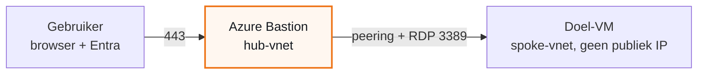
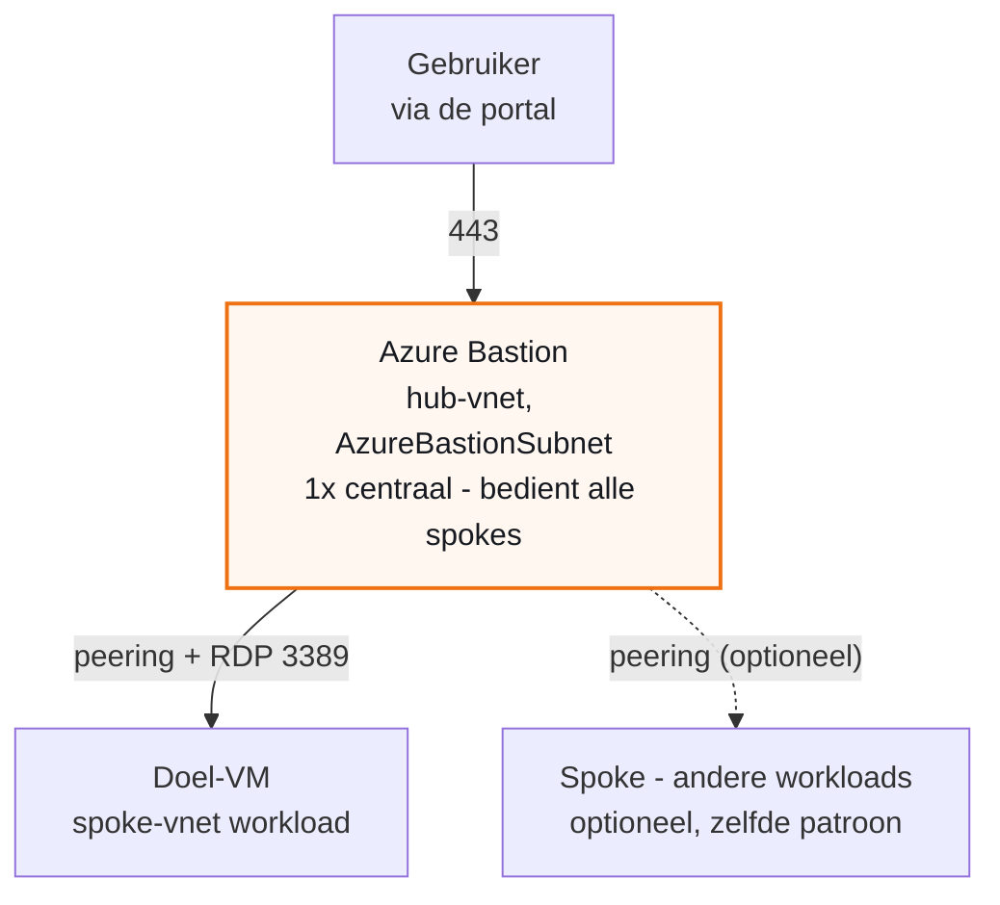

## Principe

Een VM in Azure zonder publiek IP bereik je op drie manieren: RDP naar een publiek IP, een VPN naar het netwerk, of **Azure Bastion** via de browser. De eerste zet een poort open naar internet, de tweede vraagt inrichting en een client bij de gebruiker. Bastion vraagt **niets** bij de gebruiker behalve een browser en zijn organisatie-account, en houdt de VM dicht.

&#9670; De kern in een zin

Bastion zet de RDP-sessie op in de browser; de VM houdt geen publiek IP, de gebruiker logt in met zijn Entra-account, en de rechten blijven <b>lezen</b> plus een login-rol.

## Architectuur

De keten is recht: de gebruiker meldt zich aan op de **Azure-portal**, opent de VM, en klikt **Connect > Bastion**. Bastion staat in het **hub-vnet**; de VM in een **spoke-vnet**. De **peering** tussen die twee draagt het verkeer. Rechten en netwerk moeten allebei kloppen, anders strandt de gebruiker op de laatste stap.

*Bastion in de hub, de VM in de spoke - de peering draagt het RDP-verkeer.*

## De bouwstenen

De onderdelen waaruit de inrichting bestaat, en wat elk doet. De namen in jouw omgeving vul je zelf in; de rol blijft dezelfde.

| Onderdeel | Rol |
|---|---|
| Hub-vnet | Centraal netwerk met gedeelde diensten. Hierin staat de Bastion-host, vaak ook een firewall of gateway. |
| Bastion-host | De dienst die de RDP-sessie in de browser opzet. Staat in een eigen subnet `AzureBastionSubnet`. |
| Spoke-vnet | Netwerk per workload, gescheiden van de rest. Hierin staat de doel-VM, zonder publiek IP. |
| Workload-subnet | Het subnet van de doel-VM, met een NSG en eventueel een route table. |
| Entra-groep | De groep waaraan je de rollen toekent. Gebruikers worden lid, in plaats van losse toewijzingen. |
| Doel-VM | De server waarop de gebruiker moet werken. |

&#9670; Let op de servernaam

Communiceer altijd de <b>Azure-resourcenaam</b> van de VM. Een oude on-prem naam bestaat niet in de portal; wie daarop zoekt vindt niets en denkt onterecht dat de toegang niet werkt.

## Bastion-host en subnet

Eerst het fundament: de host staat in een eigen subnet, de VM blijft dicht.

<ol class="phases"><li>Zorg dat de VM <b>geen publiek IP</b> heeft. Al het inkomende verkeer loopt via Bastion.</li><li>Deploy de Bastion-host in een eigen subnet met exact de naam <code>AzureBastionSubnet</code>, <b>minimaal /26</b>. Kleiner wordt geweigerd en blokkeert later features.</li><li>Kies de SKU.<ul><li><b>Basic</b> - genoeg om via de portal te verbinden.</li><li><b>Standard</b> - voor de native client, verbinden-op-IP en shareable links.</li></ul></li></ol>

&#9670; SKU-keuze

Voor alleen verbinden via de portal naar een VM in een gepeerd netwerk volstaat <b>Basic</b>. Kies <b>Standard</b> als je de native client of verbinden-op-IP nodig hebt.

## NSG op het Bastion-subnet

Een NSG op `AzureBastionSubnet` is optioneel maar aanbevolen. Sta minimaal dit toe, blokkeer de rest. Microsoft werkt de exacte set af en toe bij, dus controleer hem voor je hem vastzet.

| Richting | Bron of doel | Poort |
|---|---|---|
| Inbound | Internet | 443 |
| Inbound | GatewayManager | 443 |
| Inbound | AzureLoadBalancer | 443 |
| Inbound | VirtualNetwork | 8080, 5701 |
| Outbound | VirtualNetwork | 3389, 22 |
| Outbound | AzureCloud | 443 |
| Outbound | VirtualNetwork | 8080, 5701 |

## Rechten - least privilege

Om te **verbinden** heeft een account drie leesrechten nodig. Meer dan lezen is niet nodig; Owner of Contributor toekennen schendt least privilege. Ken de rollen toe aan een **Entra-groep**, niet los per persoon: een volgende gebruiker voeg je dan toe met een groepslidmaatschap.

| Rol | Op welke resource |
|---|---|
| Reader | de VM |
| Reader | de netwerkkaart (NIC) van de VM |
| Reader | de Bastion-resource |
| Reader | het vnet van de VM - alleen bij een gepeerde opstelling, zie het hoofdstuk Hub-spoke |

&#9670; Tip

Ken de Reader-rollen bij voorkeur toe op de <b>resourcegroep</b> van de workload; dan pakt Reader de VM, de NIC en het vnet in een keer. Let op: Reader erft niet over resourcegroepen heen. Staat Bastion in een andere resourcegroep, dan is daar een aparte Reader nodig.

## Entra-login op de VM

Zo logt de gebruiker in met het account dat hij toch al heeft, met MFA erover, in plaats van met een gedeeld lokaal wachtwoord.

<ol class="phases"><li>Zet op de VM een <b>systeem-toegewezen managed identity</b> aan.</li><li>Installeer de VM-extensie <code>AADLoginForWindows</code>.</li><li>Ken de groep de OS-loginrol toe.<ul><li><b>Virtual Machine User Login</b> - voor een gewone gebruiker.</li><li><b>Virtual Machine Administrator Login</b> - alleen als hij beheer moet doen.</li></ul></li></ol>

&#9670; De valkuil die tijd kost

<b>Virtual Machine Contributor geeft geen OS-login.</b> Die rol beheert de VM als resource, niet het besturingssysteem. Wie alleen die rol heeft, opent Bastion wel maar komt niet door het inloggen heen.

## MFA via Conditional Access

<ol class="phases"><li>Maak een Conditional Access-policy die de cloud-app <b>Azure Windows VM Sign-In</b> target en <b>MFA</b> eist.</li><li>Wil je ook de portal-toegang afdekken, target dan daarnaast <b>Microsoft Azure Management</b>.</li><li>Zet <b>per-gebruiker-MFA uit</b>; dat is de oude weg en geeft dubbele prompts.</li><li>Sluit <b>break-glass-accounts</b> uit van de policy, zodat een fout je niet buitensluit.</li></ol>

Conditional Access vereist een Microsoft Entra ID **P1**-licentie en werkt niet met Security Defaults aan.

## PIM voor verhoogde rechten

Moet iemand **Administrator Login**? Ken die rol dan niet vast toe, maar maak hem **eligible via PIM**: de gebruiker activeert hem tijdelijk, met een reden en eventueel goedkeuring. Voor gewone gebruikers met **User Login** is dit niet nodig.

PIM vereist een Microsoft Entra ID **P2**-licentie.

## Logging

- Zet **Bastion-diagnostics** (`BastionAuditLogs`) naar een Log Analytics-workspace. Dan zie je wie wanneer verbond.
- De aanmeldingen op de VM zelf zie je in de **Entra-aanmeldlogs**, onder de cloud-app "Azure Windows VM Sign-In".

## Hub-spoke

### Wat is hub-spoke?

Hub-spoke is een manier om je netwerk in te delen. In het midden staat een **hub**: een centraal netwerk met diensten die je maar een keer wilt neerzetten, hier **Azure Bastion**, vaak ook een firewall of VPN-gateway. Daaromheen staan de **spokes**: aparte netwerken per workload, netjes van elkaar gescheiden. Een **VNet-peering** koppelt elke spoke aan de hub, zodat het verkeer erdoorheen kan.

Wat het je oplevert: je zet Bastion **een keer** in de hub neer en bedient er alle spokes mee, in plaats van een aparte Bastion per netwerk. De workloads blijven gescheiden, en toegang en kosten houd je centraal. De prijs: het verkeer kruist nu **twee netwerken**, dus de peering moet staan en het doel-subnet moet het binnenkomende verkeer toelaten.

*De hub draagt Bastion een keer; elke spoke koppelt via peering.*

### Wat er dan bij komt

| # | Punt | Waarom |
|---|---|---|
| 1 | Reader op de Bastion-resource in de hub-resourcegroep. | Reader op de workload-resourcegroep erft niet naar de hub. |
| 2 | Reader op het spoke-vnet van de VM. | Vereist bij een gepeerde opstelling. |
| 3 | VNet-peering hub en spoke: Connected en Fully Synchronized. | Zonder werkende peering bereikt Bastion de VM niet. |
| 4 | NSG van het workload-subnet: inbound `3389` vanaf het Bastion-subnet. | Anders opent de sessie wel, maar antwoordt de VM niet. |

&#9670; Stille valkuil
<ul><li>Een <b>route table</b> met een UDR die al het verkeer (<code>0.0.0.0/0</code>) naar een firewall stuurt, kan het antwoord naar Bastion wegvangen.</li><li>Sta het toe op de firewall, of leg een specifiekere route terug naar het Bastion-subnet.</li></ul>

&#9670; Meestal de laatste horde
<ul><li>Als rechten en peering staan, is de <b>NSG op het workload-subnet</b> vaak het laatste dat blokkeert.</li><li>Opent de sessie wel maar reageert de VM niet? Controleer die NSG.</li></ul>

## Zo verbindt de gebruiker

<ol class="phases"><li>Ga naar <a href="https://portal.azure.com/">portal.azure.com</a> en meld je aan met je organisatie-account.</li><li>Zoek boven in de portal op de <b>Azure-resourcenaam</b> van de doel-VM.</li><li>Klik de VM aan en kies <b>Connect > Bastion</b>.</li><li>Log in met hetzelfde account en het bijbehorende wachtwoord. Bevestig de <b>MFA</b>-prompt als die is ingesteld.</li></ol>

De sessie opent in een nieuw browsertabblad, met de desktop van de doel-VM.

&#9670; Wat de gebruiker nodig heeft
<ul><li>Een <b>browser</b> en zijn <b>organisatie-account</b> - verder niets te installeren.</li><li>Lidmaatschap van de <b>groep</b> die de rollen draagt.</li><li>De juiste <b>Azure-resourcenaam</b> van de VM om op te zoeken.</li></ul>

## Besluiten

Elk besluit heeft een eigen pagina met de volledige onderbouwing: de context, wat het oplevert, wat het kost, en wat we hebben afgewogen maar niet gekozen.

| ADR | Besluit | Status |
|---|---|---|
| **ADR-0001 — Toegang tot een Azure-VM via Azure Bastion** | We richten de toegang tot Azure-VM's in via **Azure Bastion**. | Accepted |
| **ADR-0002 — Inrichting volgens Microsoft best practices** | We richten de toegang in volgens deze best practices: least privilege - alleen de drie Reader-rollen plus de juiste VM-Login-rol, toegekend via een Entra-groep en niet los per gebruiker. | Accepted |

## Bronnen

De best practices in dit document zijn gebaseerd op de officiële Microsoft-documentatie.

- [Connect to a Windows VM using RDP - Azure Bastion](https://learn.microsoft.com/en-us/azure/bastion/bastion-connect-vm-rdp-windows)
- [Secure your Azure Bastion deployment](https://learn.microsoft.com/en-us/azure/bastion/secure-bastion)
- [Sign in to a Windows VM with Microsoft Entra ID](https://learn.microsoft.com/en-us/entra/identity/devices/howto-vm-sign-in-azure-ad-windows)
- [Plan for VM remote access - Cloud Adoption Framework](https://learn.microsoft.com/en-us/azure/cloud-adoption-framework/ready/azure-best-practices/plan-for-virtual-machine-remote-access)
