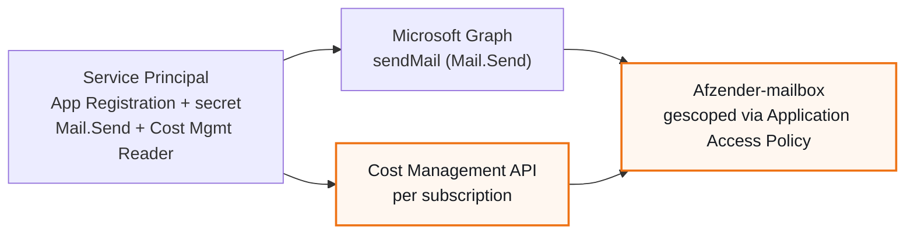

## Waarom dit rapport bestaat

Het runbook `Runbook-AzureKostenRapportage.ps1` haalt maandelijks resource-niveau kostendata op via de Azure Cost Management API, vergelijkt die met de afgelopen drie maanden, en signaleert afwijkingen (nieuwe kostenposten, verdwenen kostenposten, of een stijging/daling boven een ingestelde drempel).

Dit sjabloon beschrijft hoe je dit werkend krijgt voor een nieuwe klant: welke stappen eenmalig zijn (per Automation Account), en welke je herhaalt voor elke volgende klanttenant.

## Hoe de rapportage werkt

<ol class="phases"><li>Op de eerste van de maand draait het Automation Account het runbook, voor de afgelopen kalendermaand, voor alle geconfigureerde klanttenants tegelijk.</li><li>Het runbook logt per klanttenant in en haalt de kosten op, per resource.</li><li>Het vergelijkt die kosten met het gemiddelde van de drie voorgaande maanden, en markeert afwijkingen.</li><li>Het stuurt per klant een mail: de totale kosten van de maand, een tabel met kosten per subscription over de laatste drie maanden, en - alleen bij afwijkingen - een uitgebreider rapport als bijlage.</li></ol>

## Architectuur: een Service Principal voor mail en kostendata

Tot en met runbook-versie v1.12 gebruikte het script een Managed Identity voor Mail.Send en een aparte Service Principal voor de Cost Management API (ADR-0004). Een Managed Identity heeft echter geen "API permissions"-scherm in de portal - die permissie moest apart via Graph PowerShell worden toegekend. Dat werd in de praktijk twee keer verkeerd gedaan: een keer kreeg de Managed Identity per ongeluk Cost Management Reader, een andere keer kreeg de Service Principal per ongeluk Mail.Send. Sinds v1.13 (ADR-0005, vervangt ADR-0004) gebruikt het script daarom **een Service Principal voor beide taken**. Die heeft wel een normaal "API permissions"-scherm, dus geen PowerShell meer nodig voor Mail.Send.

<div class="call info"><div class="ct"><span>&#9670;</span> Single-tenant inrichting (standaard bij QUBE)</div><p>Het Automation Account draait in de klanttenant zelf. Een en dezelfde App Registration krijgt zowel Mail.Send als Cost Management Reader. Een credential, een secret om te beheren.</p></div>

<div class="call info"><div class="ct"><span>&#9670;</span> Centrale multi-tenant inrichting</div><p>Een Automation Account in de QUBE-tenant leest meerdere klanttenants uit. De mail-Service Principal (in de QUBE-tenant, waar de rapportage-mailbox staat) blijft dan gescheiden van de per-klant Service Principals (die kunnen niet cross-tenant, dus per klant blijft een eigen App Registration nodig voor Cost Management Reader).</p></div>


*Een Service Principal, twee permissies. Bij een centrale multi-tenant inrichting: een aparte Service Principal per klanttenant, elk volgens hetzelfde patroon.*

## Van A tot Z: complete checklist

Dit is de complete lijst, van niets tot een werkend maandrapport. De eerste stappen doe je maar een keer per Automation Account; de rest herhaal je voor elke nieuwe klant.

### A. Automation Account voorbereiden (eenmalig)

<ol class="phases"><li><b>Automation Account aanmaken</b> (over te slaan als die al bestaat): Azure Portal naar <b>Automation Accounts</b> naar <b>+ Create</b>. Resource group en naam kiezen, regio kiezen. <b>Review + create</b>.</li><li><b>Az.Accounts-module toevoegen</b>: het Automation Account naar <b>Modules</b> naar <b>Browse gallery</b> naar zoek op <code>Az.Accounts</code> naar installeren.</li><li><b>Runbook aanmaken</b>: het Automation Account naar <b>Runbooks</b> naar <b>+ Create a runbook</b>. Naam, Runbook type: <b>PowerShell</b>, Runtime version: <b>5.1</b>. Plak de inhoud van <code>Runbook-AzureKostenRapportage.ps1</code> in de editor. <b>Save</b>, dan <b>Publish</b>.</li><li><b>Timeout instellen</b>: de runbook naar <b>Configure</b> naar zet de job-timeout op minimaal <b>3600 seconden</b> (1 uur) - bij meerdere klanten/subscriptions kan een volledige run langer duren dan de standaardwaarde.</li></ol>

<div class="call caution"><div class="ct"><span>&#9670;</span> Az.Accounts-versie</div><p>Pin een expliciete versie <b>kleiner dan 5.0.0</b> bij het installeren van de module, of controleer dat de runbook-versie de SecureString-conversie voor <code>Get-AzAccessToken.Token</code> bevat (vanaf v1.1 aanwezig). Vanaf Az.Accounts 5.0 is het outputtype van dat token een SecureString i.p.v. platte tekst; zonder die conversie faalt elke aanroep met een 401.</p></div>

### B. Service Principal en rechten (eenmalig per klant/tenant)

<ol class="phases"><li>Service Principal aanmaken (App Registration + secret) - zie "Service Principal aanmaken".</li><li>Mail.Send toekennen - zie "Mail.Send toekennen".</li><li>Application Access Policy instellen - zie "Mail scopen tot de rapportage-mailbox".</li><li>Cost Management Reader toekennen op de subscription(s) - zie "Cost Management Reader toekennen".</li></ol>

### C. Configuratie (per klant)

<ol class="phases"><li>Klant toevoegen aan <code>AzureKosten-TenantConfig</code>, en (bij de eerste klant) de overige Automation Variables + Credential aanmaken - zie "Automation Variables en Credential instellen".</li><li>Testen en verifieren - zie "Testen en verifieren".</li></ol>

### D. Live zetten (eenmalig per Automation Account)

<ol class="phases"><li>Schedule koppelen zodat het runbook maandelijks vanzelf draait - zie "Terugkerende planning instellen".</li></ol>

## Service Principal aanmaken

Zorg dat je in de tenant van de klant zit (rechtsboven in de portal te checken/wisselen).

<ol class="phases"><li><b>Microsoft Entra ID</b> naar linkermenu <b>App registrations</b> naar <b>+ New registration</b>.</li><li>Naam: <code>AzureKosten-Tenant-&lt;Klantnaam&gt;</code>. Supported account types: <b>Accounts in this organizational directory only (Single tenant)</b>. Redirect URI: leeg laten. <b>Register</b>.</li><li>Noteer de <b>Application (client) ID</b> en het <b>Object ID</b> van de Overview-pagina. Controleer dat <b>Directory (tenant) ID</b> hier overeenkomt met de TenantId van deze klant.</li><li>Linkermenu <b>Certificates & secrets</b> naar tab <b>Client secrets</b> naar <b>+ New client secret</b>. Description: <code>AzureKosten runbook</code>. Expires: 24 maanden. <b>Add</b>.</li><li>Kopieer meteen de waarde onder <b>Value</b> (niet Secret ID) - na het verlaten van de pagina niet meer op te vragen.</li></ol>

<div class="call warn"><div class="ct"><span>&#9670;</span> Secret verloopt</div><p>Zet een herinnering om het secret op tijd te vernieuwen. Een verlopen secret geeft dezelfde "(hele tenant)"-fout als een ontbrekende credential (zie Troubleshooting) - en nu ook de mail, want dezelfde identity doet beide.</p></div>

## Mail.Send toekennen

<div class="call ok"><div class="ct"><span>&#9670;</span> Geen PowerShell nodig</div><p>Dit is het praktische voordeel van ADR-0005: een App Registration heeft, in tegenstelling tot een Managed Identity, gewoon een "API permissions"-scherm in de portal. Geen Graph PowerShell-sessie meer nodig voor deze stap.</p></div>

<ol class="phases"><li>Open de App Registration <code>AzureKosten-Tenant-&lt;Klantnaam&gt;</code> naar linkermenu <b>API permissions</b>.</li><li><b>+ Add a permission</b> naar <b>Microsoft Graph</b> naar <b>Application permissions</b>.</li><li>Zoek <code>Mail.Send</code> naar vink aan naar <b>Add permissions</b>.</li><li>Klik <b>Grant admin consent for &lt;tenant&gt;</b> naar <b>Yes</b>. Dit vereist Global Administrator of Privileged Role Administrator.</li><li>Controleer dat de status bij Mail.Send <b>Granted for &lt;tenant&gt;</b> toont (groen vinkje), niet alleen "Not granted".</li></ol>

<div class="call caution"><div class="ct"><span>&#9670;</span> Vergeet stap 4 niet</div><p>Permissie toevoegen zonder "Grant admin consent" te klikken lijkt in de API permissions-lijst compleet, maar levert nog steeds een 403 op bij het versturen. De status-kolom moet expliciet "Granted" tonen.</p></div>

## Mail scopen tot de rapportage-mailbox

<div class="call warn"><div class="ct"><span>&#9670;</span> Zonder deze stap</div><p>Zodra Mail.Send staat, mag de Service Principal in principe namens elke mailbox in de hele tenant mail versturen. Voor een identity die maar een rapportagemail hoeft te sturen, is dat een onnodig groot bereik - en met een client secret dat kan uitlekken, een groter risico dan bij een Managed Identity. Microsoft raadt deze scoping expliciet aan.</p></div>

```powershell
Connect-ExchangeOnline

Get-ApplicationAccessPolicy   # eerst checken op bestaande policies

New-ApplicationAccessPolicy `
    -AppId "<Application-client-ID-uit-Service-Principal-aanmaken>" `
    -PolicyScopeGroupId "<afzender-mailbox@klant-domein.nl>" `
    -AccessRight RestrictAccess `
    -Description "AzureKosten Automation Account - alleen rapportage-mailbox"

Test-ApplicationAccessPolicy -AppId "<Application-client-ID>" -Identity "<afzender-mailbox@klant-domein.nl>"
```

`Test-ApplicationAccessPolicy` moet `AccessCheckResult : Granted` teruggeven.

<div class="call caution"><div class="ct"><span>&#9670;</span> Blijft gekoppeld aan het afzenderadres</div><p><code>PolicyScopeGroupId</code> moet exact het adres zijn dat ook in <code>AzureKosten-MailAfzender</code> staat. Wijzig je de afzender later, dan moet deze policy mee-veranderen, anders komt er een 403-fout terug.</p></div>

## Cost Management Reader toekennen

Dit is een Azure RBAC-rol (IAM), volledig los van Mail.Send hierboven - die laatste is een Graph API-permissie. Beide staan op dezelfde Service Principal, maar worden apart toegekend.

<ol class="phases"><li>Per subscription die in het rapport moet verschijnen: <b>Subscriptions</b> naar de subscription naar <b>Access control (IAM)</b> naar <b>+ Add</b> naar <b>Add role assignment</b>.</li><li>Rol: <b>Cost Management Reader</b>. Members: zoek op de naam van de App Registration (<code>AzureKosten-Tenant-&lt;Klantnaam&gt;</code>) - niet op de naam van het Automation Account of enig ander resource dat toevallig gelijkend heet. <b>Review + assign</b>.</li><li>Herhaal voor elke subscription in de tenant, of ken de rol een keer toe op een Management Group als alle subscriptions daaronder hangen.</li></ol>

<div class="call caution"><div class="ct"><span>&#9670;</span> Meest voorkomende fout</div><p>Zoek in "Select members" op de naam van de <b>App Registration</b>, en controleer in de rollenlijst achteraf dat het <b>Type</b>-veld "Service principal" toont - niet "Managed identity". Een net aangemaakte App Registration duurt bovendien soms een paar minuten voordat hij in "Select members" verschijnt (directory-replicatie) - zoek dan op het Application (client) ID in plaats van de naam.</p></div>

## Automation Variables en Credential instellen

<div class="call warn"><div class="ct"><span>&#9670;</span> Sla de eerste vijf variabelen over bij een bestaand Automation Account</div><p>Die bestaan dan al. Je voegt alleen een object toe aan de bestaande <code>AzureKosten-TenantConfig</code>-array (zie hieronder) en maakt de nieuwe Credential aan.</p></div>

| Naam | Waarde | Toelichting |
|---|---|---|
| AzureKosten-TenantConfig | zie hieronder | JSON-array, een object per klanttenant |
| AzureKosten-MailOntvangers | bv. rapportage@qube.nl | Vaste ontvanger(s), kommagescheiden, geldt voor alle klanten |
| AzureKosten-MailAfzender | de mailbox uit "Mail scopen" | Moet in dezelfde tenant staan als de Service Principal die voor mail wordt gebruikt |
| AzureKosten-MailCredentialAsset | naam van de Credential (zie hieronder) | Welke Automation Credential voor de Graph-mailauthenticatie gebruikt wordt - bij single-tenant meestal dezelfde als de TenantConfig-entry |
| AzureKosten-MailTenantId | TenantId van die Credential | Nodig voor `Connect-AzAccount -ServicePrincipal` |
| AzureKosten-AnomaliedrempelPct | bv. 20 | Drempel voor afwijkingsdetectie |

Nieuwe klant toevoegen aan `AzureKosten-TenantConfig`:

```json
{
  "Naam": "<Klantnaam>",
  "TenantId": "<TenantId>",
  "CredentialAsset": "AzureKosten-Tenant-<Klantnaam>",
  "ExcludeSubscriptionIds": [],
  "Contacten": []
}
```

<div class="call info"><div class="ct"><span>&#9670;</span> ExcludeSubscriptionIds</div><p>Laat dit leeg tenzij je zeker weet dat een specifieke subscription-ID moet worden overgeslagen. Een niet-bestaand ID in deze lijst doet stilzwijgend niets - geen foutmelding, maar ook geen effect.</p></div>

Automation Credential aanmaken (Automation Account naar **Shared Resources** naar **Credentials** naar **+ Add a credential**):

<ol class="phases"><li>Name: exact <code>AzureKosten-Tenant-&lt;Klantnaam&gt;</code> - moet letterlijk matchen met zowel <code>CredentialAsset</code> in de TenantConfig-entry als <code>AzureKosten-MailCredentialAsset</code> (bij single-tenant).</li><li>User name: het Application (client) ID uit "Service Principal aanmaken".</li><li>Password + Confirm password: de Secret Value. <b>Create</b>.</li></ol>

Bij een single-tenant inrichting: zet `AzureKosten-MailCredentialAsset` op dezelfde naam als `CredentialAsset` hierboven, en `AzureKosten-MailTenantId` op dezelfde TenantId - een credential, gebruikt voor beide taken.

## Testen en verifieren

<ol class="phases"><li>Automation Account naar <b>Runbooks</b> naar de kostenrapportage-runbook. <b>Start</b> met <code>DryRun = $false</code>.</li><li>Joblog checken (<b>Jobs</b> naar laatste job naar <b>Output</b>/<b>All logs</b>): geen <code>[ERROR]</code> bij "Credential ophalen" of "Verbinden met &lt;Klantnaam&gt;", en de regel <code>Mislukt: 0</code>.</li><li>Mail checken: geen gele banner over ontbrekende subscriptions, "Totale kosten" niet meer EUR 0,00, trendtabel toont bedragen per subscription, en het onderwerp toont het eurosymbool correct (niet de letterlijke tekst "&amp;#8364;" - zie Troubleshooting als dat wel gebeurt).</li></ol>

## Terugkerende planning instellen (Schedule)

<div class="call warn"><div class="ct"><span>&#9670;</span> Zonder deze stap</div><p>Het runbook draait dan alleen als iemand het handmatig start. Voor de maandelijkse rapportage moet er een Schedule aan gekoppeld worden.</p></div>

<ol class="phases"><li>Open de runbook zelf (Automation Account naar <b>Runbooks</b> naar de kostenrapportage-runbook).</li><li>Linkermenu, onder <b>Resources</b>: <b>Schedules</b>.</li><li><b>+ Add a schedule</b> naar <b>Link a schedule to your runbook</b> naar <b>Create a new schedule</b>.</li><li>Instellingen:<ul><li>Name: bijvoorbeeld <code>Maandelijks-1e-06uur-UTC</code>.</li><li>Starts: de 1e van de eerstvolgende maand, tijd <code>06:00</code>.</li><li>Time zone: <b>UTC</b> - belangrijk, de datumlogica van het script rekent in UTC-kalendermaanden.</li><li>Recurrence: <b>Recurring</b>. Recur every: <b>1 Month(s)</b>.</li><li>Expiration: meestal <b>No expiration</b>.</li></ul></li><li><b>Create</b>.</li><li>Terug op het scherm "Link a schedule": open <b>Parameters and run settings</b> en zet:<ul><li><code>StartDate</code>: leeg laten - het script berekent zelf de vorige kalendermaand.</li><li><code>EndDate</code>: leeg laten.</li><li><code>DryRun</code>: <b>false</b> - expliciet instellen, anders wordt er nooit iets verstuurd.</li></ul></li><li><b>OK</b> / <b>Create</b>.</li></ol>

Verifieer: de Schedules-lijst van de runbook toont de nieuwe schedule met **Enabled: Yes** en een **Next run** op de juiste datum en tijd.

## Valkuilen en troubleshooting

| Symptoom | Oorzaak | Waar te checken |
|---|---|---|
| 403 Forbidden bij mailverzending | Mail.Send niet toegekend of niet "Granted" (consent ontbreekt), of Application Access Policy blokkeert het afzenderadres | Hoofdstuk "Mail.Send toekennen" en "Mail scopen" |
| "Klant - (hele tenant)" in de mislukt-banner | Credential-asset ontbreekt, of de Service Principal-verbinding mislukt (verkeerde ClientId/Secret/TenantId, of verlopen secret) | Hoofdstuk "Service Principal aanmaken" en "Automation Variables en Credential instellen" |
| Losse subscriptions ontbreken zonder tenant-brede fout | Cost Management Reader ontbreekt op die specifieke subscription | Hoofdstuk "Cost Management Reader toekennen", voor die ene subscription |
| Een rol/permissie staat toegekend maar het werkt nog niet | Toegekend aan het verkeerde object - bv. Cost Management Reader op het Automation Account (Managed identity) i.p.v. de Service Principal, of Mail.Send zonder "Grant admin consent" geklikt te hebben | Controleer het **Type**-veld in IAM (moet "Service principal" zijn) en de **Status**-kolom bij API permissions (moet "Granted" zijn) |
| Subscription staat er ondanks ExcludeSubscriptionIds gewoon in | ID bestaat niet exact zo in de tenant - de match is stil, geen foutmelding | Hoofdstuk "Automation Variables en Credential instellen" |
| Mail-onderwerp toont letterlijk `&#8364;` i.p.v. het eurosymbool | Runbook-versie ouder dan v1.12 - ConvertTo-ValutaSymbool gaf een HTML-entity terug die niet gedecodeerd wordt in platte mail-onderwerpen | Controleer de runbook-versie in de joblog-header ("=== Runbook-AzureKostenRapportage vX.X ==="), werk bij naar v1.12 of hoger |
| Rapport komt niet vanzelf elke maand | Schedule ontbreekt, staat uitgeschakeld, of `DryRun` staat op `true` in de gekoppelde parameters | Hoofdstuk "Terugkerende planning instellen" |
| Elke REST-aanroep faalt met HTTP 401 | Az.Accounts-module is 5.0.0 of hoger zonder dat de runbook de SecureString-conversie bevat | "Van A tot Z"-checklist, stap A2 en de bijbehorende waarschuwing |
| Inrichting draait nog op runbook-versie v1.9 t/m v1.12 (Managed Identity voor mail) | Nog niet gemigreerd naar ADR-0005 - ontbrekende `AzureKosten-MailCredentialAsset`/`AzureKosten-MailTenantId`, en Mail.Send staat nog op de Managed Identity | Werk het runbook bij naar v1.13, voeg de twee nieuwe variabelen toe, en ken Mail.Send toe aan de Service Principal in plaats van de Managed Identity |

<div class="call info"><div class="ct"><span>&#9670;</span> Meest voorkomende fout bij een verse inrichting</div><p>De joblog toont dan een regel in deze vorm: <code>Runbook voltooid met 1 mislukte mailverzending(en): Vaste ontvangers (...); Response status code does not indicate success: 403 (Forbidden).</code> Dit is vrijwel altijd stap B (Mail.Send + Application Access Policy) die nog niet volledig is doorlopen voor dit Automation Account - niet iets specifieks aan een klant. Bevestigd bij twee losse klant-inrichtingen (met twee verschillende varianten van dezelfde onderliggende fout: permissie op het verkeerde identity-object).</p></div>

## Besluiten

| ADR | Besluit | Status |
|---|---|---|
| **ADR-0004 — Gescheiden identities voor mail en kostendata in Azure-kostenrapportage** | Het runbook gebruikt altijd twee gescheiden identities, ongeacht of het Automation Account in een centrale QUBE-tenant draait of in de klanttenant zelf: een Managed Identity (system-assigned) voor mail, en een aparte Service Principal voor de Cost Management API. | <span class="badge b-part">Superseded by ADR-0005</span> |
| **ADR-0005 — Service Principal-authenticatie voor zowel mail als kostendata** | Het runbook gebruikt voortaan Service Principal-authenticatie (App Registration met client secret) voor zowel Mail.Send als de Cost Management API, in plaats van een Managed Identity voor mail. | <span class="badge b-ok">Accepted</span> |

Elk besluit is vastgelegd met de volledige onderbouwing: context, gevolgen en de afgewogen alternatieven.

## Bronnen

- [Application access policy in Exchange Online (Microsoft Learn)](https://learn.microsoft.com/en-us/microsoft-365/security/office-365-security/application-access-policy)
- [Grant tenant-wide admin consent to an application (Microsoft Learn)](https://learn.microsoft.com/en-us/entra/identity/enterprise-apps/grant-admin-consent)
- [Understand Cost Management data (Microsoft Learn)](https://learn.microsoft.com/en-us/azure/cost-management-billing/costs/understand-cost-mgt-data)
