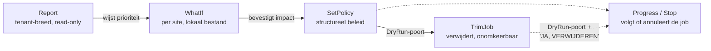

## De vraag

Microsoft heeft drie losse handleidingen voor het opschonen van versiegeschiedenis in SharePoint Online: een om te simuleren wat een nieuw beleid zou doen, een om dat beleid daadwerkelijk in te stellen, en een om oude versies weg te gooien. Elk met een eigen scriptje, zonder onderlinge samenhang en zonder overzicht: geen van de drie laat zien wáár in de tenant het probleem zit.

De vraag was tweeledig: kunnen de drie tutorials samen in één script met de juiste opties, en kan dat script ook laten zien waar in de tenant opgeschoond kan worden, met concreet advies? Beide vragen zijn beantwoord met hetzelfde script: `Manage-SPOVersionHistory.ps1`.

<div class="call warn"><div class="ct"><span>&#9670;</span> Wat dit niet is</div><p>Dit is geen automatische opschoning. Het script verwijdert nooit iets zonder expliciete, bewuste actie. Het rapport doet een aanbeveling; de beslissing om een beleid aan te passen ligt bij de klant.</p></div>

## De opzet: vijf modi, één script

Het script kent een `-Mode` parameter met vijf waarden. Elke modus doet één ding, maar ze delen dezelfde logging, dezelfde foutafhandeling en dezelfde DryRun-bescherming.

| Modus | Doet | Verandert er iets? |
|---|---|---|
| `Report` | Scant alle sites, laat zien waar versie-opslag hoog is, geeft advies | Nee — alleen lezen |
| `WhatIf` | Simuleert een beleid op een lokaal rapport-bestand | Nee — werkt lokaal, geen verbinding |
| `SetPolicy` | Zet het versiebeleid op een site (aantal versies, vervaltermijn) | Ja, tenzij DryRun |
| `TrimJob` | Verwijdert bestaande oude versies — **onomkeerbaar** | Ja, tenzij DryRun |
| `Progress` / `Stop` | Volgt of annuleert een lopende job | Nee (Progress) / Ja (Stop) |



Alle vijf modi delen dezelfde utility-functies (logging, Excel-export, foutafhandeling) en dezelfde `Connect-SPO`-functie, die een bestaande verbinding hergebruikt in plaats van elke keer opnieuw in te loggen.

## Veiligheid: DryRun en de onomkeerbare stap

<ol class="phases"><li><b>Report en WhatIf</b> wijzigen nooit iets. Report leest alleen (<code>Get-SPOSite -Detailed</code>); WhatIf werkt op een lokaal bestand en maakt zelfs geen verbinding met SharePoint.</li><li><b>SetPolicy en TrimJob</b> draaien standaard in <code>-DryRun</code> (<code>$true</code>). In die stand toont het script exact het PowerShell-commando dat zou worden uitgevoerd, zonder het uit te voeren.</li><li><b>TrimJob live</b> (<code>-DryRun:$false</code>) vraagt daarbovenop een expliciete typ-bevestiging: de tekst "JA, VERWIJDEREN", niet een simpele J/N-vraag. Reden: een trim-job verwijdert versies permanent, niet terug te halen uit de prullenbak.</li><li><b>Stop</b> vraagt standaard om bevestiging (J/N), te omzeilen met <code>-Force</code> voor geautomatiseerd gebruik.</li></ol>

<div class="call caution"><div class="ct"><span>&#9670;</span> Wat we tegenkwamen: een bevestiging die niet altijd bevestigt</div><p>Tijdens het testen bleek dat de module-installatie-bevestiging (voor ImportExcel, via <code>Read-Host</code>) in een niet-interactieve testomgeving doorging zonder zichtbaar "ja" van een mens. Dit is inmiddels beperkt tot alleen de modi die de module ook echt gebruiken, maar het onderstreept: vertrouw bij geautomatiseerd gebruik niet blind op een <code>Read-Host</code>-bevestiging. Draai zulke acties waar mogelijk interactief, of gebruik <code>-Force</code> bewust.</p></div>

## Hoe we getest hebben

Een script dat alleen op papier klopt, is geen getest script. Het is niet alleen op syntaxfouten gecontroleerd, maar ook echt verbonden met de Brouwershoff-tenant en getest tegen echte sites (`brouwershoff-admin.sharepoint.com`, Windows PowerShell 5.1, interactieve Microsoft-login). Dat leverde drie problemen op die anders pas bij de klant waren ontdekt:

| # | Wat bleek | Fix |
|---|---|---|
| 1 | `Connect-SPOService` gaf `400 Bad Request` onder PowerShell 7/Core; werkte pas onder Windows PowerShell 5.1 | Hele script herschreven zonder PS7-only syntax (ternary, null-coalescing, .NET 6 PriorityQueue) |
| 2 | Zonder UTF-8 BOM las Windows PowerShell 5.1 de niet-ASCII tekens (pijltjes, emoji) met de verkeerde codepage, en brak de parser | BOM toegevoegd aan het bestand |
| 3 | `Report`-modus signaleerde op percentage alleen: miste de grootste post (root-site, 14,7%, net onder de 15%-drempel) en gaf ruis bij een piepklein sitetje (41% van 2 MB) | Dubbele drempel (percentage en minimum MB) + altijd zichtbare top-5 op absolute omvang, los van de vlag |

<div class="call info"><div class="ct"><span>&#9670;</span> Twee kleinere bugs, ook gevonden tijdens live testen</div><p>De <code>Progress</code>-modus printte het resultaat dubbel (een overbodige <code>return</code> lekte het object nogmaals naar de console), en het <code>Aandachtspunten</code>-getal in de samenvatting bleef leeg zodra er precies één site werd gevlagd (een klassieke PowerShell-valkuil: een <code>Where-Object</code>-resultaat van één object heeft geen <code>.Count</code>). Beide gefixt en opnieuw live geverifieerd.</p></div>

<div class="call caution"><div class="ct"><span>&#9670;</span> Draai het script via powershell.exe, niet pwsh.exe</div><p><code>Connect-SPOService</code> faalt onder PowerShell 7/Core op deze tenant. Gebruik altijd Windows PowerShell 5.1.</p></div>

## Wat we aantroffen bij Brouwershoff

Van de 44 sites in de Brouwershoff-tenant gebruikt vrijwel elke site verwaarloosbaar weinig opslag aan oude versies. Op één site na: de hoofdsite (`brouwershoff.sharepoint.com/`) bevat 384,7 van de in totaal 385 GB aan versiegeschiedenis in de hele tenant. Dat is 99,8% van al het "versie-vet" op één plek.

| Kengetal | Waarde |
|---|---|
| Sites gescand | 44 |
| Totale opslag (alle sites) | 2.632 GB |
| Waarvan versiegeschiedenis | 385 GB (14,6% van de totale opslag) |
| Grootste post | `brouwershoff.sharepoint.com/` — 384,74 GB (14,7% van de opslag van díe site) |
| Eén site met scheve verhouding | `sites/ORATO-technischeomschrijving` — 0,25 GB, maar 97,1% van díe site's opslag |
| Huidig beleid, alle 44 sites | Geërfd van de organisatie: geen automatische trimming, max. 500 hoofdversies, géén tijdslimiet |

<div class="call caution"><div class="ct"><span>&#9670;</span> De grootste post haalt de eigen signaleringsdrempel niet</div><p>De hoofdsite zit op 14,7% - net onder de 15%-drempel die als standaard geldt voor "Aandachtspunt". Zonder de aparte top-5-lijst (los van die drempel) was deze site, verreweg de belangrijkste, niet opgevallen in de samenvatting. Zie ADR-0001 voor waarom nu altijd beide worden getoond.</p></div>

## Advies

Twee sites verdienen een vervolgstap. De rest van de tenant heeft op dit moment geen actie nodig.

<ol class="phases"><li><b>De hoofdsite (384,7 GB).</b> Verreweg de grootste kans, ook al haalt hij de standaard-signalering net niet. Omdat het hier om zoveel opslag gaat: eerst het officiële version storage usage report ophalen voor deze site en daarop <code>-Mode WhatIf</code> draaien, om te zien hoeveel er precies verdwijnt bij bijvoorbeeld een limiet van 100 versies of een vervaltermijn van 365 dagen, vóór er iets wordt toegepast. Bij zo'n omvang is het verschil tussen een ruwe schatting en de echte impact te groot om over te slaan.</li><li><b>sites/ORATO-technischeomschrijving (0,25 GB, maar 97,1% van de site-opslag).</b> Klein in absolute zin, maar de meest scheve verhouding van de tenant. Hier weegt de ruwe schatting van het rapport zwaarder mee, omdat de omvang klein genoeg is om het risico van een lichte overschatting te accepteren: <code>MajorVersionLimit</code> verlagen van 500 naar 100 (geschatte besparing ±0,2 GB) en een vervaltermijn instellen (bijvoorbeeld 365 dagen), want er geldt nu geen enkele tijdslimiet.</li></ol>

<div class="call warn"><div class="ct"><span>&#9670;</span> Waarom niet meteen live toepassen</div><p>Beide stappen raken een productieomgeving. SetPolicy wijzigt het beleid structureel; een eventuele daaropvolgende TrimJob verwijdert bestaande versies permanent. Beide draaien daarom eerst in -DryRun (de standaard), en TrimJob vraagt bij live uitvoering om een expliciete "JA, VERWIJDEREN"-bevestiging.</p></div>

De overige 42 sites hebben op dit moment geen actie nodig: hun versie-opslag is verwaarloosbaar, zowel in percentage als in absolute omvang.

## Gebruik

```powershell
# 1. Tenant-breed overzicht (read-only)
.\Manage-SPOVersionHistory.ps1 -Mode Report `
    -AdminUrl https://brouwershoff-admin.sharepoint.com

# 2. Impact simuleren op het officiele storage-rapport van de hoofdsite
.\Manage-SPOVersionHistory.ps1 -Mode WhatIf -PolicyType Count -MajorVersionLimit 100 `
    -ImportPath C:\Rapporten\Hoofdsite_VersionReport.csv `
    -WhatIfOutputPath C:\Rapporten\Hoofdsite_WhatIf.csv

# 3. Beleid instellen als proef (DryRun staat standaard aan)
.\Manage-SPOVersionHistory.ps1 -Mode SetPolicy `
    -AdminUrl https://brouwershoff-admin.sharepoint.com `
    -SiteUrl https://brouwershoff.sharepoint.com/sites/ORATO-technischeomschrijving `
    -PolicyType Age -ExpireAfterDays 365 -MajorVersionLimit 100

# 4. Live toepassen, pas na controle van stap 3
.\Manage-SPOVersionHistory.ps1 -Mode SetPolicy -DryRun:$false `
    -AdminUrl https://brouwershoff-admin.sharepoint.com `
    -SiteUrl https://brouwershoff.sharepoint.com/sites/ORATO-technischeomschrijving `
    -PolicyType Age -ExpireAfterDays 365 -MajorVersionLimit 100

# 5. Voortgang volgen
.\Manage-SPOVersionHistory.ps1 -Mode Progress -JobType Policy `
    -AdminUrl https://brouwershoff-admin.sharepoint.com `
    -SiteUrl https://brouwershoff.sharepoint.com/sites/ORATO-technischeomschrijving
```

## Besluiten

| ADR | Besluit | Status |
|---|---|---|
| **ADR-0001 — Eén gecombineerd script, met dubbele signaleringsdrempel** | Eén script (`Manage-SPOVersionHistory.ps1`) met een `-Mode` parameter bundelt de vijf acties: WhatIf, SetPolicy, TrimJob, Progress/Stop en Report — in plaats van drie losse Microsoft-tutorial-scripts. | <span class="badge b-ok">Accepted</span> |

## Bronnen

- [Tutorial - Run 'What-If' analysis](https://learn.microsoft.com/en-us/sharepoint/tutorial-run-what-if-analysis)
- [Tutorial - Manage version limits](https://learn.microsoft.com/en-us/sharepoint/tutorial-manage-version-limits)
- [Tutorial - Queue a trim job](https://learn.microsoft.com/en-us/sharepoint/tutorial-queue-a-trim-job)
- [Get-SPOSite (cmdlet-referentie)](https://learn.microsoft.com/en-us/powershell/module/sharepoint-online/get-sposite)
