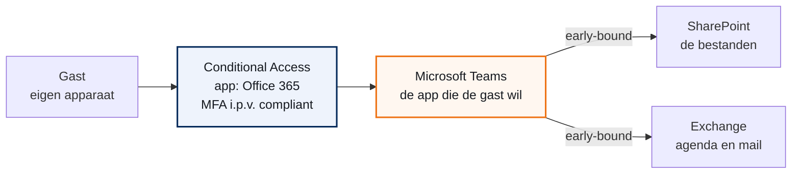
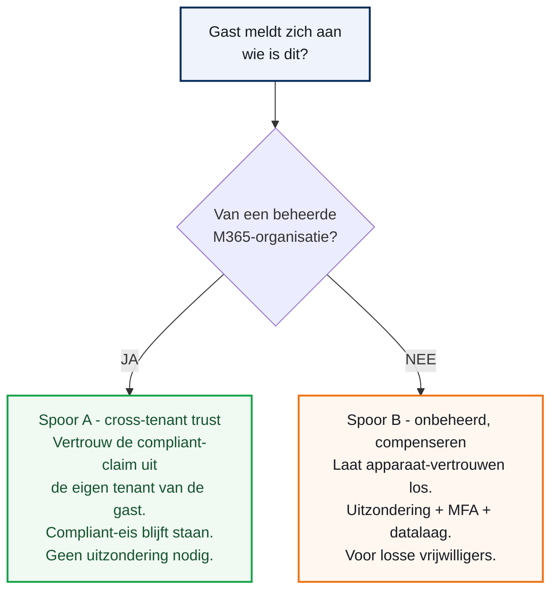

## Het vraagstuk

Landschappen gebruikt **Conditional Access** (CA): de set regels die bepaalt wie waarmee mag inloggen. Een van die regels eist een **compliant device**, een apparaat dat is aangemeld bij de tenant en aan de regels voldoet. Een gast op zijn eigen apparaat haalt die eis niet. Daarom mag hij Teams en documenten nu alleen in de **browser** openen, niet in de desktop-app.

De gasten zijn vaak **vrijwilligers**. Ze melden zich aan met hun eigen apparaat, voor een korte periode. De browser-only ervaring werkt voor hen lastig.

<div class="call warn"><div class="ct"><span>&#9670;</span> De kern in een zin</div><p>Het kan, maar niet door alleen de Teams-app uit te zonderen. Teams leunt technisch op SharePoint en Exchange, dus de uitzondering moet op het hele Office 365-pakket, met MFA in plaats van compliant device.</p></div>

## Waarom "alleen Teams" niet kan

Dit hoofdstuk legt het fundament. Snap je dit, dan snap je de rest.

Teams is geen los programma. Teams leunt op andere diensten. De bestanden staan in **SharePoint**. De agenda en mail in **Exchange**. CA kent hierbij twee soorten afdwinging.

- **Early-bound**: de gast moet eerst door de regel van de onderliggende dienst. Pas daarna opent Teams.
- **Late-bound**: de regel telt pas als Teams die dienst echt nodig heeft. Bijvoorbeeld Planner.

Dit zijn de afhankelijkheden van Teams, volgens Microsoft:

| Teams leunt op | Soort afdwinging |
| --- | --- |
| Exchange | Early-bound |
| SharePoint | Early-bound |
| Planner | Late-bound |
| Stream | Late-bound |
| Whiteboard | Late-bound |

SharePoint en Exchange zijn dus **early-bound**. Dat is de kern.



*Teams leunt early-bound op SharePoint en Exchange. Daarom moet de uitzondering op het hele Office 365-pakket, niet op Teams alleen.*

<div class="call caution"><div class="ct"><span>&#9670;</span> Het gevolg</div><p>Zonder je alleen de Teams-app uit, dan blokkeert SharePoint de gast alsnog. Hij kan wel chatten, maar het <b>Files-tabblad</b> faalt. Op het scherm verschijnt de blokkade van Entra: "You can't get there from here". Precies het symptoom: chat werkt, bestanden niet.</p></div>

## De twee harde grenzen

Naast de early-bound afhankelijkheid zijn er twee grenzen. Beide gaan over het apparaat van de gast.

**Grens 1. Compliant device is onhaalbaar.** Een apparaat wordt alleen beheerd door de eigen tenant van de gebruiker. Een gast kan zijn apparaat niet aanmelden bij Landschappen. De eis is voor hem geen bescherming, maar een dichte deur zonder sleutel.

**Grens 2. App protection werkt niet voor gasten.** De regel "Require app protection policy" gebruikt Intune MAM: bescherming in de app zelf, zonder het hele apparaat te beheren. Maar MAM vereist een apparaat dat in de tenant van Landschappen is geregistreerd. Bij een gast kan dat niet. Microsoft raadt de regel voor externen zelf af.

<div class="call info"><div class="ct"><span>&#9670;</span> Wat dit niet is</div><p>Dit is geen fout in de omgeving en geen lek. De gasten zijn nu simpelweg buitengesloten van de desktop-apps. Het risico van de huidige situatie is klein. Het probleem is de gebruikservaring, niet de veiligheid.</p></div>

## Twee sporen

Een ding bepaalt de aanpak: **wie is de gast?**



*Een vraag splitst de aanpak: komt de gast van een beheerde organisatie, of werkt hij op een eigen apparaat?*

Sommige gasten komen van een bedrijf dat zijn laptops zelf al goed beheert. Die vertrouwen we via een koppeling; dan hoeft er niets bij. De vrijwilligers werken op hun eigen spullen. Voor hen richten we een aparte, veilige route in.

Voor Landschappen zijn de gasten vooral **vrijwilligers**. Het zwaartepunt ligt dus op **Spoor B**. Spoor A nemen we mee voor het geval er ook partnergasten zijn.

## Spoor A: cross-tenant device-trust

Komt de gast uit een andere organisatie die zelf Microsoft 365 en Intune gebruikt? Dan is zijn apparaat al beheerd, maar in **zijn** tenant. Via **Cross-Tenant Access Settings** kun je die claim vertrouwen.

<ol class="phases">
<li>Ga naar <b>External Identities &#8594; Cross-tenant access settings</b>.</li>
<li>Kies <b>Organizational settings &#8594; Add organization</b>. Zet de trust per bekende partner, niet op Default.</li>
<li>Open <b>Inbound access &#8594; Trust settings</b>.</li>
<li>Vink aan: <b>Trust multifactor authentication from Microsoft Entra tenants</b>.</li>
<li>Vink aan: <b>Trust compliant devices</b>.</li>
</ol>

Nu accepteert de bestaande compliant-regel de claim van die partner. De gast werkt direct met de Teams-app, zonder in een uitzonderingsgroep te zitten. De volledige onderbouwing staat in **ADR-0002**.

<div class="call info"><div class="ct"><span>&#9670;</span> Voorwaarde</div><p>De thuis-tenant van de gast moet Entra- en Intune-beheerd zijn en zelf compliance afdwingen. Werkt dit niet, dan valt de gast terug op Spoor B.</p></div>

## Spoor B: de uitzondering

Voor de vrijwilliger op een eigen apparaat. Twee handelingen in Conditional Access.

<ol class="phases">
<li>Haal de gastengroep uit de bestaande <b>compliant-device</b>-regel. Zet de groep onder <b>Exclude</b>.</li>
<li>Maak een nieuwe regel voor die groep.
<ul><li>Target resources: de app <b>Office 365</b> (het hele pakket).</li>
<li>Grant: <b>Require multifactor authentication</b>.</li>
<li>Session: <b>Sign-in frequency</b> 1 dag, en <b>Persistent browser session</b> op Never persistent.</li></ul>
</li>
<li>Zet de nieuwe regel eerst op <b>Report-only</b>. Aanzetten doe je na de test.</li>
</ol>

<div class="call warn"><div class="ct"><span>&#9670;</span> Waarom Office 365 en niet Teams</div><p>Target je alleen de Teams-app, dan blokkeert SharePoint de gast alsnog; het is early-bound. De app "Office 365" pakt Teams, SharePoint en Exchange in een keer. Zie het hoofdstuk "Waarom alleen Teams niet kan".</p></div>

De onderbouwing van deze keuze staat in **ADR-0001**.

## Tijdgebonden via een access package

Een vrijwilliger komt voor korte tijd. Een uitzondering die je met de hand beheert, groeit: namen blijven staan. Dat noemen we scope-drift. **Entitlement Management** lost dit op met een **access package**: een bundel toegang met een verloopdatum.

<ol class="phases">
<li>Ga naar <b>Identity governance &#8594; Entitlement management &#8594; Catalogs</b>. Maak een catalog <b>Vrijwilligers</b>, met externe gebruikers aan.</li>
<li>Voeg de gastengroep en de vrijwilligers-teams toe als resources.</li>
<li>Maak een access package <b>Vrijwilliger - Teams-toegang</b>. Rol: <b>Member</b> van de groep.</li>
<li>Zet <b>Expiration</b> op een vaste termijn, bijvoorbeeld 90 dagen. Zet <b>Access Reviews</b> aan.</li>
</ol>

Lidmaatschap van het package is meteen lidmaatschap van de uitzonderingsgroep. Loopt het package af, dan verlaat de gast de groep en de uitzondering. Zie **ADR-0003**.

<div class="call info"><div class="ct"><span>&#9670;</span> Zonder P2</div><p>Access packages vragen een Entra ID <b>P2</b>- of Governance-licentie. Heeft de klant die niet, dan is er een terugval: een handmatige groep met een handmatige review in de agenda. Je verliest dan alleen het vanzelf verlopen.</p></div>

## De datalaag: drie opties

Het apparaat is onbeheerd. De bescherming zit dus bij de **data**. Er is een keuze te maken.

Je kunt niet twee dingen tegelijk: de volledige Teams-app op een privé-apparaat, en de garantie dat er nooit iets gedownload wordt. Maar kies je "geen download", dan hoef je niet naar alleen-lezen. Bekijken en bewerken in de browser kan gewoon blijven.

| Optie | Wat de vrijwilliger kan | Mechanisme |
| --- | --- | --- |
| 1. Gebruiksgemak | Alles, inclusief download naar het apparaat. | Teams-app volledig. Afdekken met labels en teamscoping. |
| 2. Bekijken en bewerken, geen download | Openen en bewerken in de browser. Geen download, printen of sync. | SharePoint web-only, bewerken staat standaard aan. Volgt de rechten. |
| 3. Alleen lezen | Alleen bekijken. | SharePoint web-only met bewerken uit. |

Optie 2 is de fijne middenweg. SharePoint "limited, web-only access" blokkeert download, printen en sync op een onbeheerd apparaat. Maar bekijken en bewerken in de browser blijft **standaard** aan. Microsoft zegt letterlijk: "By default, this policy allows users to view and edit files in their web browser." Bewerken volgt de rechten: heeft de gast alleen leesrecht, dan kan hij niet bewerken.

**Advies.** Bij laag-gevoelige data is optie 1 prima. Twijfel je, of is de data gemengd, kies dan **optie 2**. De onderbouwing staat in **ADR-0004**.

## Web-only inrichten

<div class="call caution"><div class="ct"><span>&#9670;</span> Scope het, zet het niet tenant-breed aan</div><p>Zet je web-only tenant-breed aan, dan raakt het <b>alle</b> gebruikers op een onbeheerd apparaat. Ook je eigen medewerkers die thuis werken. Scope het daarom op alleen de vrijwilligers-teams, met een sensitivity label.</p></div>

<ol class="phases">
<li>Ga naar <b>Microsoft Purview</b>: purview.microsoft.com.</li>
<li><b>Information Protection &#8594; Labels &#8594; Create a label</b>. Naam: <code>Vrijwilligers-web-only</code>.</li>
<li>Kies de scope <b>Groups &amp; sites</b>.</li>
<li>Bij <b>Access from unmanaged devices</b>: kies <b>Allow limited, web-only access</b>.</li>
<li>Publiceer het label en wijs het toe aan de vrijwilligers-teams en -sites.</li>
</ol>

Voor alleen-lezen (optie 3), of om per site te sturen, gebruik je PowerShell met de SharePoint Online Management Shell:

```powershell
Set-SPOSite -Identity https://<tenant>.sharepoint.com/sites/<site> -ConditionalAccessPolicy AllowLimitedAccess -LimitedAccessFileType OfficeOnlineFilesOnly
```

- Optie 3, alleen lezen: voeg `-AllowEditing $false` toe.
- `-LimitedAccessFileType OfficeOnlineFilesOnly` beperkt tot Office-bestanden in de browser.

<div class="call info"><div class="ct"><span>&#9670;</span> Twee dingen om te weten</div><p>Een wijziging kan tot 24 uur duren, en geldt pas na opnieuw inloggen. Het bestand opent in de browser via Office voor het web, niet ingebed in de Teams-app.</p></div>

## Document openen vanuit Teams

De concrete vraag was: opent een document vanuit de Teams-app in de app, of in de browser?

Eerst het mechanisme. Een Office-bestand in Teams staat in SharePoint. Open je het in de Teams-app, dan toont Teams het standaard in zijn **ingebouwde viewer**, een Office-webweergave binnen Teams. Niet in de losse Word- of Excel-app.

Kies je bij de datalaag voor **geen download** (optie 2 of 3), dan verandert dit. Het bestand opent dan in een **browsertab** via Office voor het web. Teams zelf blijft gewoon werken: chat, vergaderingen en het Files-tabblad.

<div class="call info"><div class="ct"><span>&#9670;</span> Het voorbehoud dat altijd geldt</div><p>Dit werkt alleen als de uitzondering het hele Office 365-pakket dekt. Blijft SharePoint de compliant-eis houden, dan kan de gast wel chatten maar loopt hij vast bij het bestand. Precies het Files-symptoom uit hoofdstuk twee.</p></div>

## Valkuilen

| # | Valkuil | Waarom |
| --- | --- | --- |
| 1 | Alleen de Teams-app uitzonderen. | Early-bound afhankelijkheid; de gast strandt bij zijn bestanden. Scope op Office 365. |
| 2 | App protection policy als alternatief. | Werkt niet voor gasten; vereist een apparaat in de eigen tenant. |
| 3 | Web-only tenant-breed aanzetten. | Raakt ook eigen medewerkers thuis. Scope met een sensitivity label. |
| 4 | Denken dat P2 gratis meekomt. | Access packages en access reviews vragen Entra ID P2 of Governance. |

<div class="call caution"><div class="ct"><span>&#9670;</span> Licenties eerst</div><ul><li>Conditional Access vereist Entra ID <b>P1</b>.</li><li>Access packages en reviews vereisen <b>P2</b> of Governance.</li><li>Sensitivity labels en DLP vereisen <b>Purview</b>.</li></ul></div>

<div class="call info"><div class="ct"><span>&#9670;</span> Zonder P2 kan het ook</div><ul><li>Vervang het access package door een handmatige groep.</li><li>Zet een handmatige review in de agenda.</li><li>Je verliest alleen het vanzelf verlopen.</li></ul></div>

## Zo bouw je het op

<ol class="phases">
<li>Maak de gastengroep <code>SG-CA-Gasten-Teams-Exceptie</code>.</li>
<li>Optioneel: zet cross-tenant trust voor bekende partners (Spoor A).</li>
<li>Maak het access package met einddatum en review.</li>
<li>Haal de groep uit de compliant-regel.</li>
<li>Maak de nieuwe regel op <b>Report-only</b>.</li>
<li>Richt de datalaag in: kies optie 1, 2 of 3.</li>
<li>Test met een <b>echte vrijwilliger</b> op een onbeheerd apparaat. Inloggen, MFA, een team openen, een document openen. Probeer te downloaden en te bewerken. Controleer de <b>sign-in logs</b>.</li>
<li>Zet de regel op <b>On</b>. Herhaal de test kort.</li>
</ol>

<div class="call info"><div class="ct"><span>&#9670;</span> Terugdraaien</div><p>Elke stap is los terug te draaien. Zet de regel terug op Report-only of Off, of haal de groep uit de Exclude. Web-only terug: kies Allow full access, of <code>Set-SPOTenant -ConditionalAccessPolicy AllowFullAccess</code>. Er zit geen onomkeerbare actie in.</p></div>

Het volledige runbook met alle knoppen en foutmeldingen staat in het projectdossier, in `04_Implementatie_runbook.md`.

## Besluiten

Elk besluit heeft een eigen pagina: de context, wat het oplevert, wat het kost, en wat we hebben afgewogen maar niet gekozen.

| ADR | Besluit | Status |
| --- | --- | --- |
| **ADR-0001 — Gasttoegang tot de Teams-app via een uitzondering op het Office 365-pakket met MFA** | We geven de gast toegang tot de Teams-app door de gastengroep uit te zonderen van de compliant-device-eis. | <span class="badge b-ok">Accepted</span> |
| **ADR-0002 — Partnergasten via cross-tenant device-trust** | Voor gasten uit een vertrouwde, beheerde Microsoft 365-organisatie zetten we in Cross-Tenant Access Settings (inbound) de opties "Trust multifactor authentication from Microsoft Entra tenants" en... | <span class="badge b-ok">Accepted</span> |
| **ADR-0003 — Tijdgebonden vrijwilligerstoegang via een access package** | We beheren de gastengroep via een access package met een verloopdatum en een periodieke access review. | <span class="badge b-ok">Accepted</span> |
| **ADR-0004 — Databescherming op onbeheerde apparaten via web-only met bewerken, gescoped met een sensitivity label** | Standaard kiezen we optie 2: we blokkeren download, printen en sync, maar staan bekijken en bewerken in de browser toe. | <span class="badge b-ok">Accepted</span> |

## Bronnen

De aanpak in dit document leunt op de officiële Microsoft-documentatie.

- [Conditional Access service dependencies](https://learn.microsoft.com/en-us/entra/identity/conditional-access/service-dependencies)
- [Authentication and Conditional Access for B2B users](https://learn.microsoft.com/en-us/entra/external-id/authentication-conditional-access)
- [Manage cross-tenant access settings for B2B collaboration](https://learn.microsoft.com/en-us/entra/external-id/cross-tenant-access-settings-b2b-collaboration)
- [Control access from unmanaged devices - SharePoint](https://learn.microsoft.com/en-us/sharepoint/control-access-from-unmanaged-devices)
- [Identity and device access policies for guest access (Zero Trust)](https://learn.microsoft.com/en-us/security/zero-trust/zero-trust-identity-device-access-policies-guest-access)
