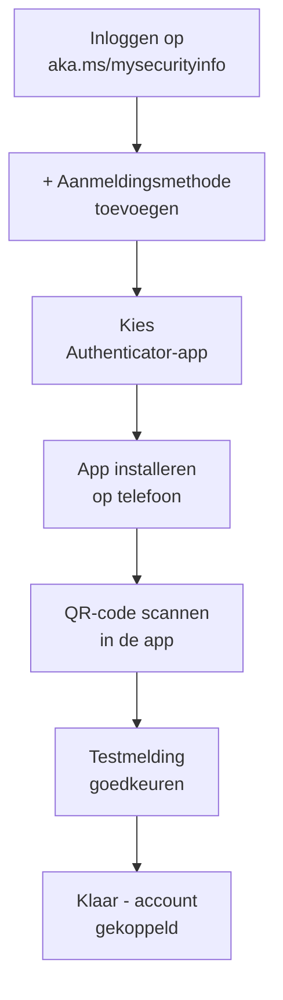

*Gebruikersinstructie — Meervoudige verificatie activeren*

| | |
|---|---|
| **Versie** | 1.0 |
| **Datum** | 23 juni 2026 |
| **Opgesteld door** | Dennis Schiphorst, Modern Workplace Consultant |
| **Namens** | QUBE ICT Solutions |
| **Doelgroep** | Medewerkers |

## Wat is MFA en waarom is het verplicht?

Met MFA (Multi-Factor Authenticatie) beveiligt u uw werkaccount met twee stappen: uw wachtwoord én een goedkeuring via uw telefoon. Zo blijft uw account beschermd, ook als uw wachtwoord ooit in verkeerde handen valt.

Uw organisatie heeft MFA verplicht gesteld. Zonder MFA heeft u na een bepaalde datum geen toegang meer tot uw e-mail, Teams en andere werkapplicaties.

## Wat heeft u nodig?

- Uw zakelijke e-mailadres en wachtwoord
- Een smartphone (iOS of Android)
- De app Microsoft Authenticator — gratis te downloaden
- Internetverbinding op telefoon én computer

## MFA instellen — stap voor stap

*Voer onderstaande stappen uit op uw computer. Houd uw smartphone bij de hand.*

<ol class="phases">
<li><b>Open de beveiligingspagina.</b> Ga naar <a href="https://aka.ms/mysecurityinfo">aka.ms/mysecurityinfo</a> en meld u aan met uw werkaccount.</li>
<li><b>Klik op "Aanmeldingsmethode toevoegen".</b> U ziet een overzichtspagina van uw beveiligingsgegevens. Klik op de knop "+ Aanmeldingsmethode toevoegen".</li>
<li><b>Kies "Authenticator-app".</b> Selecteer in de keuzelijst "Authenticator-app" en klik op "Toevoegen".</li>
<li><b>Download de app op uw telefoon.</b> Open de App Store (iPhone) of Google Play Store (Android) en zoek op "Microsoft Authenticator". Installeer de app van Microsoft Corporation.</li>
<li><b>Scan de QR-code.</b> Klik in de app op het +-teken rechtsboven en kies "Werk- of schoolaccount". Scan de QR-code die op uw computerscherm wordt getoond.</li>
<li><b>Test de koppeling.</b> Klik op uw computer op "Volgende". U ontvangt een melding op uw telefoon. Keur deze goed door op "Goedkeuren" te tikken.</li>
<li><b>Klaar.</b> U ziet de bevestiging dat uw account is gekoppeld. Vanaf nu ontvangt u bij elke aanmelding een goedkeuringsverzoek op uw telefoon.</li>
</ol>

<figure>
  
  <figcaption>Stap 1-2 — het verzoek dat verschijnt bij het inloggen op de beveiligingspagina</figcaption>
</figure>

<figure>
  
  <figcaption>Stap 4 — de app downloaden op uw telefoon</figcaption>
</figure>

<figure>
  
  <figcaption>Stap 5 — de QR-code scannen (de stap waar het vaakst iets misgaat)</figcaption>
</figure>

&#9670; Lukt scannen niet?

Zorg dat de camera van uw telefoon toegang heeft tot de Authenticator-app (vraag daarom bij de eerste keer openen), en dat de QR-code op uw computerscherm volledig zichtbaar is - niet gedeeltelijk buiten beeld of door een ander venster overlapt.

<figure>
  
  <figcaption>Stap 7 — bevestiging dat de koppeling gelukt is</figcaption>
</figure>

## Veelgestelde vragen

### Ik heb geen smartphone — wat nu?

Neem contact op met de IT-helpdesk. Er zijn alternatieve methoden beschikbaar.

### Ik krijg geen melding op mijn telefoon

Controleer of u internetverbinding heeft op uw telefoon en of meldingen voor de Authenticator-app zijn ingeschakeld. Wacht 30 seconden en probeer het opnieuw.

&#9670; Mijn telefoon is kapot of gestolen

Meld dit direct bij de IT-helpdesk. Zij blokkeren de koppeling zodat anderen geen toegang kunnen krijgen.

### Ik heb een nieuwe telefoon

MFA wordt niet automatisch overgezet. Neem vooraf contact op met de IT-helpdesk om uw account opnieuw te koppelen.

## Hulp nodig?

Lukt het niet of heeft u een vraag? Neem contact op met de IT-helpdesk van uw organisatie of met QUBE ICT Solutions.

&#9670; Bewaar deze instructie

U heeft hem mogelijk nodig als u een nieuwe telefoon krijgt.

## Bronnen

De schermafbeeldingen in dit artikel zijn afkomstig van de officiële Microsoft-documentatie.

- [Set up Security info from a sign-in page (Microsoft Support)](https://support.microsoft.com/en-us/accounts-billing/work-school/set-up-security-info-from-a-sign-in-page)
- [Download Microsoft Authenticator (Microsoft Support)](https://support.microsoft.com/en-us/authenticator/download-microsoft-authenticator)
