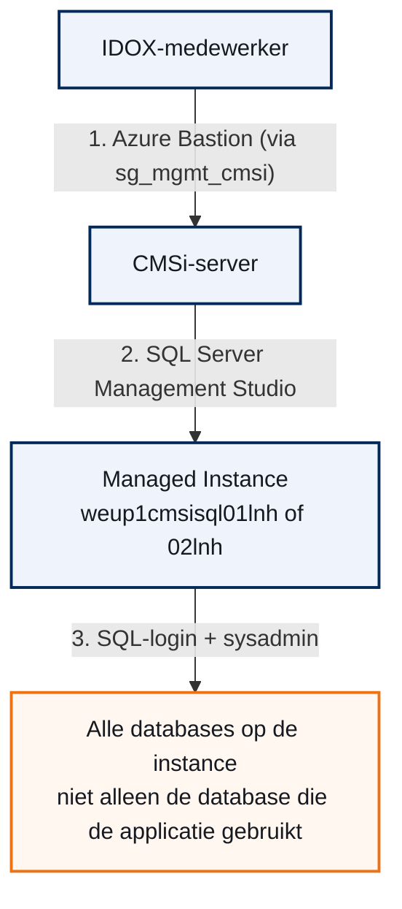

## De situatie

IDOX is een externe partij die een applicatie van Landschappen onderhoudt: app-upgrades en updates. IDOX-medewerkers hebben een eigen account in de Landschappen-tenant (Microsoft Entra ID) en moeten beheerderstoegang krijgen tot de Azure SQL Managed Instance(s) die de applicatie gebruikt, voor het uitvoeren van app-upgrades en updates. Twee medewerkers hebben deze toegang nu al: Chris Martin en Peter Taylor. Dit document beschrijft hoe die toegang is opgebouwd, en hoe je een volgende IDOX-medewerker op dezelfde manier toevoegt.

<div class="call info">
<div class="ct"><span>&#9670;</span> Wat dit document niet is</div>
<p>Dit is geen los advies vooraf. Het is een verslag van wat we aantroffen, het besluit dat daaruit volgde, en een uitvoerbare procedure. Waar de praktijk afwijkt van wat gebruikelijk wordt aanbevolen, staat dat er expliciet bij - inclusief het hoofdstuk waarin Landschappen dat moet beoordelen.</p>
</div>

## De route naar de database

Een IDOX-medewerker komt in drie stappen bij de database. Elke stap heeft zijn eigen slot. Lid zijn van de ene groep betekent niet automatisch dat de volgende deur ook opengaat.


*De route van een IDOX-medewerker naar de database, in drie stappen. Het laatste vak is bewust anders getekend: sysadmin geeft toegang tot de hele instance, niet alleen de relevante database.*

De groep `sg_mgmt_cmsi` ("Management groep voor de CMSi applicatie servers") regelt alleen stap 1: aanmelden op de CMSi-server via Azure Bastion. Die groep geeft geen SQL-toegang. Stap 3 loopt via een apart SQL-login, per persoon, op elke Managed Instance waar toegang nodig is. Twee instances zijn in beeld: `weup1cmsisql01lnh` en `weup1cmsisql02lnh`, beide in resourcegroep `weu-p1-cmsi`. De Microsoft Entra-beheerder van beide instances is `aazlnh@landschappen.nl`.

## Best practices van Microsoft

Voordat we naar de praktijk keken, hebben we uitgezocht wat Microsoft zelf aanraadt voor het beheren van interne en externe gebruikers op dit type database. Drie punten springen eruit.

<ol class="phases">
<li><b>Log in met een Entra-account, niet met een wachtwoord.</b> Een wachtwoord kun je delen of vergeten uit te schakelen. Een Entra-account is te koppelen aan multifactor-authenticatie (MFA) en aan het in- en uitdienstproces van de medewerker.</li>
<li><b>Ken rechten toe aan een groep, nooit aan een los account.</b> Iemand toevoegen of verwijderen wordt dan een wijziging in de groep, geen aparte actie op de database.</li>
<li><b>Geef niet meer dan nodig is.</b> Voor app-upgrades is meestal `db_owner` op de relevante database genoeg: schema's aanpassen, tabellen wijzigen. Dat is aanzienlijk minder dan `sysadmin`, dat de hele instance beheert.</li>
</ol>

<div class="call info">
<div class="ct"><span>&#9670;</span> Ook voor externe gastgebruikers</div>
<p>Externe medewerkers zoals IDOX kunnen als Microsoft Entra B2B-gastgebruiker precies dezelfde weg volgen als interne medewerkers: een Entra-login, in een groep, met een rol op de relevante database. Er is geen apart mechanisme nodig voor "extern".</p>
</div>

## Wat we in de praktijk aantroffen

We namen eerst aan dat de bestaande toegang van Chris Martin (IDOX) via een Entra-account liep, met precies genoeg rechten. Bij controle in SQL Server Management Studio bleek dat niet te kloppen.

Op zowel `weup1cmsisql01lnh` als `weup1cmsisql02lnh` staat een login genaamd `chris`: een lokaal **SQL Server-authenticatie**-login (gebruikersnaam en wachtwoord, geen Entra ID), lid van de serverrol **`sysadmin`**. Dat is de rol die daadwerkelijk gebruikt wordt om in te loggen, niet alleen op een database maar op de hele instance.

| Wat we verwachtten | Wat we aantroffen |
| --- | --- |
| Entra ID-login | Lokaal SQL-login (`chris`), wachtwoord-gebaseerd |
| `db_owner` op de relevante database | `sysadmin`: volledige controle over de hele instance |
| Toegang via een groep | Toegang via een los login per medewerker |

<div class="call caution">
<div class="ct"><span>&#9670;</span> Nog niet verklaard</div>
<p>Er bestaat op beide instances ook een tweede login met een e-mailadres (<code>chris.martin@idoxgroup.com</code>). Waarvoor die dient naast het login <code>chris</code>, is nog niet uitgezocht. Daarnaast staan er op <code>weup1cmsisql01lnh</code> twee logins die niet eerder in dit dossier voorkwamen: <code>simon</code> en <code>michel.kleine@vinci-energies...</code>. Mogelijk een andere externe partij met vergelijkbare toegang. Zie het hoofdstuk "Wat nog beoordeeld moet worden".</p>
</div>

## Het besluit

Voor de nieuwe collega (Peter Taylor) lagen twee wegen open: het exacte patroon van Chris volgen, of alsnog de aanbevolen aanpak (Entra-login, beperkte rechten) invoeren. Gekozen is voor het eerste: consistentie met wat er al draait, en snelheid. Dat is een bewuste keuze, met het risico dat erbij hoort.

Het eerste besluit (**ADR-0001 — IDOX-gebruikers krijgen db_owner op de Azure SQL database(s)**) ging nog uit van `db_owner` via een Entra-login, met het voorbehoud "nog te bevestigen hoe de bestaande toegang werkt". Na controle bleek die aanname onjuist. **ADR-0002 — IDOX-gebruikers krijgen sysadmin via een SQL-login, niet db_owner via Entra** vervangt ADR-0001: IDOX-gebruikers krijgen voortaan een SQL-login met `sysadmin`, gelijk aan de bestaande praktijk. ADR-0001 heeft de status Superseded by ADR-0002; ADR-0002 zelf is Accepted en houdt in dat IDOX-gebruikers een lokaal **SQL Server-authenticatie login** (gebruikersnaam plus wachtwoord, geen Entra ID) krijgen, lid van de serverrol **`sysadmin`**, op elke Managed Instance waar ze toegang toe moeten hebben.

<div class="call warn">
<div class="ct"><span>&#9670;</span> Het geaccepteerde risico</div>
<p><code>sysadmin</code> via een wachtwoord-login is breder dan nodig, en niet gekoppeld aan het Entra-account van de medewerker: geen MFA, geen automatische intrekking bij vertrek van een IDOX-medewerker. Dat risico is bewust geaccepteerd voor snelheid en consistentie, niet gecompenseerd met een tegenmaatregel. Zie "Wat nog beoordeeld moet worden".</p>
</div>

## Sysadmin of toch per database

Het besluit (ADR-0002) koos voor het simpele pad: een instelling die in een keer overal toegang geeft. Wil Landschappen dat heroverwegen, dan is dit concreet wat het verschil betekent - geen abstracte afweging, maar het commando ernaast.

`ALTER SERVER ROLE sysadmin ADD MEMBER` werkt op **serverniveau**. Het login krijgt daarmee toegang tot alle databases op de instance, nu en in de toekomst, zonder aparte stap per database. Er is geen manier om er een paar van uit te sluiten: het is alles of niets. `db_owner` werkt op **databaseniveau**: elke database is een eigen keuze, met een eigen `CREATE USER`.

| | sysadmin (huidige aanpak) | db_owner per database |
| --- | --- | --- |
| Bereik | Hele instance, alle databases | Alleen de opgegeven database(s) |
| Nieuwe database die later bijkomt | Automatisch toegankelijk | Geen toegang, tenzij apart toegevoegd |
| Werk per collega | Een keer, per instance | Een keer per database die nodig is |
| Precisie | Laag: geen scheiding tussen databases mogelijk | Hoog: elke database een eigen keuze |

Bij db_owner per database herhaal je de aanmaak voor elke database apart:

```sql
USE master
GO
CREATE LOGIN [naam] WITH PASSWORD = 'kies-een-sterk-wachtwoord'
GO

USE [database1]
GO
CREATE USER [naam] FOR LOGIN [naam]
GO
ALTER ROLE db_owner ADD MEMBER [naam]
GO

USE [database2]
GO
CREATE USER [naam] FOR LOGIN [naam]
GO
ALTER ROLE db_owner ADD MEMBER [naam]
GO
```

<div class="call info">
<div class="ct"><span>&#9670;</span> Dit is nog geen besluit</div>
<p>Dit hoofdstuk maakt de keuze uit "Wat nog beoordeeld moet worden" concreet, het neemt hem niet. Zolang ADR-0002 van kracht is, blijft <code>sysadmin</code> de werkwijze in de procedure hierna. Kiest Landschappen voor het preciezere pad, dan vervangt een nieuw ADR ADR-0002, en wordt de procedure in het volgende hoofdstuk daarop aangepast.</p>
</div>

## Een nieuwe IDOX-collega toevoegen

Een nieuwe IDOX-medewerker toevoegen kost twee stappen: toegang tot de server, en een login op de database(s). Hieronder de exacte procedure.

### Stap 1: toegang tot de CMSi-server

<ol class="phases">
<li>Zorg dat de nieuwe collega als Entra B2B-gastgebruiker in de Landschappen-tenant staat (uitgenodigd en geaccepteerd).</li>
<li>Ga in de Azure portal naar de groep <code>sg_mgmt_cmsi</code>.</li>
<li><b>Add members</b> > zoek de collega op > toevoegen.</li>
</ol>

Dit geeft toegang tot de CMSi-server via Azure Bastion. Nog geen toegang tot de database zelf.

### Stap 2: SQL-login aanmaken, op elke instance

Herhaal dit op elke Managed Instance waar de collega toegang toe nodig heeft (`weup1cmsisql01lnh`, `weup1cmsisql02lnh`, of beide). Log in met een account dat `sysadmin` heeft, bijvoorbeeld de Entra-beheerder `aazlnh@landschappen.nl`.

```sql
USE master
GO
CREATE LOGIN [naam] WITH PASSWORD = 'kies-een-sterk-wachtwoord'
GO
ALTER SERVER ROLE sysadmin ADD MEMBER [naam]
GO
```

Een aparte databasegebruiker is niet nodig: leden van `sysadmin` hebben automatisch volledige toegang tot elke database op de instance.

### Stap 3: wachtwoord overdragen en testen

Geef het wachtwoord op een veilige manier door (niet per e-mail in platte tekst). Laat de collega via Azure Bastion inloggen op de CMSi-server, en in SQL Server Management Studio verbinden met **SQL Server Authentication**. Controleer dat alle databases zichtbaar zijn.

<div class="call info">
<div class="ct"><span>&#9670;</span> Bekende valkuil: inloggen met een Entra-beheerdersaccount</div>
<p>Inloggen met een Entra-beheerdersaccount (bijvoorbeeld een Global Administrator) kan vastlopen op een Conditional Access-beleid dat MFA eist voor admin-rollen (foutcode 50076). Dit raakt niet de procedure hierboven, die gebruikt SQL-authenticatie, maar is relevant als iemand met een eigen Entra-beheerdersaccount wil inloggen om deze stappen uit te voeren.</p>
</div>

## Wat nog beoordeeld moet worden

De procedure werkt, en is nu overal hetzelfde toegepast. Maar een paar dingen zijn bewust niet opgelost, of nog niet uitgezocht. Die liggen hier voor: wat accepteert Landschappen, en wat moet nog verder?

| Punt | Wat er speelt | Wat er nodig is |
| --- | --- | --- |
| Rechtenniveau | `sysadmin` via SQL-login is breder dan nodig, en niet gekoppeld aan MFA of het Entra-account | Beslissen: blijft dit zo, of wordt dit op termijn teruggebracht naar `db_owner` op de relevante database(s) via Entra |
| Individueel of groep | Elke medewerker heeft een eigen login, geen gedeelde groep voor SQL-toegang | Beslissen of dit overgaat naar een groepsmodel |
| Onbekende logins | `simon` en `michel.kleine@vinci-energies...` op `weup1cmsisql01lnh` zijn niet eerder in dit dossier voorgekomen | Uitzoeken wie dit zijn en of hun toegang hetzelfde risico heeft als IDOX |
| Tweede login van Chris | `chris.martin@idoxgroup.com` bestaat naast `chris`, doel onbekend | Uitzoeken waarvoor deze dient, en of hij nog nodig is |
| Beheer van de Managed Instance zelf | De Entra-beheerder is een Global Admin-account (`aazlnh@landschappen.nl`), gebruikt voor dagelijks beheer | Overwegen om hiervoor een apart account of een Entra-groep te gebruiken, in plaats van het Global Admin-account |
| Netwerktoegang | De hoofdroute loopt intern via de CMSi-server | Bevestigen of IDOX ooit een andere weg naar de database gebruikt, buiten die server om |

<div class="call caution">
<div class="ct"><span>&#9670;</span> Waar we specifiek een besluit van Landschappen over vragen</div>
<p>Het rechtenniveau (<code>sysadmin</code> in plaats van <code>db_owner</code>) is de kern. Dit is nu overgenomen zoals het al draaide, niet omdat het de aanbevolen aanpak is. Wil Landschappen dit laten staan, of teruggebracht zien naar minder brede rechten? Dat bepaalt of ADR-0002 blijft staan, of vervangen wordt door een nieuw besluit.</p>
</div>

## Bronnen

Microsoft-documentatie waarop de aanbevelingen in dit document zijn gebaseerd.

- [Microsoft Entra-authenticatie - overzicht](https://learn.microsoft.com/en-us/azure/azure-sql/database/authentication-aad-overview?view=azuresql)
- [Secure with Microsoft Entra Logins - Azure SQL Managed Instance](https://learn.microsoft.com/en-us/azure/azure-sql/managed-instance/aad-security-configure-tutorial?view=azuresql)
- [Create Microsoft Entra Guest Users](https://learn.microsoft.com/en-us/azure/azure-sql/database/authentication-aad-guest-users?view=azuresql)
- [Playbook for Addressing Common Security Requirements](https://learn.microsoft.com/en-us/azure/azure-sql/database/security-best-practice?view=azuresql)
- [Secure Azure SQL Managed Instance Public Endpoints](https://learn.microsoft.com/en-us/azure/azure-sql/managed-instance/public-endpoint-overview?view=azuresql)
- [Privileged Identity Management (PIM) for Groups](https://learn.microsoft.com/en-us/entra/id-governance/privileged-identity-management/concept-pim-for-groups)
