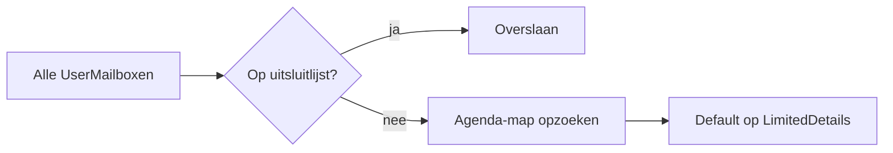

## Principe

Zonder ingrijpen bepaalt Microsoft 365 zelf wat een collega op andermans agenda ziet als er niets expliciet gedeeld is. Dat niveau ligt niet overal gelijk, en groeit vaak organisch: de een deelt zijn agenda breed, de ander niet, en niemand heeft ooit een lijn getrokken.

Dit script trekt die lijn. Het zet de standaardtoegang (het niveau dat geldt voor "Default", dus voor iedereen in de organisatie zonder aparte afspraak) op elke gebruikersmailbox naar hetzelfde niveau: **LimitedDetails**. Een collega ziet dan dat er een afspraak is en hoe lang die duurt, maar niet het onderwerp of de locatie.

&#9670; De kern in een zin

Het script overschrijft bij elke run de standaardtoegang van elke gebruikersmailbox naar LimitedDetails - behalve de mailboxen die bewust zijn uitgesloten.

## Hoe het werkt

Het script doorloopt alle mailboxen van het type `UserMailbox` en voert per mailbox vier stappen uit:

<ol class="phases"><li><b>Mailboxen ophalen.</b> <code>Get-Mailbox -ResultSize Unlimited -RecipientTypeDetails UserMailbox</code> haalt alle echte gebruikersmailboxen op. Gedeelde mailboxen en ruimtes vallen hier al buiten.</li><li><b>Uitsluiting checken.</b> Staat het adres in <code>$ExcludedMailboxes</code>, dan slaat het script deze mailbox over. Er verandert dan niets.</li><li><b>Agenda-map opzoeken.</b> <code>Get-MailboxFolderStatistics -FolderScope Calendar</code> vindt de primaire agenda-map van de mailbox.</li><li><b>Toegang zetten.</b> <code>Set-MailboxFolderPermission -User Default -AccessRights LimitedDetails</code> zet de standaardtoegang. Is er een <code>$ExcludedUser</code> opgegeven, dan krijgt die persoon expliciet <code>None</code> op elke agenda.</li></ol>

&#9670; Elke run overschrijft opnieuw

Wie zelf een ander toegangsniveau op zijn agenda heeft gezet, ziet dat bij de eerstvolgende run teruggedraaid worden naar LimitedDetails - tenzij die mailbox op de uitsluitlijst staat. Het script kent geen geheugen van eerdere, handmatige aanpassingen.

## Instellingen

Het script kent geen invoerparameters. Alle instellingen staan als variabelen bovenaan het bestand en worden bij elke run opnieuw gelezen.

| Variabele | Betekenis | Huidige waarde |
|---|---|---|
| `$GlobalAdminUPN` | Account waarmee wordt ingelogd bij Exchange Online | `aazmee@meerwaarde.onmicrosoft.com` |
| `$AccessRights` | Toegangsniveau voor "Default" | `LimitedDetails` |
| `$ExcludedUser` | Gebruiker die expliciet op "None" gezet wordt op alle agenda's | leeg (niet actief) |
| `$UseWhatIf` | `$true` = alleen simuleren, `$false` = echt doorvoeren | `$false` |
| `$AllowedRecipientTypeDetails` | Welke mailboxtypes worden verwerkt | `UserMailbox` |
| `$ExcludedMailboxes` | Mailboxen die worden overgeslagen | `martijn.kool@meerwaarde.nl`, `aazmee@meerwaarde.onmicrosoft.com` |

&#9670; UseWhatIf staat nu op onwaar

De variabele <code>$UseWhatIf</code> bepaalt of het script echt wijzigt (<code>$false</code>) of alleen simuleert (<code>$true</code>). Op dit moment staat hij op <code>$false</code>: elke run voert de wijziging direct door. Zet hem tijdelijk op <code>$true</code> om een nieuwe uitsluitlijst of een ander toegangsniveau eerst te controleren.

## Uitvoeren

<ol class="phases"><li>Open PowerShell op een werkplek met de Exchange Online-module.</li><li>Draai <code>.\Set-DefaultCalendarPermissions.ps1</code>. Het script vraagt zelf om in te loggen bij Exchange Online met het Global Admin-account.</li><li>Het script verwerkt elke mailbox en sluit de sessie af met <code>Disconnect-ExchangeOnline</code>.</li><li>De resultaten verschijnen in een grid-venster (<code>Out-GridView</code>): een rij per mailbox, met status (<code>OK</code>, <code>UITGESLOTEN</code>, <code>OVERGESLAGEN</code> of <code>FOUT</code>) en een foutmelding waar van toepassing.</li></ol>

&#9670; Test eerst met WhatIf

Zet <code>$UseWhatIf</code> op <code>$true</code> en draai het script opnieuw voor je een inhoudelijke wijziging (nieuw toegangsniveau, nieuwe uitsluiting) op de echte omgeving loslaat.

## Wat dit nog niet is

De naam "runbook" wekt de indruk dat dit al als Azure Automation-taak draait. Dat is nu niet zo. Het script is geschreven voor interactief gebruik en heeft twee eigenschappen die dat in de weg zitten:

- `Connect-ExchangeOnline -UserPrincipalName ... -ShowProgress $true` vraagt om een interactieve aanmelding. Een Automation-runbook heeft geen scherm om op in te loggen en heeft in plaats daarvan een Managed Identity of een App Registration met certificaat nodig.
- `Out-GridView` opent een Windows-venster. Dat bestaat niet op een Automation-worker. De resultaten moeten in plaats daarvan weggeschreven worden, bijvoorbeeld naar `Write-Output` of een logbestand.

Daarnaast houdt het script geen logbestand bij: de uitvoer bestaat alleen in het grid-venster van de sessie die het script draaide. Bij een fout ben je afhankelijk van wat daar op dat moment nog open staat.

&#9670; Openstaand punt

Het omzetten naar een echt Azure Automation-runbook staat open. Daarbij geldt de QUBE-standaard dat elk runbook dat wijzigingen doorvoert start met een <code>DryRun</code>-parameter die standaard op waar staat.

## Besluiten

| ADR | Besluit | Status |
|---|---|---|
| **ADR-0001 — Standaard agendatoegang op LimitedDetails, twee mailboxen uitgesloten** | De standaardtoegang op alle gebruikersmailboxen wordt gezet op LimitedDetails. | Accepted |

## Bronnen

- [Set-MailboxFolderPermission (Microsoft Learn)](https://learn.microsoft.com/powershell/module/exchange/set-mailboxfolderpermission)
- [Agenda-toegangsrechten in Exchange Online (Microsoft Learn)](https://learn.microsoft.com/exchange/collaboration-exo/calendars/calendar-permissions)
