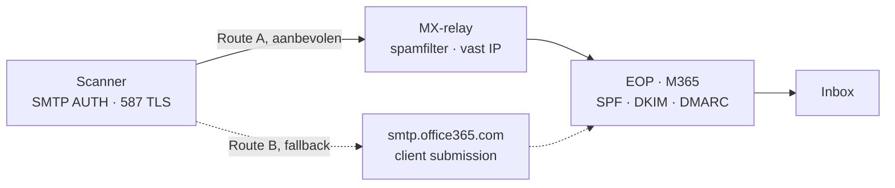

## Mailflow

Een scanner meldt zich met gebruikersnaam en wachtwoord aan bij een SMTP-server (poort `587`, STARTTLS) en geeft de mail mee. Dat kan bij een **MX-relay** — een spamfilterdienst die de mail cleant en doorzet naar de tenant — of **rechtstreeks bij Microsoft 365**. Beide eindigen bij Exchange Online Protection (EOP): daar worden SPF, DKIM en DMARC gecontroleerd en wordt gefilterd, waarna de mail in de inbox belandt. Elke schakel is een controlepunt: klopt de authenticatie, de afzender of het DNS niet, dan stopt de mail precies daar.



| # | Controlepunt | Waar te kijken |
|---|---|---|
| 1 | Apparaat SMTP-instellingen | afzender, server, poort, TLS, credentials |
| 2 | Relay-logs of M365-auth | accepted/rejected bij relay, of SMTP-AUTH bij M365 |
| 3 | Message Trace / EOP | SPF/DKIM/DMARC-resultaat, quarantaine ja/nee |
| 4 | Inbox ontvanger | aflevering — headers tonen de hele route |

## Routekeuze

De keuze draait om een vraag: loopt er nog een betaald abonnement op de MX-relay? Zo ja, dan is de **relay-route (A)** de veiligere manier om in te richten — je hoeft de Microsoft 365-tenant er niet voor te verzwakken. Vervalt het abonnement, dan stap je over op **M365-direct (B)**, waarvoor je legacy SMTP AUTH moet openzetten en een MFA-uitzondering moet maken.

<div class="call ok"><div class="ct"><span>&#9670;</span> Route A - MX-relay is de veilige keuze zolang je ervoor betaalt</div><p>Zolang het relay-abonnement actief is, richt je zo in. Waarom dit veiliger is dan M365-direct: <b>(1)</b> het apparaat authenticeert bij de relay, niet rechtstreeks bij Microsoft 365 - geen SMTP AUTH open, geen MFA-uitzondering; <b>(2)</b> de relay levert spam-/virusfiltering en een vast uitgaand IP; <b>(3)</b> het M365-account blijft volledig MFA-beschermd.</p></div>

<div class="call info"><div class="ct"><span>&#9670;</span> Route B - Microsoft 365 direct (fallback bij opzeggen)</div><p>Zeg je de relay op, dan mailt de scanner rechtstreeks via <code>smtp.office365.com</code>. Dat werkt, maar je moet dan legacy SMTP AUTH aanzetten en het scanner-account uitsluiten van MFA - een bewuste verzwakking die je compenseert met IP-restrictie, een sterk wachtwoord en bewaking.</p></div>

| Aspect | A · MX-relay | B · M365-direct |
|---|---|---|
| Server / poort | `<relay-host>` : 587 | `smtp.office365.com` : 587 |
| SMTP AUTH in M365 | Niet nodig — blijft dicht | Aanzetten (legacy) |
| MFA op scanner-account | Blijft aan | Uitzondering nodig |
| Spam-/virusfilter | Inbegrepen | Alleen EOP |
| Uitgaand IP | Vast (relay) | Wisselend |
| Voorwaarde | Abonnement actief | Altijd beschikbaar |

<div class="call caution"><div class="ct"><span>&#9670;</span> Bevinding - controleer de relay-credentials</div><p>Een <i>Invalid credentials</i> bij de relay betekent meestal een verkeerd of te zwak wachtwoord, niet per se dat de dienst weg is. Staat het wachtwoord in de wachtwoordkluis als zwak gemarkeerd, zet dan een sterk, uniek wachtwoord - dit account mag vaak legacy auth en is dus een gewild doelwit. Verifieer daarna server, poort 587 en TLS.</p></div>

## Afzender-account

Gebruik een gedeelde scanner-mailbox (bijv. `scanner@<hoofddomein>`) als afzender voor alle klant-domeinen; de overige domeinen hangen als alias onder diezelfde mailbox. Efficiënt (één licentie, één wachtwoord in de kluis), met twee vaste consequenties: **inloggen** gebeurt altijd met het **primaire** adres, en mailen namens een alias vraagt om een aparte instelling (alleen relevant bij Route B; bij de relay bepaal je de afzender op het apparaat).

| Adres | Rol |
|---|---|
| `scanner@<hoofddomein>` | Primair — hiermee logt het apparaat in |
| `scanner@<klantdomein-1>` | Alias — afzender voor klant 1 |
| `scanner@<klantdomein-n>` | Alias |

<div class="call warn"><div class="ct"><span>&#9670;</span> Onthoud dit onderscheid</div><p><b>Inloggen = primair adres.</b> <b>Afzender / From = het alias</b> van het betreffende domein. Bij Route A accepteert de relay het From-adres dat je op het apparaat instelt; bij Route B moet je aliassen expliciet toestaan.</p></div>

## Route A: MX-relay

Bij de relay-route authenticeert het apparaat bij de spamfilterdienst, die de mail cleant en via het publieke EOP-pad doorzet naar de M365-tenant. Je raakt de tenant-beveiliging niet aan: geen SMTP AUTH openzetten, geen MFA-uitzondering.

| Veld | Waarde |
|---|---|
| SMTP Server Name | `<relay-host>` |
| SMTP Port Number | `587` |
| Secure Connection (SSL/TLS) | On |
| SMTP Authentication | On |
| Auth. User Name | relay-account, bijv. `scanner@<hoofddomein>` |
| Auth. Password | sterk wachtwoord uit de kluis |
| Email Address / From | domein-alias, bijv. `scanner@<klantdomein>` |

<div class="call ok"><div class="ct"><span>&#9670;</span> Wat je in M365 NIET hoeft te doen bij Route A</div><ul><li>Geen <code>Set-CASMailbox -SmtpClientAuthenticationDisabled $false</code></li><li>Geen MFA-uitzondering / Conditional Access-exclusion</li><li>Geen Security Defaults uitzetten</li></ul><p>De relay regelt de authenticatie; de tenant blijft op de standaard-beveiliging staan. Enige aandachtspunt: het relay-wachtwoord sterk houden en het SPF-record per domein op de relay laten wijzen.</p></div>

## Route B: Microsoft 365 direct

Zonder relay verstuurt het apparaat rechtstreeks via Microsoft 365. Microsoft biedt drie manieren; voor een apparaat dat ook extern moet mailen en kan authenticeren is **SMTP client submission** de keuze.

| Route | Server & poort | Auth |
|---|---|---|
| Direct send (alleen eigen domein) | `<tenant>.mail.protection.outlook.com` : 25 | geen |
| Client submission (gekozen fallback) | `smtp.office365.com` : 587 | ja |
| Relay (connector, IP-gebaseerd) | `<tenant>.mail.protection.outlook.com` : 25 | IP |

<div class="call info"><div class="ct"><span>&#9670;</span> Let op - dit is de fallback, niet de voorkeur</div><p>Client submission verplicht je legacy SMTP AUTH open te zetten en een MFA-uitzondering te maken. Dat is precies de tenant-verzwakking die je bij Route A vermijdt. Kies dit dus alleen als er geen relay (meer) is.</p></div>

### MFA & SMTP AUTH

SMTP AUTH op `smtp.office365.com` is legacy authentication en kan geen interactieve MFA-prompt tonen — herkenbaar aan `535 5.7.139 / Invalid credentials`. Bij Route B behandel je het scanner-account als service-account: geen interactieve MFA, wel sterk afgeschermd.

| # | Blokkade | Oplossing |
|---|---|---|
| 1 | Security Defaults aan → legacy geblokkeerd | Uitzetten en vervangen door Conditional Access |
| 2 | Conditional Access dwingt MFA af | Scanner-account uitsluiten van de MFA-policy |
| 3 | SMTP AUTH staat standaard uit | Per mailbox aanzetten |

<ol class="phases"><li>SMTP AUTH aanzetten voor de scanner-mailbox.</li><li>Tenant-brede stand controleren (mag niet globaal geblokkeerd zijn).</li><li>Security Defaults nalopen in het Entra admin center; stap over op Conditional Access voor je ze uitzet.</li><li>Scanner uitsluiten van MFA (Conditional Access-exclusion of per-user MFA disabled), liefst met IP-restrictie op het kantoor-/apparaat-IP.</li><li>Sterk wachtwoord in de kluis vastleggen.</li></ol>

```powershell
Set-CASMailbox -Identity scanner@<hoofddomein> -SmtpClientAuthenticationDisabled $false
Get-TransportConfig | Format-List SmtpClientAuthenticationDisabled
```

<div class="call caution"><div class="ct"><span>&#9670;</span> Beveiligingsafweging</div><p>Een gedeeld account zonder MFA dat legacy auth mag, is een bewuste uitzondering. Compenseer met IP-restrictie, een sterk uniek wachtwoord en aanmeldbewaking. Dit is precies de reden waarom Route A de voorkeur heeft zolang de relay betaald wordt.</p></div>

### Alias-afzender

Bij Route B verstuur je standaard alleen als het primaire adres. Wil je namens een alias mailen (`From = scanner@<klantdomein>`) zonder herschrijving of `5.7.3 Not allowed to submit as this address`, zet dan tenant-breed `SendFromAliasEnabled` aan. Bij Route A bepaalt het apparaat de afzender en accepteert de relay die — deze setting is dan niet nodig.

```powershell
Set-OrganizationConfig -SendFromAliasEnabled $true
```

<div class="call info"><div class="ct"><span>&#9670;</span> Let op de DNS-consequentie</div><p>Verstuur je namens <code>scanner@&lt;klantdomein&gt;</code>, dan wordt dat domein gecontroleerd op SPF/DKIM/DMARC. Elk klant-domein dat als afzender dient, moet dus zijn eigen DNS op orde hebben.</p></div>

## Apparaat-instellingen

Open de webinterface (IP in de browser), log in met de gegevens uit de wachtwoordkluis; bij een nieuw apparaat eerst een kluis-record aanmaken. Vul onder *User Email Profile → SMTP Server* de waarden in. Let op **Secure Connection = On**; die staat vaak per ongeluk uit.

<ol class="phases"><li>Ga naar de webinterface: typ het IP van het apparaat in de browser.</li><li>Log in met de beheergegevens uit de kluis (nieuw apparaat = nieuw record).</li><li>Vul het SMTP-profiel in (per route hieronder).</li><li>Zet onder <i>Printing Services → [DEFAULT]</i> <b>Auto Specify Sender = On</b> met het afzenderadres.</li></ol>

Route A · relay:

| Veld | Waarde |
|---|---|
| SMTP Server Name | `<relay-host>` |
| SMTP Port Number | `587` |
| Secure Connection | On |
| Auth. User Name | relay-account |
| Auth. Password | sterk wachtwoord uit de kluis |
| From | domein-alias |

Route B · M365:

| Veld | Waarde |
|---|---|
| SMTP Server Name | `smtp.office365.com` |
| SMTP Port Number | `587` (STARTTLS) |
| Secure Connection | On |
| Auth. User Name | primair adres `scanner@<hoofddomein>` |
| Auth. Password | uit de kluis (of app-wachtwoord) |
| From | domein-alias (vereist SendFromAlias) |

<div class="call warn"><div class="ct"><span>&#9670;</span> Auto Specify Sender = On</div><p>Zo vertrekt elke scan vanaf een vast adres en krijgt de gebruiker geen "Kies sender"-scherm.</p></div>

## Adresboek & Use Name As

De meest voorkomende oorzaak van verdwenen scans. Staat een gebruiker verkeerd in het adresboek, dan gebruikt het apparaat het gebruikersadres als From in plaats van het scanneradres → verzenddomein klopt niet met SPF/DKIM → **DMARC-fail** → quarantaine, zonder foutmelding op het apparaat.

<ol class="phases"><li>Ga naar Address Book → zoek de gebruiker → vink aan.</li><li>Detailed View / Edit → Protection → Use Name As.</li><li>Zorg dat alleen <b>Destination</b> aangevinkt staat.</li><li>Zorg dat <b>Sender</b> absoluut NIET aangevinkt staat.</li></ol>

<div class="call caution"><div class="ct"><span>&#9670;</span> Zo ziet een fout eruit in de headers</div><p>De <code>header.from</code> is dan een gebruikersdomein in plaats van het scanneradres, met <code>dmarc=fail action=quarantine</code> als gevolg. Herken je dat, controleer dan Use Name As voor die gebruiker.</p></div>

## DNS: SPF, DKIM, DMARC

Het SPF-record hangt af van de route. Bij Route A laat je SPF naar de relay wijzen; bij Route B naar Microsoft. Publiceer daarnaast DKIM en DMARC. Zonder correct DNS belandt post in spam of quarantaine. Stap je van A naar B (of terug), pas dan de SPF-include aan — een oude include laten staan veroorzaakt SPF-fouten.

| Route | SPF-include |
|---|---|
| A · MX-relay | `v=spf1 include:<relay-spf> ~all` |
| B · M365-direct | `v=spf1 include:spf.protection.outlook.com -all` |

```
nslookup -type=txt <domein>
nslookup -type=cname selector1._domainkey.<domein>
nslookup -type=txt _dmarc.<domein>
```

## Testen

Test de route eerst los van het apparaat, zodat je weet of het aan de mailserver ligt of aan de apparaatconfiguratie. Draai op de pc van de gebruiker of via het RMM. Werkt de test wel maar het apparaat niet, dan zit het in de apparaatinstelling (SSL uit, poort, servernaam).

Route A · relay:

```powershell
$recipient = "gebruiker@domein.com"
$from      = "scanner@<klantdomein>"
$secpasswd = ConvertTo-SecureString "STERK_RELAY_WACHTWOORD" -AsPlainText -Force
$creds     = New-Object System.Management.Automation.PSCredential ($from, $secpasswd)
Send-MailMessage -From $from -To $recipient -Subject "MX-relay test" -Body "Test via relay" -SmtpServer "<relay-host>" -Port 587 -UseSsl -Credential $creds
```

Route B · M365:

```powershell
$recipient = "gebruiker@extern-domein.com"
$from      = "scanner@<hoofddomein>"    # inloggen = primair
$sendas    = "scanner@<klantdomein>"    # From = alias
$secpasswd = ConvertTo-SecureString "WACHTWOORD_UIT_KLUIS" -AsPlainText -Force
$creds     = New-Object System.Management.Automation.PSCredential ($from, $secpasswd)
Send-MailMessage -From $sendas -To $recipient -Subject "M365 SMTP test" -Body "Test via office365" -SmtpServer "smtp.office365.com" -Port 587 -UseSsl -Credential $creds
```

| Foutcode | Betekenis & fix |
|---|---|
| `535 5.7.139` Invalid credentials | Relay: verkeerd/zwak wachtwoord. M365: SMTP AUTH uit of MFA blokkeert |
| `5.7.3` Not allowed to submit | Route B: From is niet gelijk aan inlog en SendFromAliasEnabled staat uit |
| `5.7.57` Not authenticated | Geen/verkeerde TLS → controleer UseSsl / poort 587 |
| `dmarc=fail` | Verkeerde From (adresboek) of SPF past niet bij route |

<div class="call info"><div class="ct"><span>&#9670;</span> Send-MailMessage is "obsolete"</div><p>Het werkt prima voor een snelle test. Voor productie of automatisering is Microsoft Graph (<code>Mail.Send</code>) de aanbevolen weg.</p></div>

## Best practices & hardening

De veiligste inrichting is Route A zolang het relay-abonnement loopt — de tenant blijft dan volledig MFA-beschermd. Onafhankelijk van de route gelden de principes hieronder. Let vooral op het wachtwoord: een als zwak gemarkeerd wachtwoord op een scanner-account (dat vaak legacy auth mag) is een concreet risico.

| Principe | Toelichting |
|---|---|
| Relay verkiezen zolang betaald | Route A houdt de tenant dicht — geen SMTP AUTH / MFA-uitzondering |
| Sterk, uniek wachtwoord | Vervang een zwak wachtwoord direct; in de kluis; roteer bij lek-vermoeden |
| Isoleer het service-account | Alleen dit account krijgt (bij Route B) de MFA-uitzondering — nooit uitbreiden |
| IP-restrictie | Beperk aanmelden/relayen tot kantoor-/apparaat-IP |
| Aanmeldbewaking | Alerts op verdachte sign-ins van het scanner-account |
| Toekomst: Graph API | Voor server-side integraties Microsoft Graph `Mail.Send` i.p.v. SMTP AUTH |

## Checklist

Route A · MX-relay (aanbevolen zolang betaald):

<ol class="phases"><li>Relay-abonnement actief bevestigd.</li><li>Sterk wachtwoord in de kluis (vervang een zwak wachtwoord).</li><li>Apparaat: <code>&lt;relay-host&gt;</code>:587, Secure Connection On, auth aan.</li><li>SPF per domein → relay-include.</li><li>M365-tenant ongewijzigd (geen SMTP AUTH / MFA-uitzondering).</li></ol>

Route B · M365-direct (fallback):

<ol class="phases"><li>SMTP AUTH aan voor de scanner-mailbox.</li><li>Scanner uitgesloten van MFA (liefst met IP-restrictie).</li><li><code>SendFromAliasEnabled $true</code>.</li><li>Apparaat: <code>smtp.office365.com</code>:587, Secure Connection On.</li><li>SPF per domein → Microsoft-include.</li></ol>

Beide routes:

<ol class="phases"><li>Adresboek: Use Name As → alleen Destination, Sender uit.</li><li>DKIM en DMARC gepubliceerd.</li><li>Auto Specify Sender = On.</li><li>PowerShell-test geslaagd (niet in quarantaine).</li><li>Message Trace: dmarc=pass.</li><li>Echte scan door gebruiker bevestigd.</li></ol>

<div class="call ok"><div class="ct"><span>&#9670;</span> Eindresultaat</div><p>Het apparaat verstuurt scan-to-email via de veiligste beschikbare route: de MX-relay zolang het abonnement loopt (tenant blijft dicht), of M365-direct als fallback - in beide gevallen namens het juiste domein-alias, met DMARC-pass en een sterk afgeschermd account.</p></div>

## Bronnen

Deze leidraad leunt op de Microsoft 365-documentatie over mail versturen vanaf apparaten en op de eigen QUBE-praktijk bij het inrichten van multifunctionals.

- [How devices and applications authenticate to Microsoft 365](https://learn.microsoft.com/en-us/exchange/mail-flow-best-practices/how-to-set-up-a-multifunction-device-or-application-to-send-email-using-microsoft-365-or-office-365)
- [Enable or disable authenticated client SMTP submission (SMTP AUTH)](https://learn.microsoft.com/en-us/exchange/clients-and-mobile-in-exchange-online/authenticated-client-smtp-submission)
- [Send email from a Microsoft 365 alias (SendFromAliasEnabled)](https://learn.microsoft.com/en-us/microsoft-365/admin/email/send-from-aliases)
