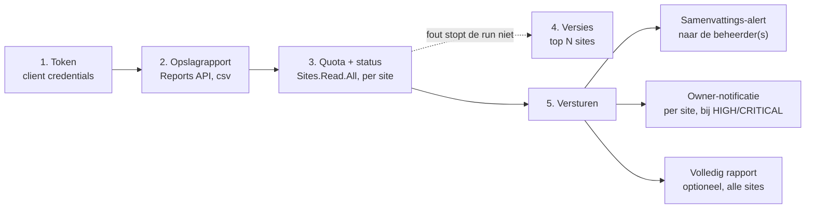

## Waar dit over gaat

SharePoint Online waarschuwt niemand als een site bijna vol zit. Een gebruiker merkt het pas als uploaden ineens mislukt, en een beheerder ziet het pas als hij toevallig het Admin Center opent. Bij een tenant met tientallen of honderden sites is dat geen incident meer, dat is een kwestie van tijd.

Dit runbook (`Check-SharePointStorage-Runbook.ps1`) draait op een schema in Azure Automation, haalt het opslaggebruik per site en per tenant op via de Graph Reports API, classificeert elke site op resterende capaciteit, en stuurt een e-mail voor als iets een drempel nadert. Het gaat verder dan het rapport uit het Admin Center: het haalt ook de werkelijke per-site quota op, herkent sites zonder eigen limiet, en telt versiegeschiedenis mee als aparte risicofactor.

&#9670; De kern in een zin

Het script leest en waarschuwt. Het verwijdert, verplaatst of comprimeert niets vanzelf - elke opruimactie blijft mensenwerk, dit script zorgt er alleen voor dat iemand op tijd weet dat het nodig is.

## Hoe het rapport tot stand komt

Het script doorloopt bij elke run dezelfde vijf stappen. Elke stap heeft een eigen Graph-endpoint en een eigen foutafhandeling, zodat een fout in de versiecontrole (stap 4) de rest van de run niet blokkeert.

Alleen stap 5 wordt overgeslagen in DryRun; stap 1 t/m 4 draaien altijd, zodat je ook in DryRun de echte data ziet.

## Authenticatie en tokenbeheer

Het script praat met Graph via de OAuth2 client credentials flow: geen gebruiker, geen interactieve login, alleen een App Registration met een clientsecret. Dat past bij een runbook dat onbeheerd draait.

| Recht (Application) | Waarvoor |
|---|---|
| `Reports.Read.All` | Het opslagrapport per site ophalen (Reports API) |
| `Sites.Read.All` | De werkelijke per-site quota en versiegeschiedenis per bibliotheek |
| `Mail.Send` | De alert- en rapportmail versturen namens de sender-mailbox |
| `GroupMember.Read.All` | Owners van de M365 Group achter een site opzoeken, voor de individuele notificatie |

Alle vier vereisen **admin consent** — dit zijn applicatierechten, niet gedelegeerde rechten, dus een gewone gebruiker kan ze niet zelf toestaan.

<ol class="phases"><li>Maak een App Registration aan in Entra ID (of hergebruik een bestaande die alleen voor dit doel dient).</li><li>Voeg de vier rechten hierboven toe onder <b>API permissions &rsaquo; Application permissions</b>, en klik <b>Grant admin consent</b>.</li><li>Maak een <b>client secret</b> aan en noteer de waarde meteen - die is na het sluiten van het scherm niet meer terug te zien.</li><li>Zet Client ID, Tenant ID en het secret in de Automation Variables, zie het volgende hoofdstuk.</li></ol>

Het token wordt opgehaald met `Request-GraphToken` en automatisch ververst zodra het bijna verloopt — met een marge van 5 minuten, zodat een langlopende versiecontrole nooit midden in een aanroep zonder geldig token komt te zitten. Het secret zelf wordt pas vlak voor de aanvraag naar platte tekst omgezet en direct daarna weer gewist (in een `finally`-blok, dus ook bij een fout).

&#9670; Het secret staat nooit in een log

Ook niet bij een fout. Faalt de tokenaanvraag, dan logt het script de foutmelding van Entra ID, nooit de body die verstuurd is. Wie zelf debug-code toevoegt die de hele request logt, moet dat expliciet uit het secret filteren.

## Het Automation Account inrichten

Het script leest zijn configuratie uit Azure Automation Variables. Dat is bewust: dezelfde runbook-code werkt zo voor elke klant-tenant, alleen de variabelen verschillen.

| Variable | Type | Inhoud |
|---|---|---|
| `GraphClientId` | Tekst | App Registration client ID |
| `GraphTenantId` | Tekst | Tenant ID van de klant |
| `GraphClientSecret` | **Encrypted** | Het clientsecret |
| `GraphSenderUpn` | Tekst | Mailbox die als afzender verstuurt (Exchange Online quota van deze mailbox) |
| `GraphAdminEmail` | Tekst | Een of meer adressen, gescheiden door `;` of `,` |
| `SPOTenantName` | Tekst | Naam voor in de titel van elke mail |
| `SPOTenantQuotaGB` | Tekst/getal | Tenant-quota in binaire GB (1 TB = 1024 GB); zie de rekenregel hieronder |

&#9670; Reken de tenant-quota in binaire GB

Het licentieoverzicht van Microsoft noemt TB. Vermenigvuldig met 1024 om bij binaire GB uit te komen, niet met 1000: 1,82 TB wordt dus 1,82 &times; 1024 = 1863,68, afgerond 1864 GB. Een factor 1000 in plaats van 1024 geeft een tenant-percentage dat structureel net iets te optimistisch is.

<ol class="phases"><li>Maak in het Azure Automation Account de zeven variabelen hierboven aan.</li><li>Zet <code>GraphClientSecret</code> aan als <b>Encrypted</b> - dat is een aparte schakelaar bij het aanmaken van de variable, niet iets wat achteraf te zetten is.</li><li>Importeer het runbook <code>Check-SharePointStorage-Runbook.ps1</code> als PowerShell 7.2-runbook.</li><li>Voer eerst een test uit met <code>-SendTestMail $true</code> om de Graph-verbinding te bevestigen, zie het hoofdstuk Gebruik.</li><li>Zet daarna een <b>Schedule</b> op het runbook, bijvoorbeeld maandelijks of wekelijks, met de parameters die bij die klant horen.</li></ol>

## Drempelwaarden en classificatie

Elke site krijgt een status op basis van **resterend** percentage, niet gebruikt percentage — een site die voor 96% vol zit heeft 4% resterend, en dat is de waarde die telt. Denk aan een benzinemeter: een tank van 5 liter met 1 liter erin staat er hetzelfde bij als een tank van 80 liter met 16 liter erin — allebei 20% resterend.

| Status | Resterende capaciteit |
|---|---|
| OK | Meer dan 20% |
| WARNING | 20% of minder |
| HIGH | 10% of minder |
| CRITICAL | 5% of minder |
| POOL | Quota ≥ 25 TB — geen eigen limiet, telt niet individueel mee |

Diezelfde vier drempels gelden ook voor de **tenant als geheel**: het script telt het totale gebruik over alle sites op en zet dat af tegen de tenant-quota uit `SPOTenantQuotaGB`.

Sommige sites hebben geen eigen limiet: ze delen de resterende tenant-opslag, en die waarde kan oplopen tot tientallen TB. Zonder correctie zou zo'n site altijd "ruim voldoende" lijken, ook als de tenant zelf krap zit. Daarom krijgt een site met een quota van 25 TB of meer de status **POOL**: hij telt mee in het tenant-totaal, maar wordt niet individueel op de drempels beoordeeld en krijgt geen owner-notificatie.

&#9670; Twee bronnen voor de quota, met voorrang

Het CSV-rapport uit de Reports API bevat een quota-kolom, maar die kan afwijken van de werkelijke drive-quota. Het script haalt daarom per site ook <code>GET /sites/{id}/drive?$select=quota</code> op en geeft die waarde voorrang. Alleen als die aanroep faalt (bijvoorbeeld 403 op een site zonder toegang) valt het terug op de CSV-waarde, zichtbaar in de kolom QuotaSource (Drive, CSV of TenantPool).

## Versiegeschiedenis bewaken

Oude versies van bestanden tellen niet mee in het per-site opslagcijfer uit de Reports API, maar ze tellen wel mee in de werkelijke tenant-opslag. Een bibliotheek met duizenden versies per bestand kan zo een aanzienlijk deel van de tenant-quota opslokken zonder dat het rapport dat laat zien.

Het script telt versies daarom apart, via `GET /drives/{id}/root/search(q='')` met `$expand=versions`, voor de meest gebruikte sites en daarbinnen de meest gebruikte bibliotheken:

| Parameter | Standaard | Betekenis |
|---|---|---|
| `VersionTopSites` | 5 | Aantal sites (op gebruik gesorteerd) dat wordt gecontroleerd |
| `VersionTopLibraries` | 3 | Aantal bibliotheken per site dat wordt gecontroleerd |
| `VersionCountWarning` | 5000 | Vanaf hoeveel versies een bibliotheek als HOOG wordt gemarkeerd |

&#9670; Dit kan lang duren bij grote tenants

Graph staat ongeveer 10.000 requests per 10 minuten toe voor Sites.Read.All. Een tenant met veel sites en grote bibliotheken kan tegen die grens aanlopen. Zet <code>VersionTopSites</code> en <code>VersionTopLibraries</code> laag (tot maximaal 5) bij een grote klant, en verhoog pas als blijkt dat de run ruim binnen de tijd blijft.

Een versie zonder size-metadata telt wel mee in het aantal, maar niet in de geschatte opslaggrootte. Ligt dat percentage boven 20%, dan meldt het script dat expliciet: de geschatte versie-opslag is dan een onderschatting, geen foutieve waarde.

## Mail en notificaties

Het script kan drie soorten mail versturen, elk met een eigen doel:

| Mail | Naar | Wanneer |
|---|---|---|
| Samenvattings-alert | Beheerder(s), `GraphAdminEmail` | Zodra er minstens een site met status WARNING/HIGH/CRITICAL is |
| Owner-notificatie | Site-eigenaren | Per site met status HIGH of CRITICAL |
| Volledig rapport | Beheerder(s) | Optioneel, met `SendFullReport`, altijd als er alerts zijn en desgewenst ook zonder |

Owner-e-mailadressen komen uit de **M365 Group** achter de site (`GroupMember.Read.All`): het script zoekt de group met `sharepointSiteId eq '{id}'` en leest daar de owners van. Vindt het geen group — bijvoorbeeld bij een klassieke SharePoint-site zonder Teams of Groepen erachter — dan valt de notificatie terug op de beheerder(s), zodat er nooit een waarschuwing in het niets verdwijnt.

Alle drie de mails gebruiken dezelfde e-mailveilige HTML-opmaak in de QUBE-huisstijl: tabellen met inline styles, zodat ze ook in mailclients correct tonen die geen extern CSS laden.

&#9670; DryRun staat standaard aan

Zolang <code>DryRun</code> op <code>$true</code> staat, doorloopt het script alle stappen - data ophalen, classificeren, versies tellen - maar slaat elke verzendstap over en logt in plaats daarvan wat er verstuurd zou zijn. Dat is bewust de standaard: een nieuwe versie is zo veilig te testen zonder dat er mail naar echte site-eigenaren gaat.

## Gebruik: parameters en een eerste run

| Parameter | Type | Standaard | Doet |
|---|---|---|---|
| `DryRun` | bool | `$true` | Verwerkt data, verstuurt geen mail |
| `SendFullReport` | bool | `$true` | Stuurt ook een overzicht van alle sites |
| `SendTestMail` | bool | `$false` | Stuurt alleen een testmail, geen data-ophaling |
| `Period` | tekst | `D30` | Periode voor het Graph-rapport: D7, D30, D90 of D180 |
| `TenantTotalQuotaInputGB` | getal | uit Automation Variable | Overschrijft `SPOTenantQuotaGB` voor deze run |
| `TopSitesInReport` | getal | 5 | Aantal sites getoond in de mail; leeg voor alle sites |
| `VersionTopSites` / `VersionTopLibraries` | getal | 5 / 3 | Zie het hoofdstuk Versiecontrole |
| `VersionCountWarning` | getal | 5000 | Zie het hoofdstuk Versiecontrole |

<ol class="phases"><li><b>Testmail.</b> Draai het runbook met <code>-SendTestMail $true</code>. Dit bevestigt alleen dat Mail.Send werkt, zonder data op te halen.</li><li><b>DryRun.</b> Draai zonder <code>SendTestMail</code>, met <code>DryRun $true</code> (de standaard). Controleer in de Automation Job-uitvoer of de statusverdeling en de owner-notificaties kloppen.</li><li><b>Live.</b> Pas als stap 2 er goed uitziet: zet <code>DryRun $false</code> in de Automation Job-parameters en draai opnieuw, of laat het schema het overnemen.</li></ol>

&#9670; Parameters zijn bool, geen switch

De Azure Automation Job-UI stuurt parameters altijd als tekst ("True" / "False"). Een <code>[switch]</code>-parameter wijst dat af met een transformatiefout. Vul in de Job-parameters daarom <code>True</code> of <code>False</code> in, geen <code>-DryRun</code> zonder waarde.

## Bekende afwijkingen en grenzen

- **Vertraging van 48 tot 72 uur.** De Graph Reports API loopt achter op het realtime Admin Center. Een site die net is opgeschoond, laat dat pas na een paar dagen in dit rapport zien.
- **Prullenbak en versie-opslag tellen niet mee per site.** Het rapport meet uitsluitend actief gebruikte opslag per site. Beide tellen wel mee in het tenant-totaal (de Microsoft-quota), dus de som van alle sites in dit rapport komt niet exact overeen met het tenant-totaal bovenaan de mail.
- **POOL-sites worden niet individueel beoordeeld.** Zie het hoofdstuk Drempelwaarden.
- **Tenant-quota is handmatig.** Verandert de licentie van de klant, dan moet `SPOTenantQuotaGB` bijgewerkt worden. Het script kan dat getal niet zelf afleiden uit Graph.

&#9670; Wat dit script niet doet

Het verwijdert geen bestanden, zet geen versiebeperking, en wijzigt geen quota. Het signaleert. De aanbevelingen in elke mail (versiebeperking instellen, opslag uitbreiden) blijven mensenwerk.

## Besluiten

Deze besluiten gelden QUBE-breed voor Automation-runbooks die mail versturen of gevoelige gegevens verwerken, niet alleen voor dit script.

| ADR | Besluit | Status |
|---|---|---|
| **ADR-0001 — DryRun = waar als standaard** | Elk Automation-runbook dat mail verstuurt of een wijziging doorvoert, krijgt een parameter `DryRun` met standaardwaarde `$true`. | Accepted |
| **ADR-0002 — Clientsecret nooit in het log** | Het clientsecret wordt uit de Automation Variable gehaald als SecureString, pas vlak voor de tokenaanvraag omgezet naar platte tekst, en meteen na de aanvraag weer gewist (ook bij een fout). | Accepted |
| **ADR-0003 — 25 TB+ site = tenant-pool** | Een site waarvan de opgehaalde drive-quota 25 TB of meer bedraagt, krijgt de status POOL in plaats van een OK/WARNING/HIGH/CRITICAL-indeling. | Accepted |

## Bronnen

Waar dit script op leunt: de Graph-documentatie voor rapportages en site-opslag.

- [SharePoint site usage detail rapport](https://learn.microsoft.com/en-us/graph/api/reportroot-getsharepointsiteusagedetail)
- [Drive-quota per site opvragen](https://learn.microsoft.com/en-us/graph/api/drive-get)
- [DriveItem versions en $expand](https://learn.microsoft.com/en-us/graph/api/driveitem-list-versions)
- [Mail versturen namens een gedeelde mailbox](https://learn.microsoft.com/en-us/graph/api/user-sendmail)
- [Servicelimieten Microsoft Graph, throttling](https://learn.microsoft.com/en-us/graph/throttling-limits)
