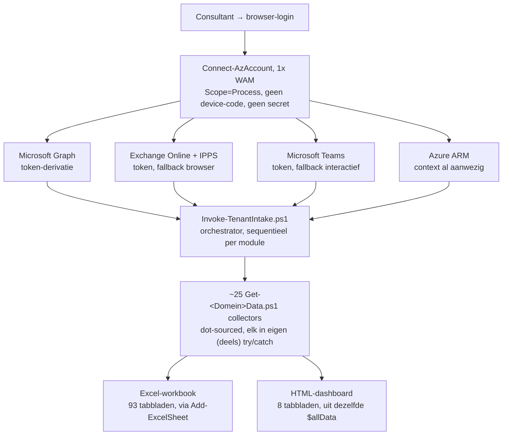
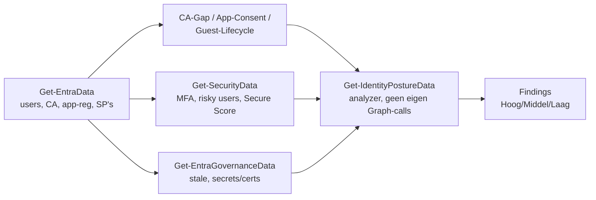

## Waarom dit framework bestaat

Voordat QUBE bij een klant aan de slag kan, moet eerst duidelijk zijn hoe de omgeving eruitziet: wie heeft welke rechten, staat MFA overal aan, is de mail beveiligd, zijn de apparaten up-to-date, hoe staat het met Azure. Dat handmatig nalopen kost een dag of meer, en twee consultants die hetzelfde nalopen komen zelden tot precies dezelfde lijst.

Het Tenant Intake Framework is een verzameling PowerShell-scripts die deze inventarisatie automatiseert: een orchestrator (`Invoke-TenantIntake.ps1`) authenticeert één keer interactief bij een klanttenant, roept daarna ~25 losse databron-scripts aan (Entra, Exchange, SharePoint, Teams, Intune, Azure, Copilot, Power Platform, ...), en schrijft het resultaat weg naar een Excel-workbook en een HTML-dashboard. Daarnaast bestaan er 7 zelfstandige diepte-audit-scripts en 5 rapportagetools die op het resultaat verder bouwen (vergelijken, herstelplan, consultancyverslag).

Dit hoofdstuk documenteert hoe dat geheel in elkaar zit: per domein welke scripts er zijn, welke Graph/Azure/Exchange-permissies ze nodig hebben, welke data ze ophalen, en - als apart hoofdstuk - of de manier waarop dit gebeurt aansluit bij Microsoft's eigen aanbevelingen voor least privilege, paginering en foutafhandeling.

<div class="call info"><div class="ct"><span>&#9670;</span> Voor wie dit is</div><p>Dit is een intern naslagwerk voor QUBE-consultants die het framework draaien, onderhouden of uitbreiden met een nieuwe module. Het vervangt niet het README.md in de projectmap (dat blijft de snelstartgids met commando's); dit document legt uit <i>waarom</i> het zo werkt.</p></div>

## Architectuur: van login tot rapport

`Invoke-TenantIntake.ps1` is de orchestrator. Hij doet zelf geen dataverzameling — dat is de taak van de ~25 losse `Get-<Domein>Data.ps1`-scripts, die hij pas op het moment dat ze nodig zijn inlaadt via dot-sourcing (`. (Resolve-LocalScriptPath -ScriptName '...')`). Elke collector is een functie die een hashtable met collecties teruggeeft; de orchestrator schrijft die weg naar Excel (`Add-ExcelSheet`) en bewaart hem ook in-memory in `$allData`, dat aan het eind in zijn geheel wordt doorgegeven aan `New-HtmlReport.ps1`.



<div class="call info"><div class="ct"><span>&#9670;</span> Volgorde van collectie</div><p>Licenties &#8594; Entra ID (+ Org, CA-gap, App consent, Guest lifecycle) &#8594; Security &#8594; Exchange (+ deep, mail-security) &#8594; SharePoint (+ exposure) &#8594; Teams (+ Defender O365, Compliance) &#8594; Intune (+ deep, baseline) &#8594; Azure (+ gov, cost hygiene) &#8594; Identity Posture &#8594; Copilot &#8594; Entra Governance &#8594; PIM &#8594; Power Platform. Sequentieel, niet parallel.</p></div>

<div class="call warn"><div class="ct"><span>&#9670;</span> Foutisolatie is niet overal gelijk</div><p>De acht hoofdmodules (Licenties, Entra, Security, Exchange, SharePoint, Teams, Intune, Azure) hebben zelf geen <code>try/catch</code> om hun <code>Get-*Data</code>-aanroep - een fout dáár breekt de hele scan af. Alle onderliggende sub-modules (CA-gap, App consent, PIM, Copilot, ...) zijn wel geïsoleerd. Zie ADR-0003 en het hoofdstuk Valkuilen.</p></div>

## Authenticatie en rechten: één login, alleen lezen

<ol class="phases"><li>De consultant start <code>Invoke-TenantIntake.ps1</code> vanuit een interactieve desktopsessie (geen server, geen CI-runner - een browserpop-up moet kunnen verschijnen).</li><li><code>Connect-AzAccount -Scope Process -SkipContextPopulation</code> is de enige plek waar om credentials wordt gevraagd.</li><li>Voor Graph, Exchange Online, IPPS en Teams wordt een los token <i>afgeleid</i> van die ene sessie (<code>Get-AzAccessToken -ResourceUrl ...</code>) - geen nieuwe prompt, geen ander account.</li><li>Mislukt tokenderivatie (bv. Teams' AADSTS530004 bij gastaccounts), dan valt het script terug op een schone interactieve login waarbij de consultant zelf het beheerdersaccount van de doeltenant kiest (<code>-TeamsInteractiveLogin</code>).</li><li>Aan het eind sluit een <code>finally</code>-blok elke sessie netjes af, ook als de scan halverwege faalt.</li></ol>

De aangevraagde Graph-scopes (`Get-GraphScopes` in `Invoke-TenantIntake.ps1`) zijn stuk voor stuk leesscopes:

```
User.Read.All, Group.Read.All, Policy.Read.All, Directory.Read.All,
AuditLog.Read.All, Reports.Read.All, SecurityEvents.Read.All,
RoleManagement.Read.Directory, PrivilegedAccess.Read.AzureAD,
PrivilegedEligibilitySchedule.Read.AzureADGroup, IdentityRiskyUser.Read.All,
Application.Read.All, DelegatedPermissionGrant.Read.All,
UserAuthenticationMethod.Read.All, Organization.Read.All, Domain.Read.All,
AccessReview.Read.All, EntitlementManagement.Read.All,
LifecycleWorkflows.Read.All, SharePointTenantSettings.Read.All,
Sites.Read.All, DeviceManagementConfiguration.Read.All,
DeviceManagementManagedDevices.Read.All, DeviceManagementApps.Read.All
```

| Workload | Vereiste rol | Type |
|---|---|---|
| Entra ID / M365 (Graph) | Global Reader + Security Reader | Reader |
| Exchange Online | View-Only Organization Management | Reader |
| SharePoint | SharePoint Administrator | Reader (geen schrijfrechten gebruikt) |
| Teams | Teams Service Administrator (read) | Reader |
| Intune | Intune Service Administrator (read) | Reader |
| Azure | Reader op alle subscriptions | Reader |

<div class="call caution"><div class="ct"><span>&#9670;</span> Eén bekende afwijking</div><p><code>Get-SSOAppAudit.ps1</code> vraagt de scope <code>AppRoleAssignment.ReadWrite.All</code> aan, terwijl het script zelf uitsluitend leest. Functioneel onschuldig, maar het schendt least privilege: een grotere bevoegdheid dan het script gebruikt. Zie ADR-0002.</p></div>

<div class="call info"><div class="ct"><span>&#9670;</span> Buiten de hoofdorchestrator: app-only kan wel</div><p>Drie standalone diepte-audits (<code>GET-ConditionalAccessAudit.ps1</code>, <code>Get-EntraIDGovernanceAudit.ps1</code>, <code>Get-CopilotReadinessAudit.ps1</code>) ondersteunen optioneel app-only auth via <code>-ClientId/-ClientSecret/-TenantId</code>. Geen hardcoded secrets aangetroffen - wel is <code>-ClientSecret</code> in alle drie getypeerd als <code>[string]</code> (plaintext) in plaats van <code>[securestring]</code>, pas intern omgezet. Zie het hoofdstuk Toetsing aan Microsoft best practices.</p></div>

## Identity & Security: Entra, MFA, CA, PIM

Het grootste cluster van het framework: basisgegevens (`Get-EntraData`), organisatie-instellingen (`Get-TenantOrgData`), en zes gespecialiseerde analyses bovenop diezelfde data (CA-gaps, app-consent-risico, gastlevenscyclus, governance/staleness, PIM, en de losstaande identity-posture-aggregator die alles samenvat tot bevindingen).

| Script | Doel | Kernscopes/rollen | Belangrijkste output |
|---|---|---|---|
| `Get-EntraData.ps1` | Basis: users, guests, adminrollen, groepen, CA, app-registraties, SP's | `User.Read.All`, `Group.Read.All`, `Policy.Read.All` | Entra-Users, -Gasten, -AdminRollen, -CA, -AppReg |
| `Get-TenantOrgData.ps1` | Org-info, domeinen, auth-policy, hybrid-config, governance-features | `Policy.Read.All`, `Organization.Read.All`, `IdentityGovernance.Read.All` | Org-Info, Org-Domains, Org-AuthPolicy |
| `Get-SecurityData.ps1` | MFA-registratie, risky users, sign-in logs, Secure Score | `UserAuthenticationMethod.Read.All`, `IdentityRiskyUser.Read.All` | Sec-MFA, Sec-RiskyUsers, Sec-SecureScore |
| `Get-ConditionalAccessGapData.ps1` | CA-dekking op 7 controlepunten (MFA-admin, legacy auth, risk-based, ...) | `Policy.Read.All` | CA-GapCoverage |
| `Get-AppConsentRiskData.ps1` | App-owners, credential-hygiëne, hoog-risico OAuth-grants | `Application.Read.All`, `DelegatedPermissionGrant.Read.All` | AppConsent-Apps, -Grants |
| `Get-GuestLifecycleData.ps1` | Gast-staleness, memberships, guest-admins, domeinspreiding | (hergebruikt Entra-data) | Guest-Lifecycle, -Domains |
| `Get-EntraGovernanceData.ps1` | Stale accounts (90/180d), verlopen app-secrets/certs | `User.Read.All`, `Application.Read.All` | Gov-StaleAccounts, -AppSecrets |
| `Get-IdentityPostureData.ps1` | **Analyzer, geen eigen Graph-calls**: break-glass, admin-hygiëne, app-risico | (verwerkt bovenstaande output) | Posture-BreakGlass, -AdminHygiene, -AppRisk |
| `Get-PIMData.ps1` | Actief/eligible/permanent privileged, rolbeleid, activatiehistorie, dekkingsgraad | `RoleManagement.Read.Directory`, `PrivilegedAccess.Read.AzureAD` | PIM-Actief, -Eligible, -Permanent, -Rolbeleid |



Standalone (los draaien, dupliceren delen van deze logica): `GET-ConditionalAccessAudit.ps1`, `Get-EntraIDGovernanceAudit.ps1`, `Get-SSOAppAudit.ps1`.

<div class="call warn"><div class="ct"><span>&#9670;</span> Drie keer dezelfde CA-policies, drie keer break-glass-detectie</div><p>Conditional Access-policies worden onafhankelijk <b>drie keer</b> opgehaald (<code>Get-EntraData</code>, <code>Get-ConditionalAccessGapData</code>, <code>GET-ConditionalAccessAudit.ps1</code>). Break-glass-detectie bestaat in <b>drie varianten</b> met elk een andere keywordlijst (<code>Get-IdentityPostureData</code>: 5 woorden; <code>Get-ConditionalAccessGapData</code>: 4 woorden; <code>Get-EntraIDGovernanceAudit.ps1</code>: 11 woorden + rol-check + "recent gebruikt"-check). Geen canonieke, gedeelde lijst.</p></div>

## Exchange & mail

| Script | Doel | Bijzonderheid |
|---|---|---|
| `Get-ExchangeData.ps1` | Mailboxen, transport rules, connectors, DKIM, anti-spam | Mailbox-statistieken hardgecapt op eerste 500 |
| `Get-ExchangeDeepData.ps1` | OrgConfig, accepted/remote domains, retentie, journaling, RBAC, SPF/DMARC via DNS | 13 secties, elk eigen try/catch; `Meta`-object voor bevindingen |
| `Get-MailSecurityDeepData.ps1` | Domein-risicoscore (SPF/DMARC/DKIM), transport-rule-risico, Defender-dump | Eén grote try/catch (minder granulair dan de andere twee) |
| `Get-DefenderO365Data.ps1` | Safe Links, Safe Attachments, Anti-Phishing, Alert policies, ATP-plan | Rijkste risico-set van het cluster |
| `Get-CompliancePurviewData.ps1` | DLP, retentie, sensitivity labels, eDiscovery, information barriers | Bevat een ongebruikte Graph-call naar secureScores (dode code) |

<ol class="phases"><li><code>Get-ExchangeDeepData.ps1</code> leest per geauthoriseerd domein de SPF/DMARC TXT-records via <code>Resolve-DnsName</code>.</li><li><code>Get-MailSecurityDeepData.ps1</code> combineert dat met DKIM-status tot een eenvoudige if/elseif-risicoketen per domein.</li><li>De standalone <code>Get-DomainEmailAudit.ps1</code> doet dit een derde keer, maar veel dieper: SPF all-tag-hardening, DNS-lookup-telling (RFC 7208-limiet van 10), DMARC-alignment-tags, en een gewogen risicoscore 0-10+.</li><li>Alleen de standalone audit verifieert de DKIM-selectors ook daadwerkelijk in DNS (CNAME/TXT) in plaats van enkel de Exchange-config uit te lezen - kan dus mismatches vinden ("Exchange actief maar DNS ontbreekt").</li></ol>

<div class="call info"><div class="ct"><span>&#9670;</span> SPF/DMARC/DKIM zit op drie plekken</div><p><code>Get-ExchangeDeepData.ps1</code> (basaal), <code>Get-MailSecurityDeepData.ps1</code> (iets uitgebreider) en de standalone <code>Get-DomainEmailAudit.ps1</code> (zeer diepgaand, met gewogen score) overlappen functioneel. Voor een consultancyverslag is de standalone audit de bron van waarheid.</p></div>

<div class="call caution"><div class="ct"><span>&#9670;</span> Ongepagineerd bij grote tenants</div><p><code>Get-AuthorisedSenderAudit.ps1</code> haalt OAuth-grants op met <code>$top=999</code> maar volgt géén <code>@odata.nextLink</code> - bij meer dan 999 grants gaat data stilzwijgend verloren. Dezelfde audit claimt in de log-tekst een "sample top-50" voor Send-As-permissies, maar haalt in werkelijkheid <code>-ResultSize 5000</code> mailboxen op, elk met een eigen <code>Get-RecipientPermission</code>-call.</p></div>

## SharePoint & Teams

`Get-SharePointData.ps1` en `Get-SharePointExposureData.ps1` gebruiken uitsluitend Microsoft Graph (`Get-MgSite`, `admin/sharepoint/settings`) — geen SharePoint Online Management Shell of PnP nodig. `Get-TeamsData.ps1` leunt op de `MicrosoftTeams`-module en levert, in tegenstelling tot bijna elk ander script in het framework, **geen eigen risicokolom**: het is een pure collector, de beoordeling gebeurt elders.

<div class="call warn"><div class="ct"><span>&#9670;</span> Sites dubbel opgehaald, exposure hardgecapt</div><p>Beide SharePoint-scripts roepen los <code>Get-MgSite -Search '*' -All</code> + <code>Get-MgSiteDrive</code> aan (twee ongecoördineerde Graph-call-rondes over dezelfde siteset). <code>Get-SharePointExposureData.ps1</code> beoordeelt bovendien alleen de <b>eerste 200 sites</b> (<code>-MaxSites 200</code>, geen paginering-melding naar de gebruiker) - bij tenants met meer sites is de exposure-analyse onvolledig zonder dat dit zichtbaar wordt in het rapport.</p></div>

<div class="call ok"><div class="ct"><span>&#9670;</span> Wel goed: expliciete paginering</div><p><code>Get-SharePointData.ps1</code> is een van de weinige scripts met een eigen paginerings-helper (<code>Invoke-GraphGetAll</code>, volgt <code>@odata.nextLink</code>) voor de directe REST-calls - precies het patroon dat elders in het framework ontbreekt.</p></div>

## Intune

| Script | Doel | Bijzonderheid |
|---|---|---|
| `Get-IntuneData.ps1` | Devices, compliance policies, config-profielen, apps, Autopilot | N+1 per compliance policy voor assignments |
| `Get-IntuneDeepData.ps1` | Compliance-dekking per device, Win32-app-uitrol, LAPS, config-dekking | Win32-apps gecapt op eerste 50; LAPS-detectie via naam-regex |
| `Get-IntuneBaselineGapData.ps1` | Gap-analyse tegen de Intune security baseline | Zie caution hieronder |

<div class="call caution"><div class="ct"><span>&#9670;</span> Regex over een JSON-dump, geen structurele check</div><p><code>Get-IntuneBaselineGapData.ps1</code> serialiseert alle opgehaalde config naar één grote JSON-string (<code>ConvertTo-Json -Depth 5 -Compress</code>) en matcht daar per baseline-control een regex overheen (bv. <code>(?i)bitlocker|encrypt</code>). Dit is tekst zoeken in een dump, geen gestructureerde instellingen-check - gevoelig voor zowel gemiste als onterechte treffers (matcht ook in irrelevante metadata-velden). Voor een betrouwbare baseline-toets is een controle op het daadwerkelijke instellingenpad nodig, niet op de geserialiseerde tekst.</p></div>

## Azure & governance

Het zwaarste cluster van het framework: van resource-niveau (`Get-AzureData`) tot een 188KB diepte-audit per Resource Group, met het canonieke multi-subscription-patroon vier keer los geïmplementeerd.

| Script | Doel | Rollen |
|---|---|---|
| `Get-AzureData.ps1` | Subscriptions, resources, directe RBAC, open NSG-poorten, Defender-score | Reader op alle subscriptions |
| `Get-AzureGovData.ps1` | Management groups, Policy, VNets, LAW, backup, managed identities, automation | Reader + Az.Network/OperationalInsights/RecoveryServices |
| `Get-AzureCostHygieneData.ps1` | Losse disks, gestopte VM's, ongekoppelde public IP's, oude snapshots | Reader |
| `Get-RGAccessAudit.ps1` (standalone, 188KB) | 31 audit-functies per Resource Group: RBAC, credentials, encryptie, netwerk, backup, kosten | Reader op de RG + Entra-leesrechten |

Alle drie de eerste scripts doorlopen elke subscription (`Get-AzSubscription` → `foreach { Set-AzContext }`) en schrijven weg naar dezelfde `$allData['Azure*']`-structuur (1 workbook, 6 sheet-groepen). `Get-RGAccessAudit.ps1` draait daarnaast los, met een eigen RBAC-ophaal die niet aan de andere drie gekoppeld is.

<div class="call warn"><div class="ct"><span>&#9670;</span> RBAC drie keer, niet identiek geclassificeerd</div><p><code>Get-AzureData.ps1</code> (subscription/root-scoped), <code>Get-AzureGovData.ps1</code> (alleen per managed identity) en <code>Get-RGAccessAudit.ps1</code> (RG- en resource-scoped, met eigen orphaned/gast/privileged-classificatie) halen alle drie <code>Get-AzRoleAssignment</code> op, elk net iets anders opgebouwd. Bij gebruik van meerdere van deze scripts op dezelfde tenant kunnen de RBAC-bevindingen tussen rapporten niet 1-op-1 vergeleken worden.</p></div>

<div class="call info"><div class="ct"><span>&#9670;</span> Enige self-healing in het framework</div><p><code>Get-AzureGovData.ps1</code> herkent een 401 op zijn ARM-fallback-call en forceert éénmalig een reconnect (<code>Ensure-AzureConnection -Force</code>) - de enige plek in de hele toolset met dit soort herstelgedrag.</p></div>

## Copilot & Power Platform

`Get-CopilotReadinessData.ps1` (collector) en `Get-CopilotReadinessAudit.ps1` (standalone, 1337 regels) doen vrijwel hetzelfde: Copilot-licenties, Shadow AI-detectie via een keywordlijst, sensitivity-label-dekking en gebruikssignalen. `Get-PowerPlatformData.ps1` behandelt omgevingen, apps, flows, DLP-beleid en custom connectors, met expliciete "risky flow"-detectie op HTTP-triggers gecombineerd met gevoelige connectoren.

<div class="call caution"><div class="ct"><span>&#9670;</span> Twee Shadow AI-detectoren, twee uitkomsten</div><p>Beide Copilot-scripts matchen app-namen tegen een keywordlijst (<code>ChatGPT, Notion AI, Grammarly, Claude, Gemini, ...</code>). De standalone audit voegt echter <b>'Copilot' en 'Notion' zelf</b> toe aan die lijst, de collector niet - bij gebruik van beide tools op dezelfde tenant zijn de Shadow AI-bevindingen dus niet vergelijkbaar. Ook markant: "Claude" staat letterlijk in de bekende-AI-tools-lijst (feitelijk correct, geen actie nodig).</p></div>

<div class="call warn"><div class="ct"><span>&#9670;</span> Copilot-collector leunt stil op eerdere scopes</div><p><code>InformationProtectionPolicy.Read.All</code>, dat <code>Get-CopilotReadinessData.ps1</code> nodig heeft, wordt nergens expliciet via <code>Ensure-GraphConnection -Scopes</code> aangevraagd vóór deze stap - het script vertrouwt op scopes die eerdere modules al hebben opgehaald. Draait Copilot als losse module (<code>-Modules Entra</code> bevat deze stap niet standaard), dan ontbreekt mogelijk deze scope.</p></div>

Power Platform-authenticatie hergebruikt, net als de rest van het framework, de Az-sessie (`Add-PowerAppsAccount` via `Get-AzAccessToken -ResourceUrl 'https://service.powerapps.com/'`), met expliciete caps tegen grote resultsets (`MaxFlowsPerEnv`/`MaxAppsPerEnv` = 500).

## Rapportage: Excel-workbook en HTML-dashboard

`Add-ExcelSheet` schrijft elke collectie direct weg tijdens de scan (`Export-Excel -Append`, met 3 retries bij een bestandslock — handig als een OneDrive-sync of een open preview in de weg zit). `New-HtmlReport.ps1` draait pas aan het eind, op basis van dezelfde `$allData`/`$findings` uit diezelfde run: een hier-string HTML-template met ~90 `__PLACEHOLDER__`-tokens die via `.Replace()` worden ingevuld. Geen templating-engine, puur string-vervanging.

<div class="call warn"><div class="ct"><span>&#9670;</span> README versus werkelijkheid</div><p>Het README.md beschrijft het dashboard als vier tabs (Dashboard, Bevindingen, Architectuur, Data Explorer). De code (<code>New-HtmlReport.ps1</code>) bouwt in werkelijkheid <b>8 hoofdtabs</b>: Overzicht, Identiteit, Communicatie, Apparaten, Azure, Copilot &amp; AI, Power Platform, Bevindingen. "Architectuur" bestaat niet als eigen tab, maar als Mermaid-netwerkdiagram-subtab <b>binnen</b> Azure. "Data Explorer" bestaat niet als centraal zoekscherm, maar als herhaald patroon: elke tabel heeft zijn eigen zoekbalk (<code>ConvertTo-ReportTable</code> + <code>filterTable()</code>). Dit handboek volgt de code; het README verdient een update.</p></div>

<ol class="phases"><li>Voor elke Azure-subscription bouwt het script Mermaid <code>flowchart</code>-syntax als tekst op, uit <code>AllData['AzureGov'].VirtualNetworks</code>, <code>.PublicIpAddresses</code>, <code>Azure.NSGRules</code> en <code>.Resources</code>.</li><li>Node-classes: Internet, Public IP, NSG, VNet, Subnet, Peering, Resource - elk met eigen kleur/stijl.</li><li>Diagramrichting wordt automatisch gekozen (LR bij ≥4 resource groups of ≥5 VNets, anders TD); subnetten worden gecapt op 5 of 8 per VNet met een "... en N meer"-overflow-node.</li><li>De Mermaid-broncode staat als <code>&lt;script type='text/plain'&gt;</code> in de pagina en wordt pas gerenderd bij het openen van de tab (lazy render) - zodat niet alle diagrammen tegelijk bij het laden van de pagina draaien.</li><li>Eigen pan/zoom-JS (wheel-zoom, drag-pan, fit-to-width) en een "open in nieuw tabblad"-knop die de SVG als blob exporteert.</li></ol>

<div class="call info"><div class="ct"><span>&#9670;</span> Externe afhankelijkheid</div><p>Mermaid.js wordt geladen vanaf een CDN (<code>cdn.jsdelivr.net/npm/mermaid@10</code>). Het HTML-rapport is dus <b>niet volledig zelfstandig</b>: zonder internetverbinding rendert het netwerkdiagram niet (de rest van het rapport werkt wel offline).</p></div>

De risicoclassificatie in het dashboard is een vaste drempel op het aantal Hoog-bevindingen: Kritiek bij ≥5, Hoog bij ≥3, Matig bij ≥1, anders Laag. Per-tabel badges herkennen tekstpatronen (`^HOOG`, `^MIDDEN`, `VERLOPEN`, ...) zodat collectors zelf geen HTML hoeven te genereren.

## Standalone diepte-audits

Naast de ~25 collectors die de orchestrator aanroept, bestaan er 7 scripts die volledig op zichzelf draaien: eigen `#Requires`, eigen param-blok, eigen `Connect-*`-aanroepen (inclusief optionele app-only auth), eigen module-installatie, en een eigen HTML- en/of Excel-export. Ze delen **geen code** met de orchestrator of met elkaar — hulpfuncties als `Write-ActionItem`, `Export-ToExcel` en `Install-RequiredModule` zijn in minstens twee van de grote audits letterlijk gedupliceerd.

| Script | Omvang | Diepte t.o.v. de collector-laag |
|---|---|---|
| `GET-ConditionalAccessAudit.ps1` | 1245 regels | Voegt named locations, exclusie-drempels en een overall-score toe |
| `Get-EntraIDGovernanceAudit.ps1` | 1278 regels | MFA-check via `Get-MgUserAuthenticationMethod` i.p.v. het aggregatie-report; break-glass met 11 keywords + "recent gebruikt"-check; enige plek met licentie-overconsumptie-detectie |
| `Get-SSOAppAudit.ps1` | 499 regels | Enterprise-app/SSO-audit met SAML-certificaatvervaldatums; filtert Managed Identities expliciet uit; enige standalone zonder HTML-output |
| `Get-DomainEmailAudit.ps1` | ~600 regels | SPF/DMARC/DKIM met gewogen risicoscore en DNS-verificatie van DKIM-selectors |
| `Get-AuthorisedSenderAudit.ps1` | ~594 regels | Wie mag namens het domein mailen: SPF-includes, connectoren, OAuth mail-scopes, Send-As |
| `Get-CopilotReadinessAudit.ps1` | 1337 regels | Zie hoofdstuk Copilot & Power Platform |
| `Get-RGAccessAudit.ps1` | 3011 regels / 188KB | Zie hoofdstuk Azure & governance — het grootste script van het framework |

<div class="call caution"><div class="ct"><span>&#9670;</span> Drie los draaiende bestanden na een volledige engagement</div><p>Een consultant die zowel <code>Invoke-TenantIntake.ps1</code> als meerdere standalone audits draait, krijgt minimaal drie Excel-bestanden (plus losse HTML-rapporten) met deels overlappende data (RBAC, CA-policies, Copilot-licenties) die niet automatisch worden samengevoegd. De vergelijkingstool uit het volgende hoofdstuk werkt alleen tussen twee <code>Invoke-TenantIntake</code>-runs, niet tussen een intake-run en een standalone audit.</p></div>

## Aanvullende rapportagetools

In tegenstelling tot de collectors en de standalone audits werken deze vijf tools nooit rechtstreeks tegen Graph/Azure — ze lezen uitsluitend een al gegenereerd `TenantIntake_*.xlsx`-bestand. Geen sessie nodig, dus ook bruikbaar dagen of weken na de scan zelf.

| Script | Doel |
|---|---|
| `Test-TenantScanPrerequisites.ps1` | Preflight: PowerShell-versie, module-versies, actieve Graph-scopes — zonder nieuwe login te forceren |
| `Export-TenantPermissionGapReport.ps1` | Scant alle sheets op tekens van ontbrekende rechten/licenties (tekstmatch op Status/Fout-kolommen) |
| `Compare-TenantIntakeReports.ps1` | Exacte-tekst-vergelijking van `Findings-Normalized` tussen twee scans: Nieuw / Opgelost |
| `New-TenantRemediationPlan.ps1` | Herstelplan met Rol/Effort/Actie per bevinding, via pattern-matching op de bevindingstekst (9 categorieën + fallback) |
| `New-ConsultancyReportFromTenantScan.ps1` | Markdown-consultancyverslag met vaste secties; aanbevelingen zijn generieke boilerplate, geen dynamische logica |

<div class="call info"><div class="ct"><span>&#9670;</span> Het "Niet beschikbaar"-patroon</div><p>Meerdere collectors (<code>Get-TenantOrgData.ps1</code> voorop) geven bij een ontbrekende licentie of scope een placeholder-rij terug (<code>Status='Niet beschikbaar'</code>, met <code>Ontbreekt</code>/<code>Nodig</code>/<code>Fout</code>-kolommen) in plaats van een lege sheet. <code>Export-TenantPermissionGapReport.ps1</code> is specifiek gebouwd om precies dat patroon te herkennen - de twee scripts horen functioneel bij elkaar, ook al roept de een de ander niet aan.</p></div>

## Toetsing aan Microsoft best practices

Microsoft geeft voor dit soort tools een paar concrete vuistregels: vraag nooit meer rechten dan je gebruikt, laat één falend onderdeel niet de hele taak breken, verwerk grote datasets in pagina's en houd rekening met snelheidslimieten, en bewaar nooit een wachtwoord in platte tekst. Dit framework scoort goed op de grote architectuurkeuzes en heeft op een paar plekken kleinere verbeterpunten in de uitvoering.

### Least privilege (Zero Trust)

Microsoft's Zero Trust-model begint bij "verify explicitly, use least privileged access". Dit framework voldoet daar consequent aan: alle 23 Graph-scopes in `Get-GraphScopes` eindigen op `.Read.All`/`Read.Directory`, alle vereiste Exchange/Teams/Azure-rollen zijn Reader-rollen, en er is in de volledige codebase (~40 scripts) geen enkele schrijf-cmdlet aangetroffen. De ene afwijking (`AppRoleAssignment.ReadWrite.All` in `Get-SSOAppAudit.ps1`, functioneel ongebruikt) staat vastgelegd in ADR-0002 als openstaand punt.

### Authenticatie (Microsoft identity platform)

Microsoft raadt voor interactief gebruik WAM/browser-auth aan boven device-code (phishing-gevoeliger) en boven credentials in code. De hoofdorchestrator volgt dit exact: één interactieve login, tokenderivatie, geen device-code, geen secret (ADR-0001). Bij de drie standalone scripts die wél app-only ondersteunen, is de afwijking van Microsoft's aanbeveling beperkt maar reëel: `-ClientSecret` komt binnen als `[string]` (plaintext) in plaats van `[securestring]` of certificate-based credential. Microsoft's eigen voorbeelden voor `Connect-MgGraph -ClientSecretCredential` gebruiken een `PSCredential`/`SecureString`; dit framework zet het pas *na* het parameter-binding om, waardoor het secret zichtbaar kan blijven in PowerShell-historie of procesargumenten bij interactief gebruik.

### Foutafhandeling en resilience

Microsoft's Graph-throttling-richtlijn (respecteer `Retry-After`, gebruik exponentiële backoff bij 429) wordt maar op één plek expliciet gevolgd: `Invoke-GraphSafe` in `Get-TenantOrgData.ps1` (max 2 retries, vaste 15s×attempt-backoff — geen `Retry-After`-header-lezing). Elders vertrouwt het framework op de ingebouwde retry van de Microsoft.Graph SDK (`-All`-cmdlets) of doet het simpelweg geen retry. Bij de vele N+1-call-patronen (per site, per app, per guest, per managed identity, per VM) is dat een reëel risico bij grote tenants — Microsoft Graph ondersteunt `$batch`-requests (tot 20 calls per round-trip) juist voor dit scenario, en dat wordt nergens in het framework gebruikt. Foutisolatie per module (ADR-0003) is wel het dominante patroon, maar niet consistent doorgevoerd in de acht hoofdmodules.

### Paginering

Microsoft Graph vereist dat een client `@odata.nextLink` volgt totdat die leeg is; alles negeren na de eerste pagina levert stilzwijgend onvolledige data op. De Microsoft.Graph SDK-cmdlets (`-All`) doen dit intern correct. Bij handgeschreven `Invoke-MgGraphRequest`-paginering is het beeld gemengd: `Get-PIMData.ps1`, `Get-AppConsentRiskData.ps1`, `Get-SharePointData.ps1` en `Get-SharePointExposureData.ps1` implementeren elk hun eigen (functioneel identieke) paginering-helper correct. `Get-AuthorisedSenderAudit.ps1` doet dat niet voor zijn `oauth2PermissionGrants`-call (`$top=999`, geen nextLink) — de enige aangetroffen plek waar dit misgaat.

### Duplicatie en consistentie

<div class="call warn"><div class="ct"><span>&#9670;</span> Geen gedeelde detectielogica</div><p>De grootste architecturale zwakte is niet een schending van een Microsoft-richtlijn, maar interne inconsistentie: dezelfde bevinding (stale accounts, break-glass, CA-dekking, RBAC-classificatie, Copilot Shadow AI) wordt op 2 tot 3 plekken onafhankelijk berekend, met net andere keywordlijsten of drempels. Dat betekent dat twee rapporten over dezelfde tenant (bijvoorbeeld een volledige intake plus een losse standalone audit) niet gegarandeerd dezelfde uitkomst geven voor hetzelfde risico. Voor een consultancy-tool waar bevindingen richting een klant gaan, is dit het punt dat het meeste vertrouwen kan kosten als het onopgemerkt blijft.</p></div>

## Valkuilen en aandachtspunten

Concrete, in de code aangetroffen punten, geordend op waar ze het rapport het meest kunnen laten afwijken van de werkelijkheid.

| # | Waar | Wat | Risico |
|---|---|---|---|
| 1 | `Get-AuthorisedSenderAudit.ps1` | OAuth-grants opgehaald met `$top=999`, geen `@odata.nextLink` gevolgd | Grants boven de 999e gaan stilzwijgend verloren |
| 2 | `Get-SharePointExposureData.ps1` | Hardgecapt op eerste 200 sites (`-MaxSites`), geen afkap-melding | Exposure-analyse onvolledig bij grote tenants, onzichtbaar in het rapport |
| 3 | `Get-SSOAppAudit.ps1` | Vraagt `AppRoleAssignment.ReadWrite.All` aan, gebruikt alleen GET | Schendt least privilege; zie ADR-0002 |
| 4 | 3 standalone audits met app-only auth | `-ClientSecret` als `[string]`, niet `[securestring]` | Secret kan zichtbaar blijven in shell-historie/procesargumenten |
| 5 | `Get-IntuneBaselineGapData.ps1` | Regex over een volledige JSON-dump i.p.v. gestructureerde settings-check | Vals-positieve en gemiste baseline-bevindingen |
| 6 | README.md vs. `New-HtmlReport.ps1` | Documentatie beschrijft 4 dashboard-tabs, code bouwt er 8 | Verwarring bij wie het README als referentie gebruikt |
| 7 | 8 hoofdmodules in `Invoke-TenantIntake.ps1` | Geen eigen `try/catch` rond de `Get-*Data`-aanroep | Eén ontbrekende rol/licentie kan de hele scan afbreken; zie ADR-0003 |
| 8 | `Get-CompliancePurviewData.ps1` | Ongebruikte Graph-call naar `security/secureScores` | Dode code, geen functioneel risico maar onderhoudslast |
| 9 | Break-glass / stale-accounts / Shadow AI-detectie | 2-3 onafhankelijke implementaties per bevinding, uiteenlopende keywordlijsten | Zelfde tenant kan verschillende bevindingen opleveren afhankelijk van welk script draaide |
| 10 | RBAC-ophalen in `Get-AzureData.ps1`, `Get-AzureGovData.ps1`, `Get-RGAccessAudit.ps1` | Drie keer los opgehaald, drie net iets andere classificaties | Rapporten onderling niet 1-op-1 vergelijkbaar |

## Besluiten

| ADR | Besluit | Status |
|---|---|---|
| **ADR-0001 — Eén browserlogin, tokenderivatie naar alle workloads** | De hoofdorchestrator authenticeert uitsluitend interactief via de browser (WAM), met het account dat de consultant zelf bij de eerste stap kiest; alle overige workloads leiden hun token af van die ene sessie. | <span class="badge b-ok">Accepted</span> |
| **ADR-0002 — Uitsluitend leesrechten, getoetst aan Microsoft least privilege** | Least privilege ligt vast als toetssteen: elke scope/rol die een script aanvraagt, moet aantoonbaar door dat script gebruikt worden. | <span class="badge b-ok">Accepted</span> |
| **ADR-0003 — Modulaire collectors, met foutisolatie per module** | Modulariteit met foutisolatie ligt vast als architectuurprincipe; elke databron staat op zichzelf en een fout in de ene module mag de andere niet raken - de huidige inconsistentie in de acht hoofdmodules is een expliciet openstaand punt, geen stilzwijgende afwijking. | <span class="badge b-ok">Accepted</span> |

## Bronnen

- [Microsoft Graph throttling guidance](https://learn.microsoft.com/en-us/graph/throttling)
- [Microsoft Graph paging guidance](https://learn.microsoft.com/en-us/graph/paging)
- [Microsoft Graph best practices for working with users](https://learn.microsoft.com/en-us/graph/best-practices-concept)
- [Zero Trust guidance - verify explicitly, least privileged access](https://learn.microsoft.com/en-us/security/zero-trust/zero-trust-overview)
- [Microsoft identity platform - app authentication flows](https://learn.microsoft.com/en-us/entra/identity-platform/authentication-flows-app-scenarios)
