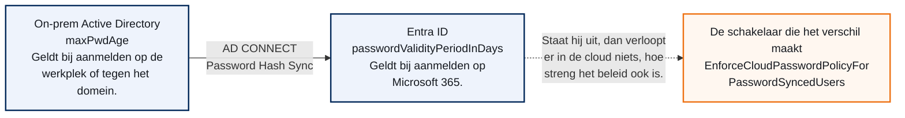
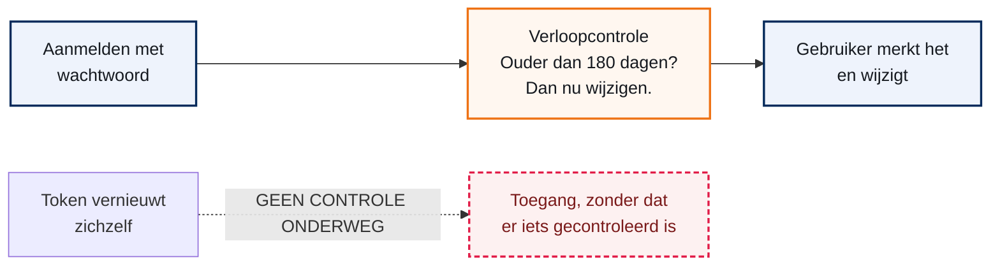
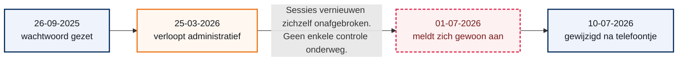

## De melding

Een medewerker wijzigde zijn wachtwoord voor het laatst op 26 september 2025. Het beleid schrijft twee wijzigingen per jaar voor, dus ongeveer 180 dagen. Dat wachtwoord had rond 25 maart 2026 moeten verlopen.

Op 1 juli 2026 meldde diezelfde medewerker zich nog gewoon aan. Ruim drie maanden na de datum waarop dat niet meer had mogen kunnen. En het bleef niet bij dit ene account; het beeld was dat er meer van zijn.

<div class="call info">
<div class="ct"><span>&#9670;</span> Wat de vraag eigenlijk was</div>
<p>Niet "hoe repareren we het runbook". De vraag was: verloopt hier eigenlijk wel iets, en zo ja, waar dwingt iets dat af? Dat is een andere vraag, en hij vraagt om meten voordat je iets aanpast.</p>
</div>

Stel je een slagboom voor die openstaat. Je kunt lang discussiëren over de klok die aangeeft wanneer hij dicht moet, maar als er geen motor op zit gaat hij nooit dicht. Dit onderzoek ging over de motor, niet over de klok.

## Hoe een wachtwoord verloopt

Een wachtwoord verloopt niet vanzelf. Er zijn twee losse dingen nodig, en ze worden vaak door elkaar gehaald.

Het eerste is het **beleid**: een getal dat zegt hoe lang een wachtwoord geldig is. Dat getal staat ergens opgeslagen en verandert niets aan de wereld. Het is een afspraak.

Het tweede is de **handhaving**: het moment waarop een systeem dat getal opzoekt, vergelijkt met de leeftijd van het wachtwoord, en op grond daarvan iemand tegenhoudt. Zonder dat moment gebeurt er niets.

<div class="call warn">
<div class="ct"><span>&#9670;</span> Het beleid kan perfect kloppen terwijl er niets gebeurt</div>
<p>Dit is de kern van deze hele diagnose. Een verlopen wachtwoord blokkeert niemand uit zichzelf. Het blokkeert iemand op het moment dat die persoon zich met dat wachtwoord aanmeldt. Gebeurt dat niet, dan merkt niemand iets.</p>
</div>

Vergelijk het met een verlopen rijbewijs. Het is verlopen op de dag dat het verloopt, maar je merkt er pas iets van als iemand ernaar vraagt. Rijdt er nooit een agent achter je, dan rijd je jaren door.

## Twee plekken waar beleid staat

In een hybride omgeving staat het wachtwoordbeleid op twee plekken. Die twee weten niets van elkaar en gelden op verschillende momenten.

**On-prem Active Directory** heeft `maxPwdAge`. Die geldt als iemand zich aanmeldt op de werkplek of tegen het domein. Fine Grained Password Policies kunnen daar per groep overheen gaan.

**Entra ID** heeft `passwordValidityPeriodInDays`, per domein. Die geldt bij aanmelden op Microsoft 365.

Draait er Password Hash Sync, dan gebeurt er standaard iets dat veel mensen verrast: Entra zet `DisablePasswordExpiration` op elke gesynchroniseerde gebruiker. De cloud houdt dan niemand tegen op de leeftijd van zijn wachtwoord, hoe streng het beleid daar ook staat. Alleen als de schakelaar `EnforceCloudPasswordPolicyForPasswordSyncedUsers` aan staat doet de cloud wel mee.


*Twee beleidsbronnen, een schakelaar ertussen*

<div class="call caution">
<div class="ct"><span>&#9670;</span> Wat Graph niet laat zien</div>
<p>Fine Grained Password Policies zijn via Microsoft Graph niet zichtbaar. Wat AD werkelijk per gebruiker hanteert, kun je alleen on-prem opvragen. Alles wat je in de cloud meet is dus de halve waarheid tot je die kant er ook bij hebt.</p>
</div>

## Waarom verlopen niet altijd bijt

Entra controleert de leeftijd van een wachtwoord op het moment dat iemand zich met dat wachtwoord aanmeldt. Dat moment heet een interactieve aanmelding.

Maar de meeste toegang loopt niet via de voordeur. Een gebruiker die zich eenmaal heeft aangemeld krijgt tokens. Die tokens vernieuwen zichzelf op de achtergrond, tientallen keren per dag, zonder dat er ooit een wachtwoord aan te pas komt. Dat heet een niet-interactieve aanmelding.

En er is nog een categorie die verwarrend is: aanmeldingen die in het logboek als interactief staan maar toch geen wachtwoord toetsen. Een Primary Refresh Token op een ingeschreven laptop, Windows Hello, of de Authentication Broker op een telefoon. De gebruiker doet iets, maar niet het ding waar de controle op zit.


*Twee routes naar toegang, maar de controle staat op een*

## Hoe we het hebben gemeten

We zijn niet begonnen bij het account, maar bij de tenant. Dat is met opzet: begin je bij een los account, dan kijk je naar een symptoom terwijl de oorzaak tenantbreed kan zijn.

De volgorde was steeds van breed naar smal:

<ol class="phases">
<li><b>De tenant.</b> Welk beleid staat er, per domein, en is het domein federated of managed?</li>
<li><b>De synchronisatie.</b> Draait Password Hash Sync, en staat de cloud-policy voor gesynchroniseerde gebruikers aan?</li>
<li><b>Het account.</b> Welke uitzonderingen staan erop, en welke wachtwoorddatums zijn gevuld?</li>
<li><b>Het gedrag.</b> Hoe meldt deze gebruiker zich aan, en dwingt Conditional Access ergens herauthenticatie af?</li>
</ol>

<div class="call ok">
<div class="ct"><span>&#9670;</span> Alles read-only</div>
<p>Geen enkele stap in deze diagnose schrijft iets. Er is niets gewijzigd aan gebruikers, beleid of instellingen. De enige wijziging in deze hele periode is de wachtwoordwijziging die de medewerker zelf deed nadat er contact was geweest.</p>
</div>

## De tenant

Alle twaalf geverifieerde domeinen staan op dezelfde waarden: **180 dagen geldig, meldvenster 14 dagen**. Dat is geen standaardwaarde. Moderne tenants staan standaard op "verloopt nooit", en oudere op 90 dagen. Iemand heeft hier bewust 180 gezet.

Ook belangrijk: alle domeinen staan op `Managed`, niet op `Federated`. Entra evalueert het verlopen van wachtwoorden dus zelf en besteedt dat niet uit aan ADFS.

| Wat | Waarde | Betekenis | Status |
| --- | --- | --- | --- |
| `passwordValidityPeriodInDays` | 180 | het beleid van twee keer per jaar, technisch vastgelegd | OK |
| `passwordNotificationWindowInDays` | 14 | Entra begint zelf 14 dagen vooraf te melden | OK |
| `authenticationType` | Managed | geen federatie; Entra doet de controle zelf | OK |
| Aantal domeinen | 12 | waarvan een routeringsdomein van Exchange Online | OK |

<div class="call info">
<div class="ct"><span>&#9670;</span> Wat dit meteen uitsluit</div>
<p>Twee veelvoorkomende oorzaken vallen hiermee af. Het is niet "de tenant laat wachtwoorden nooit verlopen", en het is niet "een federatie die de controle overneemt".</p>
</div>

## De synchronisatie

Dit is waar we de bekende valkuil verwachtten. Die bleek er niet te zijn.

| Instelling | Waarde | Betekenis | Status |
| --- | --- | --- | --- |
| `passwordSyncEnabled` | True | Password Hash Sync draait | OK |
| `passwordWritebackEnabled` | False | een wijziging in de cloud gaat niet terug naar AD | Let op |
| `cloudPasswordPolicyForPasswordSyncedUsersEnabled` | True | de cloud dwingt de 180 dagen ook af voor gesynchroniseerde gebruikers | OK |
| `userForcePasswordChangeOnLogonEnabled` | True | een tijdelijk wachtwoord uit AD dwingt een wijziging af | OK |

Die derde regel is de belangrijke. Had die op `False` gestaan, dan was het verhaal hier klaar geweest: dan zet Entra `DisablePasswordExpiration` op elke gesynchroniseerde gebruiker en verloopt er in de cloud niets. Hij staat aan. De cloud hoort dus te handhaven.

<div class="call caution">
<div class="ct"><span>&#9670;</span> Wat we nog niet weten</div>
<p>Sinds wanneer die schakelaar aan staat, hebben we niet kunnen vaststellen. Het auditlogboek bewaart 30 dagen, dus als hij ergens dit voorjaar is omgezet is dat niet meer terug te zien. Dat is een vraag voor de mensen, niet voor het systeem.</p>
</div>

## Het account

Het betrokken account is gesynchroniseerd vanuit AD en heeft geen enkele uitzondering op het wachtwoordbeleid.

| Veld | Waarde | Betekenis | Status |
| --- | --- | --- | --- |
| `onPremisesSyncEnabled` | True | hybride account, komt uit AD | OK |
| `passwordPolicies` | leeg | geen `DisablePasswordExpiration`; dit wachtwoord hoort te verlopen | OK |
| `createdDateTime` | 26-09-2025 10:12:36 | aanmaakmoment van het account | OK |
| `lastPasswordChangeDateTime` | 10-07-2026 06:07:48 | de wijziging na het telefoontje | OK |
| `onPremisesLastPasswordChangeDateTime` | leeg | hoort gevuld te zijn vanuit `pwdLastSet` in AD | Afwijkend |

Die laatste regel is de anomalie. Bij een gesynchroniseerd account hoort dat veld gevuld te zijn. Het gevolg: we hebben geen enkel zicht op wat AD zelf van dit wachtwoord vindt. Alles wat hierboven staat komt uit de cloud.

<div class="call info">
<div class="ct"><span>&#9670;</span> Een detail dat de aanleiding bevestigt</div>
<p>Let op dat de tabel hierboven de stand van <b>12 augustus 2026</b> toont. De wachtwoorddatum die de melding veroorzaakte staat er dus niet meer in; die is op 10 juli overschreven.</p>
<p>Leg de drie momenten naast elkaar:</p>
</div>

| Moment | Waar het vandaan komt |
| --- | --- |
| 26-09-2025 10:12:36 | account aangemaakt, uit `createdDateTime` |
| 26-09-2025 11:53 | wachtwoord gezet, uit het Entra-portaal begin juli 2026 |
| 10-07-2026 06:07:48 | wachtwoord gewijzigd na contact, uit `lastPasswordChangeDateTime` |

De eerste twee liggen anderhalf uur uit elkaar op dezelfde dag: het account wordt aangemaakt, en kort daarna wordt het wachtwoord gezet. Precies wat je bij een nieuwe medewerker verwacht. Het waren dus twee verschillende velden, en de oorspronkelijke waarneming ging echt over een wachtwoorddatum. Dat is het controleren waard, want in het Entra-portaal is de aanmaakdatum een standaardkolom en de wachtwoorddatum niet - de twee worden makkelijk verwisseld.

## Het aanmeldpatroon

Hier valt het kwartje. Twee logboeken, hetzelfde account, allebei opgevraagd op 12 augustus 2026.

| Soort aanmelding | Aantal | Periode | Status |
| --- | --- | --- | --- |
| Interactief | 8 | 28-07-2026 tot 11-08-2026 | laag |
| Niet-interactief | 25 of meer | 12-08-2026, 01:00 tot 09:26 | hoog |

Lees die aantallen precies. Beide queries mochten 25 regels ophalen. Het interactieve logboek gaf er **acht** terug, dus dat is het volledige beeld voor de periode die bewaard wordt. Het niet-interactieve logboek gaf er precies **25** terug en liep daarmee tegen de limiet aan. Het werkelijke aantal ligt dus hoger; we weten alleen dat die 25 allemaal binnen een ochtend vielen.

Dit zijn de acht interactieve aanmeldingen:

| Datum en tijd | App | Client |
| --- | --- | --- |
| 28-07-2026 08:41:06 | Office 365 SharePoint Online | Browser |
| 28-07-2026 08:41:29 | Office 365 SharePoint Online | Browser |
| 28-07-2026 08:48:34 | SharePoint Online Web Client Extensibility | Browser |
| 28-07-2026 08:48:47 | SharePoint Online Web Client Extensibility | Browser |
| 30-07-2026 15:12:09 | Microsoft Authentication Broker | Mobile Apps and Desktop clients |
| 30-07-2026 15:12:24 | Outlook Mobile | Mobile Apps and Desktop clients |
| 30-07-2026 15:12:25 | Microsoft Authentication Broker | Mobile Apps and Desktop clients |
| 11-08-2026 15:50:40 | LNH app - Any2info | Browser |

Vier daarvan zijn een SharePoint-sessie op een ochtend. Drie vallen binnen zestien seconden op 30 juli: twee keer de Authentication Broker en daartussen Outlook Mobile. Dat is het patroon van een mobiel apparaat dat zich met dit account aanmeldt.

De niet-interactieve regels zijn Outlook Mobile, Microsoft Office en Microsoft Edge die hun tokens verversen. Geen daarvan vraagt een wachtwoord.

Acht keer aanmelden in twee weken, tegenover minstens 25 tokenvernieuwingen op een enkele ochtend. Dat is de verhouding waar het om draait.

<div class="call caution">
<div class="ct"><span>&#9670;</span> Wat hier niet staat</div>
<p>Uit deze regels blijkt niet <b>of</b> dat mobiele apparaat toen nieuw werd ingericht. Het kan net zo goed een bestaand toestel zijn dat opnieuw moest aanmelden. Wie dat wil weten, kijkt naar <code>deviceDetail</code> in het aanmeldlogboek of naar de registratiedatum van het apparaat in Entra. Wij hebben dat niet gedaan, want voor de conclusie maakt het niet uit.</p>
</div>

<div class="call warn">
<div class="ct"><span>&#9670;</span> De metingen gaan over de periode na de wijziging</div>
<p>Het interactieve logboek bewaart 30 dagen. De aanmelding van 1 juli 2026 is daarmee definitief buiten bereik. Wat we hier zien is hoe deze gebruiker werkt, niet wat er op die specifieke dag gebeurde. Voor de conclusie maakt dat weinig uit: het patroon is het bewijs, niet die ene regel.</p>
</div>

## Conditional Access

Conditional Access kan afdwingen dat iemand zich periodiek opnieuw aanmeldt. Die instelling heet sign-in frequency. Van de negentien beleidsregels in deze tenant hebben er precies twee zo'n instelling.

| Beleid | Sign-in frequency | Bereik | Status |
| --- | --- | --- | --- |
| Legacy-auth mailrelay | 365 dagen | scope nog na te gaan | Let op |
| Browsersessie op onbeheerde apparaten | 4 uur | alleen browsers, alleen onbeheerd | OK |

Het verkeer uit het vorige hoofdstuk - mobiele en desktopclients op beheerde apparaten - valt onder geen van beide. Die sessies vernieuwen zichzelf onbeperkt.

MFA staat wel tenantbreed aan. Dat is relevant voor de afweging verderop.

<div class="call caution">
<div class="ct"><span>&#9670;</span> Losse waarneming</div>
<p>Het beleid met 365 dagen draagt legacy authenticatie in de naam, terwijl een ander beleid basic authentication juist tenantbreed blokkeert. Ga na wie daaronder valt. Is dat een serviceaccount, prima. Zit er meer in scope, dan is dat een bevinding op zichzelf en losstaand van dit onderzoek.</p>
</div>

## De verklaring

Het wachtwoord was wel degelijk verlopen. Alleen kwam er nooit een moment waarop dat getoetst werd.

<ol class="phases">
<li><b>Het wachtwoord verliep administratief rond 25 maart 2026.</b> Het beleid werkte precies zoals bedoeld.</li>
<li><b>Niets dwong ooit een herauthenticatie af.</b> Geen sign-in frequency voor beheerde apparaten, dus de tokens bleven zichzelf vernieuwen. Tientallen keren per dag.</li>
<li><b>Er is in maart geen waarschuwing geweest.</b> Waarom niet, staat in het volgende hoofdstuk.</li>
</ol>


*De 107 dagen tussen verlopen en opvallen*

Samengevat: de klok stond goed, de slagboom had dicht gemoeten, maar er reed nooit iemand langs de slagboom. Iedereen liep al binnen door een deur die openstond sinds de vorige keer.

## Wat het runbook wel en niet doet

Er draait een Azure Automation runbook dat gebruikers per mail waarschuwt. Het meldt op 10, 8, 5, 3 en 1 dag voor het verlopen.

Dat interval is op zichzelf niet het probleem. Wie normaal naar het verlopen toe telt, wordt op dag 10 gepakt en daarna nog vier keer. Het werkt alleen onder vier voorwaarden, en die zijn alle vier te controleren in het Automation Account.

| Voorwaarde | Wat er misgaat als hij niet klopt | Status |
| --- | --- | --- |
| Het draait dagelijks | Bij een wekelijkse schedule ziet het runbook maar een restklasse van zeven. In vier van de zeven gevallen krijgt een gebruiker helemaal geen mail. | Na te gaan |
| Het draait met `DryRun = $false` | De standaardwaarde is `$true`. Een schedule zonder expliciete parameters verstuurt dus nooit iets, en de job slaagt gewoon. | Na te gaan |
| Het komt tot de mailstap | `$ErrorActionPreference` staat op `Stop`. Struikelt een eerdere stap, dan is er geen mail en ook geen halve run. | Na te gaan |
| Het `mail`-attribuut is gevuld | Het script mailt naar `mail`, niet naar de UPN. Is dat veld leeg, dan staat de gebruiker wel in het rapport maar krijgt hij niets. | Na te gaan |

<div class="call warn">
<div class="ct"><span>&#9670;</span> De echte dode hoek</div>
<p>Zodra iemand voorbij de verloopdatum is, krijgt hij nooit meer een mail. Het aantal resterende dagen is dan negatief en het script slaat die gebruiker stil over. Dat raakt niet de mensen die er nu naartoe tellen, maar wel precies de achterstand waar dit onderzoek over gaat. Die groep moet apart benaderd worden; het runbook gaat ze uit zichzelf nooit vinden.</p>
</div>

<div class="call info">
<div class="ct"><span>&#9670;</span> De simpelste verklaring voor maart</div>
<p>In de header van het script staat versie 1.1 met datum 11 juni 2026. Dat is bijna drie maanden na de datum waarop dit wachtwoord verliep. Het runbook bestond toen vermoedelijk nog niet, of draaide nog niet live. Dat is in vijf minuten hard te maken met de jobhistorie.</p>
</div>

## Drie richtingen

De vraag is niet meer technisch. Alles werkt zoals het is ingesteld. De vraag is wat je wilt.

<div class="call info">
<div class="ct"><span>&#9670;</span> A. Stop met periodiek verlopen</div>
<p>MFA staat tenantbreed aan. De richtlijn van Microsoft en van NIST is dat gedwongen periodiek wijzigen dan meer kwaad dan goed doet: mensen gaan volgnummers achter hun wachtwoord zetten. Zet de geldigheid op "nooit" en zet het runbook uit. De prijs: het beleid van twee keer per jaar gaat van tafel, en dat moet iemand bewust willen.</p>
</div>

<div class="call info">
<div class="ct"><span>&#9670;</span> B. Maak verlopen merkbaar</div>
<p>Voeg een sign-in frequency toe voor beheerde apparaten. Dan bijt de policy echt en loopt iedereen er vanzelf tegenaan. De prijs: gebruikers moeten vaker opnieuw aanmelden, en dat kost supportvragen.</p>
</div>

<div class="call caution">
<div class="ct"><span>&#9670;</span> C. Repareer alleen de meldingen</div>
<p>Laat het runbook ook mailen naar wie al verlopen is, herhaal wekelijks in plaats van op vijf losse dagen, en zorg dat het live draait met een schedule. De prijs: het blijft vrijblijvend. Niets dwingt iets af, en dit is in de kern wat er nu al staat.</p>
</div>

Wil de klant het beleid houden, dan is het B en C samen. C alleen is de huidige situatie, en die werkt aantoonbaar niet.

Kort door de bocht: of je laat de regel los omdat je een betere hebt (MFA), of je zorgt dat de regel echt iets doet. Wat je niet moet doen is de regel op papier houden en hopen dat een mailtje het werk doet.

## De diagnose naspelen

Deze diagnose is herhaalbaar. Alles hieronder leest alleen; er wordt niets gewijzigd.

Het gereedschap staat in het projectdossier: `docs/runbook-diagnose-wachtwoordverloop.md` beschrijft de procedure, `scripts/Get-PasswordExpiryDiagnostics.ps1` doet de cloudkant in een keer en schrijft een CSV weg.

### Stap 1: klopt de aanname

Controleer eerst waar je datum vandaan komt. De gebruikerslijst in het Entra-portaal toont de aanmaakdatum als standaardkolom, de wachtwoorddatum niet.

```powershell
Connect-MgGraph -Scopes "User.Read.All" -NoWelcome
Invoke-MgGraphRequest -Method GET -OutputType PSObject -Uri 'https://graph.microsoft.com/v1.0/users/<upn>?$select=displayName,createdDateTime,lastPasswordChangeDateTime,onPremisesLastPasswordChangeDateTime,onPremisesSyncEnabled,passwordPolicies'
```

### Stap 2: het beleid van de tenant

```powershell
(Invoke-MgGraphRequest -Method GET -OutputType PSObject -Uri 'https://graph.microsoft.com/v1.0/domains').value |
    Select-Object id, authenticationType, passwordValidityPeriodInDays, passwordNotificationWindowInDays |
    Format-Table -AutoSize
```

De waarde 2147483647 betekent "verloopt nooit". Staat die er, dan verloopt er in de cloud niets.

### Stap 3: de synchronisatie

```powershell
(Invoke-MgGraphRequest -Method GET -OutputType PSObject -Uri 'https://graph.microsoft.com/v1.0/directory/onPremisesSynchronization').value.features |
    Format-List
```

### Stap 4: het gedrag

Het interactieve en het niet-interactieve logboek naast elkaar. Het tweede vraagt de beta-endpoint.

```powershell
(Invoke-MgGraphRequest -Method GET -OutputType PSObject -Uri "https://graph.microsoft.com/beta/auditLogs/signIns?`$filter=userPrincipalName eq '<upn>' and signInEventTypes/any(t: t eq 'nonInteractiveUser')&`$top=25").value |
    Select-Object createdDateTime, appDisplayName, clientAppUsed, resourceDisplayName |
    Format-Table -AutoSize
```

En de sessiecontroles in Conditional Access:

```powershell
(Invoke-MgGraphRequest -Method GET -OutputType PSObject -Uri 'https://graph.microsoft.com/v1.0/identity/conditionalAccess/policies').value |
    Select-Object displayName, state,
        @{ N = 'Frequentie'; E = { $_.sessionControls.signInFrequency.value } },
        @{ N = 'Eenheid';    E = { $_.sessionControls.signInFrequency.type } } |
    Format-Table -AutoSize
```

### Stap 5: de on-prem kant

Graph laat de on-prem policy niet zien. Draai dit op een domain controller of een machine met de AD-module.

```powershell
Get-ADDefaultDomainPasswordPolicy | Select-Object MaxPasswordAge, MinPasswordLength
Get-ADFineGrainedPasswordPolicy -Filter * | Select-Object Name, Precedence, MaxPasswordAge, AppliesTo
Get-ADUser -Identity <sam> -Properties PasswordLastSet, PasswordNeverExpires, msDS-UserPasswordExpiryTimeComputed
```

`msDS-UserPasswordExpiryTimeComputed` is de door AD zelf berekende verloopdatum, inclusief een eventuele fijnmazige policy. Dat is de enige waarde die de waarheid vertelt.

## Valkuilen

De rechten die het runbook nodig heeft zijn niet de rechten die de diagnose nodig heeft. Het runbook heeft genoeg aan `User.Read.All`, `Mail.Send` en `Domain.Read.All`. De diagnose vraagt daarnaast `AuditLog.Read.All` en `OnPremDirectorySynchronization.Read.All`. Voeg die **niet** toe aan de app-registratie van het runbook - dat is een mailapplicatie, die hoort geen auditlogboeken te kunnen lezen. Draai de diagnose interactief als beheerder.

De logboeken bewaren maar 30 dagen. Wie een gebeurtenis van drie maanden geleden wil terugzien, is te laat. Meet dus zodra de vraag opkomt.

Het bewijs verdwijnt ook op een andere manier. Zodra een gebruiker zijn wachtwoord wijzigt, is de oude datum weg. In dit onderzoek bestaat de oorspronkelijke waarde alleen nog in een screenshot. Meet de hele tenant dus in een keer, niet gebruiker voor gebruiker.

En tot slot: het beleid dat je in de cloud meet is niet noodzakelijk het beleid dat een gebruiker aan zijn werkplek merkt. Zolang de on-prem kant niet gemeten is, is de diagnose niet compleet.

## Wat nog open staat

Vier dingen zijn nog niet gedaan. Ze veranderen de conclusie waarschijnlijk niet, maar ze maken hem hard.

| Openstaand | Waarom het uitmaakt | Status |
| --- | --- | --- |
| De tenantbrede meting | Maakt "er lijken er meer te zijn" een getal in plaats van een indruk. | Open |
| De on-prem kant | De enige plek waar staat wat een gebruiker aan zijn werkplek merkt. | Open |
| De jobhistorie van het runbook | Bepaalt of er ooit een waarschuwing is verstuurd, en sinds wanneer. | Open |
| Het besluit tussen A, B en C | Zolang dat er niet is, verandert er niets aan de situatie. | Open |

Daarnaast twee kleinere: uitzoeken waarom `onPremisesLastPasswordChangeDateTime` leeg is, en nagaan wie er onder het legacy-auth beleid met 365 dagen valt.

<div class="call caution">
<div class="ct"><span>&#9670;</span> Wat dit document niet is</div>
<p>Dit is geen eindrapport en geen advies dat al is afgestemd met de klant. Het is de stand van het onderzoek op 12 augustus 2026: wat we hebben gemeten, wat daaruit volgt, en welke keuze voorligt. Het besluit wordt apart vastgelegd zodra het genomen is.</p>
</div>

## Bronnen

- [Microsoft Entra - wachtwoordverloopbeleid instellen](https://learn.microsoft.com/entra/identity/authentication/concept-sspr-policy)
- [Password hash synchronization met Microsoft Entra Connect Sync](https://learn.microsoft.com/entra/identity/hybrid/connect/how-to-connect-password-hash-synchronization)
- [Conditional Access - sessielevensduur en sign-in frequency](https://learn.microsoft.com/entra/identity/conditional-access/concept-session-lifetime)
- [Microsoft Entra - aanmeldlogboeken en soorten aanmeldingen](https://learn.microsoft.com/entra/identity/monitoring-health/concept-sign-ins)
- [Microsoft Graph API - resource type domain](https://learn.microsoft.com/graph/api/resources/domain)
