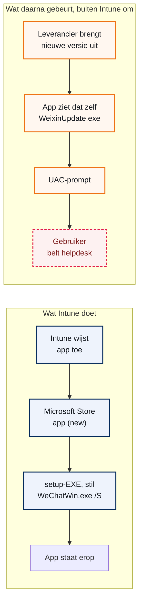
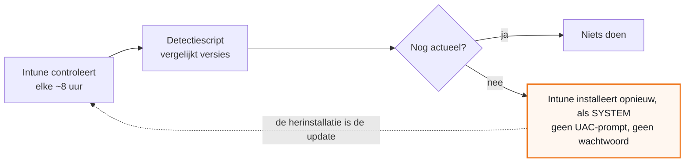

## Waar dit over gaat

Gebruikers van WeChat op een beheerde laptop krijgen bij het openen van de app een melding dat er een update is. Die update vraagt om adminrechten. Standaardgebruikers hebben die niet, dus bellen ze de helpdesk om een wachtwoord.

De gebruikelijke oplossing is de app via Intune uitrollen. Dan zou Intune de app op de achtergrond bijwerken en zou de melding verdwijnen. Dat is bij de meeste apps ook zo. Bij WeChat niet, en dat is niet op te lossen door hem anders uit te rollen.

Dit handboek gaat van onderaf te werk: eerst het mechanisme waarom Intune deze app niet bijwerkt, dan de meting die dat aantoont, dan de inrichting die het wel oplost, en tot slot de grenzen daarvan.

## Hoe Intune een app bijwerkt

Intune kent verschillende app-types. Voor het bijwerken maakt die keuze alles uit, en dat staat nergens op de app-pagina.

Het app-type **Microsoft Store app (new)** praat via Windows Package Manager (winget) met de Microsoft Store. Wat er daarna gebeurt, hangt af van de vorm waarin de leverancier zijn app aanlevert:

- Levert hij een **MSIX-pakket**, dan werkt Windows Update de app bij. Dat is de bedoelde route en die werkt goed.
- Levert hij een **gewone setup-EXE of een MSI**, dan geldt de regel van Microsoft zelf: de applicatie is volledig zelf verantwoordelijk voor zijn updates.

WeChat is het tweede geval. De Store levert geen MSIX-pakket maar een setup-EXE die stil wordt gestart met de schakelaar `/S`. Intune zet die app dus een keer neer en bemoeit zich daarna nooit meer met de versie.



*Bij een EXE-app eindigt de verantwoordelijkheid van Intune bij de installatie. Alles rechts van de stippellijn gebeurt buiten het beheer om. De onderste rij ziet de gebruiker, de bovenste rij ziet de beheerder in de portal — ze weten niets van elkaar.*

<div class="call caution"><div class="ct"><span>&#9670;</span> Waarom dit een stille valkuil is</div><p>De uitrol slaagt en de portal meldt netjes "Installed", 0 failed. Niets wijst erop dat het bijwerken niet geregeld is. Je merkt het alleen doordat gebruikers blijven bellen.</p></div>

## Wat de meting aantoont

Het mechanisme uit het vorige hoofdstuk is niet theorie. Het is te meten door drie versienummers naast elkaar te leggen.

| Waar | Versie | Wat het betekent |
| --- | --- | --- |
| Op de laptop | 4.1.11.52 | De app heeft zichzelf bijgewerkt |
| In de Microsoft Store | 4.1.11.24 | Dit is wat Intune zou uitdelen |
| Bij de leverancier | 4.1.12 | Dit is waar de melding over gaat |

De laptop loopt dus **voor** op de uitrol. Dat kan alleen als de app zichzelf heeft bijgewerkt, en het betekent dat Intune geen stem heeft in de versie.

Het betekent ook iets voor de toekomst: Intune zal die melding nooit vóór zijn. De updater van de leverancier weet altijd eerder van een nieuwe versie dan de Store-catalogus.

## De vier manieren om een app uit te rollen

| Vorm | Werkt bij | Kosten | Wanneer |
| --- | --- | --- | --- |
| Microsoft Store app (new), MSIX | Ja, via Windows Update | Geen | Altijd de eerste keus als de app als MSIX bestaat |
| Microsoft Store app (new), EXE of MSI | **Nee** | Geen | Alleen als bijwerken niet uitmaakt |
| Enterprise App Catalog | Ja, Microsoft houdt het bij | Intune Plan 2 of Suite | Als de app in de catalogus staat |
| Win32-app met eigen scripts | Ja, als je het zelf regelt | Geen extra licentie | Als de app in geen van de bovenste drie past |

Voor WeChat vallen de eerste drie af. Er is geen MSIX-versie: de gesandboxte Store-app is jaren geleden ingetrokken en wat er nu staat is de gewone Win32-EXE. En WeChat staat niet in de Enterprise App Catalog; Tencent-apps staan daar niet in.

Blijft over: een Win32-app waarin we het bijwerken zelf regelen. De rest van dit handboek gaat daarover.

<div class="call info"><div class="ct"><span>&#9670;</span> Ook dicht: alleen de Store gebruiken en Intune uitfaseren</div><p>Dat is hetzelfde pakket, dus hetzelfde gedrag. Het levert alleen een extra risico op: twee uitrollen die om dezelfde app vechten, met dubbele installaties tot gevolg.</p></div>

## Waarom een programma om rechten vraagt

Windows gokt niet welke rechten een programma nodig heeft. Elk programma draagt een **manifest** bij zich, een stukje XML in het bestand zelf, met daarin het veld `requestedExecutionLevel`. Er zijn drie waarden:

- `asInvoker` — draai met de rechten van wie mij start. Geen UAC-prompt.
- `requireAdministrator` — ik wil beheerdersrechten. Altijd een UAC-prompt.
- `highestAvailable` — geef me het hoogste dat deze gebruiker heeft.

Dat veld is leesbare tekst en zit gewoon in het bestand. Je hebt er geen speciaal gereedschap voor nodig:

```powershell
$b = [IO.File]::ReadAllBytes($exe)
[regex]::Matches([Text.Encoding]::ASCII.GetString($b),
  '<requestedExecutionLevel[^>]*>') | ForEach-Object { $_.Value }
```

<div class="call caution"><div class="ct"><span>&#9670;</span> Valkuil: let op de aanhalingstekens</div><p>Leveranciers wisselen <code>level="asInvoker"</code> en <code>level='asInvoker'</code> door elkaar, soms binnen hetzelfde pakket. Zoek je alleen op dubbele aanhalingstekens, dan lijkt het manifest te ontbreken en concludeer je het tegenovergestelde van wat er staat. Match op beide: <code>level=['"](\w+)['"]</code>.</p></div>

## Wat WeChat precies meebrengt

De installer is een NSIS-pakket. De inhoud zit in `install.7z` en is uit te pakken met 7-Zip. Zo ziet het eruit, met het rechtenniveau uit elk manifest:

| Bestand | Arch | Rechtenniveau | Rol |
| --- | --- | --- | --- |
| `WeChatWin_<versie>.exe` | x86 | **requireAdministrator** | De setup |
| `Weixin.exe` | x64 | asInvoker | De app zelf |
| `WeixinUpdate.exe` | x86 | **asInvoker** | De updater |
| `WeixinExt.exe` | x86 | requireAdministrator | Uitbreiding |
| `WetypeInstaller.exe` | x86 | asInvoker | Invoermethode |
| `Uninstall.exe` | x86 | requireAdministrator | Verwijderen |

Alles is geldig ondertekend door dezelfde uitgever:

```text
CN=Tencent Technology (Shenzhen) Company Limited
Vingerafdruk: 2241B013E2D6B9AAD7590E8056BF5E17CB1C795B
```

Twee dingen vallen op, en ze wijzen niet dezelfde kant op.

**De setup eist adminrechten, altijd.** Ongeacht welke doelmap je meegeeft. De route "installeer in de map van de gebruiker, dan hoeft niemand admin te zijn" kan een gebruiker dus niet zelf uitvoeren.

**De updater eist ze niet.** Die staat op `asInvoker` en vraagt uit zichzelf niets. Waar komt de prompt dan vandaan? Ofwel de updater botst op de schrijfrechten van `Program Files`, ofwel hij start de setup en die vraagt om rechten.

<div class="call warn"><div class="ct"><span>&#9670;</span> WeChat 4.x heet intern Weixin</div><p>Zoek je in de programmamap of in een pakket op <code>WeChat*</code>, dan vind je de belangrijkste bestanden niet. Alleen de setup heet nog <code>WeChatWin</code>. De app, de updater en de rest heten <code>Weixin*</code>.</p></div>

## De diagnose in vijf minuten

Welke van de twee mogelijkheden uit het vorige hoofdstuk het is, hoef je niet te gokken. Laat de updatemelding komen en lees de UAC-prompt: die noemt altijd het programma en de uitgever.

| De prompt noemt | Dan is de blokkade | Bouw dan |
| --- | --- | --- |
| `WeChatWin_<versie>.exe` of iets met Setup | De setup, die rechten eist | Variant A: Intune werkt bij |
| `WeixinUpdate.exe` | De schrijfrechten van de installatiemap | Variant B: per-user installatie |

Gaat de prompt te snel voorbij, houd dan Taakbeheer op het tabblad Details open, of gebruik Process Explorer om te zien welk proces de ouder is.

Zoek daarna ook op waar de app staat. Staat de sleutel onder `HKLM`, dan is de app systeembreed geïnstalleerd:

```powershell
Get-ItemProperty 'HKLM:\SOFTWARE\Microsoft\Windows\CurrentVersion\Uninstall\*',
  'HKLM:\SOFTWARE\WOW6432Node\Microsoft\Windows\CurrentVersion\Uninstall\*',
  'HKCU:\SOFTWARE\Microsoft\Windows\CurrentVersion\Uninstall\*' -ErrorAction SilentlyContinue |
  Where-Object DisplayName -match 'WeChat|Weixin' |
  Select-Object DisplayName, DisplayVersion, InstallLocation, PSPath
```

<div class="call caution"><div class="ct"><span>&#9670;</span> Doe dit niet op het toestel van de drukste gebruiker</div><p>De chatgeschiedenis van WeChat staat lokaal, niet bij de leverancier. Wie een installatie verwijdert zonder de gegevensmap veilig te stellen, wist iemands gesprekken. Test op een testtoestel.</p></div>

## Het principe: de detectieregel doet het werk

De gebruikelijke aanpak bij een Win32-app is: pakket bouwen, uitrollen, en bij elke nieuwe versie opnieuw verpakken. Dat werkt, maar het is handwerk dat nooit ophoudt en het loopt per definitie achter op de leverancier.

Dat is te vermijden, en de truc zit niet in het installatiescript maar in de **detectieregel**. Een Win32-app in Intune bestaat uit twee delen die los van elkaar draaien:

<ol class="phases">
<li>Een <b>installatiescript</b> dat de app neerzet. Dat draait alleen als Intune vindt dat de app ontbreekt.</li>
<li>Een <b>detectiescript</b> dat bepaalt of de app er is. Dat draait bij elke controle, ongeveer elke acht uur.</li>
</ol>

Laat het detectiescript nu niet kijken of een bestand bestaat, maar of de **versie nog actueel** is. Loopt de laptop achter, dan meldt het "niet gevonden". Intune installeert dan opnieuw, en die herinstallatie is de update.



*De detectieregel is de motor. Omdat hij op versie vergelijkt en niet op het bestaan van een bestand, wordt elke herinstallatie automatisch een update.*

Er blijft dus een pakket, en dat blijft goed. Het werkt omdat de leverancier de actuele versie op zijn downloadpagina publiceert in de statische HTML, zodat een script hem betrouwbaar kan uitlezen.

## Het installatiescript

Dit script draait in systeemcontext, dus zonder UAC-prompt en zonder dat er iemand een wachtwoord hoeft te typen. In gewone taal doet het vier dingen, in deze volgorde: het kijkt of de gebruiker de app op dat moment gebruikt (en zo ja, dan doet het niets en probeert het later opnieuw), het leest bij de leverancier welke versie de nieuwste is, het haalt die op en controleert of het bestand echt van de leverancier komt, en dan installeert het de app zonder dat de gebruiker er iets van merkt. Gaat er iets mis, dan stopt het en schrijft het op waarom.

```powershell
# Installeert de nieuwste WeChat (Weixin), stil, in systeemcontext.
[Net.ServicePointManager]::SecurityProtocol = [Net.SecurityProtocolType]::Tls12

$logMap = 'C:\ProgramData\QUBE\WeChat'
New-Item -ItemType Directory -Path $logMap -Force | Out-Null
$log = Join-Path $logMap 'install.log'
function Schrijf($tekst) {
    "$(Get-Date -Format 'yyyy-MM-dd HH:mm:ss')  $tekst" | Add-Content $log
}

# Draait de app? Dan niet installeren: de setup sluit hem af en breekt een
# gesprek af. 1618 = "installatie al bezig"; die code staat in de app als Retry.
if (Get-Process -Name 'Weixin' -ErrorAction SilentlyContinue) {
    Schrijf 'Weixin draait, installatie uitgesteld (exit 1618).'
    exit 1618
}

# Actuele versie en URL van de downloadpagina lezen.
try {
    $html = (Invoke-WebRequest 'https://pc.weixin.qq.com/' -UseBasicParsing).Content
} catch {
    Schrijf "Downloadpagina niet bereikbaar: $($_.Exception.Message)"
    exit 1618
}
$treffer = [regex]::Match($html, 'https?://[\w./-]*WeChatWin_([\d.]+)\.exe')
if (-not $treffer.Success) {
    Schrijf 'Geen download-URL gevonden op de pagina. Opzet gewijzigd?'
    exit 1
}
$url    = $treffer.Value
$versie = $treffer.Groups[1].Value
$setup  = Join-Path $env:TEMP "WeChatWin_$versie.exe"
Schrijf "Nieuwste versie: $versie"

& "$env:SystemRoot\System32\curl.exe" -L --fail --silent --show-error --max-time 900 -o $setup $url
if ($LASTEXITCODE -ne 0 -or -not (Test-Path $setup)) {
    Schrijf "Download mislukt (curl $LASTEXITCODE)."
    exit 1618
}

# Ondertekening controleren voordat we hem draaien.
$sig = Get-AuthenticodeSignature $setup
if ($sig.Status -ne 'Valid' -or
    $sig.SignerCertificate.Thumbprint -ne '2241B013E2D6B9AAD7590E8056BF5E17CB1C795B') {
    Schrijf "Ondertekening niet in orde: $($sig.Status). Gestopt."
    Remove-Item $setup -Force
    exit 1
}

$p = Start-Process -FilePath $setup -ArgumentList '/S' -Wait -PassThru
Schrijf "Setup afgerond met code $($p.ExitCode)."
Remove-Item $setup -Force -ErrorAction SilentlyContinue
exit $p.ExitCode
```

<div class="call warn"><div class="ct"><span>&#9670;</span> Nooit een URL zonder versienummer</div><p>Er bestaat ook een adres zonder versie in de naam. Dat geeft netjes HTTP 200 terug, maar levert een bijna een jaar oud bestand. Er komt geen foutmelding bij. Lees altijd de pagina.</p></div>

<div class="call info"><div class="ct"><span>&#9670;</span> Waarom exit 1618</div><p>Dat is de Windows-code voor "installatie al bezig". Door die code in Intune als Retry te markeren, probeert Intune het later opnieuw in plaats van de uitrol als mislukt te melden.</p></div>

## Het detectiescript

Dit is het script dat de vraag beantwoordt: loopt deze laptop achter? Het zoekt op welke versie er staat, kijkt bij de leverancier welke de nieuwste is, en vergelijkt die twee. Loopt de laptop achter, dan geeft het dat door en zorgt Intune voor de rest. Kan het de leverancier niet bereiken, dan zegt het bewust "alles in orde" — anders zou het bij elke internetstoring de app opnieuw gaan installeren.

```powershell
# Detectiescript voor de Intune Win32-app.
# Regel van Intune: exit 0 MET uitvoer op stdout = app is in orde.
# Geen uitvoer of een andere exitcode = Intune installeert (opnieuw).
[Net.ServicePointManager]::SecurityProtocol = [Net.SecurityProtocolType]::Tls12

function InOrde($reden) { Write-Output "OK: $reden"; exit 0 }
function Installeer()   { exit 1 }

# De sleutelnaam is niet bekend en de app heet intern Weixin, dus zoeken we op
# beide namen in beide hives.
$sleutels = @(
    'HKLM:\SOFTWARE\Microsoft\Windows\CurrentVersion\Uninstall\*',
    'HKLM:\SOFTWARE\WOW6432Node\Microsoft\Windows\CurrentVersion\Uninstall\*'
)
$app = Get-ItemProperty $sleutels -ErrorAction SilentlyContinue |
       Where-Object { $_.DisplayName -match 'WeChat|Weixin' } |
       Select-Object -First 1

if (-not $app) { Installeer }

# Niet bijwerken terwijl de gebruiker chat. Volgende ronde weer.
if (Get-Process -Name 'Weixin' -ErrorAction SilentlyContinue) {
    InOrde 'app draait, update uitgesteld'
}

# Lukt de netwerkcall niet, dan melden we "in orde" - anders ontstaat er een
# herinstallatielus zodra het internet even hapert.
try {
    $html = (Invoke-WebRequest 'https://pc.weixin.qq.com/' -UseBasicParsing -TimeoutSec 20).Content
} catch {
    InOrde 'downloadpagina niet bereikbaar'
}
$m = [regex]::Match($html, 'WeChatWin_([\d.]+)\.exe')
if (-not $m.Success) { InOrde 'geen versie op de pagina gevonden' }

# Vergelijk op Major.Minor.Build. De pagina noemt drie cijfers (4.1.12), de
# installatie vier (4.1.11.52); zonder afkappen vergelijk je appels met peren.
function DrieDelig($tekst) {
    $d = ($tekst -split '\.') + @('0','0','0')
    [version]("{0}.{1}.{2}" -f $d[0], $d[1], $d[2])
}
if ((DrieDelig $m.Groups[1].Value) -gt (DrieDelig $app.DisplayVersion)) { Installeer }
InOrde "versie $($app.DisplayVersion) is actueel"
```

<div class="call caution"><div class="ct"><span>&#9670;</span> De regel van Intune staat op zijn kop</div><p>Intune ziet een app als <b>gevonden</b> wanneer het script exitcode 0 geeft <b>en</b> iets naar stdout schrijft. Geen uitvoer betekent "niet gevonden". Dat is contra-intuitief: een <code>Write-Host</code> op de verkeerde plek zorgt ervoor dat Intune nooit meer installeert. Vandaar de twee functies <code>InOrde</code> en <code>Installeer</code>: dan kun je die logica niet per ongeluk omdraaien.</p></div>

Deze zes vergelijkingen zijn getest. De middelste twee zijn de belangrijke: die voorkomen een eeuwige herinstallatielus doordat de pagina drie cijfers noemt en de installatie vier.

| Pagina | Geïnstalleerd | Uitkomst |
| --- | --- | --- |
| 4.1.12 | 4.1.11.52 | installeren |
| 4.1.12 | 4.1.12.26 | in orde |
| 4.1.12 | 4.1.12 | in orde |
| 4.2 | 4.1.12.26 | installeren |
| 4.1.12 | 4.1.11.24 | installeren |
| 4.1.12 | 3.9.12.57 | installeren |

## Inpakken en in Intune zetten

Inpakken met de Microsoft Win32 Content Prep Tool. Het detectiescript gaat **niet** in het pakket; dat upload je los bij de detectieregel.

```text
.\IntuneWinAppUtil.exe -c .\bron -s Install-Weixin.ps1 -o .\uit
```

Dan in Intune: Apps, Windows, Add, **Windows app (Win32)**.

| Veld | Waarde |
| --- | --- |
| Naam | WeChat (Weixin), beheerd |
| Install command | `powershell.exe -ExecutionPolicy Bypass -NoProfile -File .\Install-Weixin.ps1`, met het volledige `SysNative`-pad |
| Install behavior | System |
| Device restart behavior | No specific action |
| Requirements | 64-bits, Windows 10 1809 of nieuwer |
| Detection rule | Use a custom detection script, `Detect-Weixin.ps1` |
| Return codes | `1618` toevoegen als **Retry** |

<div class="call caution"><div class="ct"><span>&#9670;</span> Valkuil: gebruik SysNative</div><p>De Intune Management Extension is 32-bits. Start je gewoon <code>powershell.exe</code>, dan krijg je de 32-bits versie, en die ziet <code>HKLM\SOFTWARE\...\Uninstall</code> via de WOW6432Node-omleiding. Dan vind je de verkeerde versie of geen. Het volledige pad <code>%SystemRoot%\SysNative\WindowsPowerShell\v1.0\powershell.exe</code> dwingt 64-bits af.</p></div>

## De oude uitrol afbouwen

<ol class="phases">
<li>Bij de bestaande Store-app: de <b>toewijzing verwijderen</b>. Zet hem niet op Uninstall.</li>
<li>De nieuwe Win32-app toewijzen als <b>Required</b> aan de groep die WeChat nodig heeft.</li>
<li>Wachten op een controle, of op het toestel de sync uit de Company Portal starten.</li>
<li>Controleren in het eigen log en in het log van de Intune Management Extension.</li>
</ol>

<div class="call warn"><div class="ct"><span>&#9670;</span> Waarom niet op Uninstall</div><p>Uninstall start de verwijderaar van de app. De chatgeschiedenis staat lokaal, dus dat kan gesprekken kosten. Door alleen de toewijzing weg te halen blijft de app staan en neemt de nieuwe uitrol hem over zonder onderbreking.</p></div>

## Variant: installeren in de map van de gebruiker

Wijst de diagnose uit dat `WeixinUpdate.exe` de prompt veroorzaakt, dan mist die alleen schrijfrechten. Geef hem een map waar hij wel mag schrijven, en hij werkt zichzelf voortaan zelf bij: direct, zonder script en zonder vertraging.

De setup eist adminrechten, dus de gebruiker kan dit niet zelf. Intune wel, want die draait als SYSTEM.

```powershell
$gebruiker = (Get-CimInstance Win32_ComputerSystem).UserName   # DOMEIN\naam
if (-not $gebruiker) { exit 1618 }                             # niemand ingelogd
$naam    = $gebruiker.Split('\')[-1]
$doelmap = "C:\Users\$naam\AppData\Local\Programs\Weixin"

# Valkuil: /D= moet als LAATSTE argument, zonder aanhalingstekens.
Start-Process $setup -ArgumentList "/S /D=$doelmap" -Wait
```

Wat je hierbij moet weten:

- Er komt **een installatie per gebruikersprofiel**. Op een laptop met een vaste gebruiker is dat prima. Delen twee mensen een toestel, dan staat de app twee keer.
- De **oude systeembrede installatie moet eerst weg**, en daarbij moet de gegevensmap veiliggesteld worden.
- Dit is **geen ondersteunde opzet** van de leverancier. Het werkt of het werkt niet, en dat weet je pas na de test. Werkt het, dan is dit de beste uitkomst: geen licentie, geen script dat onderhoud vraagt, geen vertraging.

## Variant: rechten geven met EPM

Blijft er een melding komen en is dat onacceptabel, dan is er Endpoint Privilege Management: een regel die precies een programma verhoogt, via een virtueel account dat niet in de groep Administrators zit. De gebruiker wordt geen beheerder, en elke verhoging komt in een rapportage.

| Wat | Waarde |
| --- | --- |
| Bestand | `WeixinUpdate.exe` |
| Uitgever | CN=Tencent Technology (Shenzhen) Company Limited |
| Vingerafdruk | `2241B013E2D6B9AAD7590E8056BF5E17CB1C795B` |
| Elevatietype | Automatic |
| Kindprocessen | Require rule to elevate |

Twee dingen zijn hier fout te doen:

- **Match niet op de hash.** De updater krijgt bij elke release een nieuwe hash, en dan valt de regel elke keer om. Match op bestandsnaam plus uitgeverscertificaat.
- **Laat kindprocessen niet meeliften.** De standaard staat dat toe, en dat is voor een updater te ruim: die start van alles.

<div class="call info"><div class="ct"><span>&#9670;</span> Eerst bewijzen, dan kopen</div><p>EPM zit in Intune Plan 2 of de Intune Suite, en er is een proefperiode van 90 dagen voor maximaal 250 gebruikers, een keer per capability per tenant. Ruim genoeg om deze route te bewijzen voordat er iets gekocht wordt.</p></div>

## Wat we niet adviseren

**Een lokaal adminaccount op de laptop.** Gratis en zo geregeld. Maar je geeft een permanente beheerderingang weg voor een probleem dat vaak cosmetisch is, en je verliest het zicht op wat er op het toestel gebeurt. Slechte ruil.

**Een tijdelijk-adminwachtwoord.** Werkt, en kan goedkoper zijn dan EPM, vooral als er al zo'n platform staat voor wachtwoordbeheer. Maar de gebruiker doet de update zelf en is in dat venster volledig beheerder. Dat lost het gedoe met beheerderswachtwoorden op, niet de melding en niet het risico.

**De webversie in plaats van de app.** Lijkt de simpelste oplossing en is het zelden. Inloggen kan alleen door een QR-code te scannen met de telefoon, en die telefoon moet online blijven, want de berichten staan daar en niet op een server. De leverancier stuurt zelf naar de desktop-app voor bestandsoverdracht, back-up en tijdlijn. Voor wie bestanden deelt met externe contacten en meldingen nodig heeft, is dit geen alternatief.

## Valkuilen

**De app heet intern anders.** WeChat 4.x heet `Weixin`. Zoeken op `WeChat*` in de programmamap of in een pakket levert de kernbestanden niet op.

**Een "latest"-URL die niet de laatste is.** HTTP 200, geen foutmelding, en een bestand van bijna een jaar oud. Alleen te zien door `Last-Modified` en de bestandsgrootte te vergelijken.

**Aanhalingstekens in het manifest.** Zoeken op alleen `level="..."` laat vier van de zes bestanden lijken alsof ze geen manifest hebben. Match op beide soorten.

**Losse strings in een binary bewijzen niets.** Bij het zoeken naar update-gedrag gaven `Program Files` en een bestandsnaam allebei een treffer, en beide bleken vals: de eerste kwam uit een ingebakken pad van een cryptobibliotheek, de tweede uit een lijst met bestandsnamen van een oude versie. Kijk altijd naar de context.

**`/D=` bij een NSIS-installer.** Moet het laatste argument zijn en mag niet tussen aanhalingstekens staan, ook niet bij spaties in het pad. Anders wordt de doelmap stil genegeerd en installeert hij alsnog systeembreed.

## Wat dit niet is

**Wel:** de app komt op de laptop, blijft actueel, en er komt geen UAC-prompt en geen beheerderswachtwoord aan te pas. Geen extra licentiekosten. Geen herverpakken bij elke release.

**Niet onmiddellijk.** Intune haalt beleid ongeveer elke acht uur op, en het detectiescript slaat een ronde over als de gebruiker de app op dat moment gebruikt. Tussen een release bij de leverancier en de update op de laptop zit dus tot ongeveer een dag. In dat gat kan de melding nog een keer verschijnen. Hij verdwijnt daarna zelf.

**Niet onderhoudsvrij.** Het script leunt op de downloadpagina van de leverancier. Verandert die van opzet, dan stopt het script met een regel in het log in plaats van iets verkeerds te installeren. Dat is een bewuste keuze, maar het betekent wel dat iemand dat log moet lezen.

<div class="call caution"><div class="ct"><span>&#9670;</span> De melding is cosmetisch, wat eronder zit niet</div><p>Een app die alleen met een beheerderswachtwoord te patchen is, blijft in de praktijk ongepatcht. De gebruiker ziet een irritante pop-up; het echte punt is software die achterloopt op een toestel dat met externe partijen praat. Dat is de reden om dit op te lossen, niet de ergernis.</p></div>

Er is nog een keerzijde die expliciet benoemd moet worden. Kiest u voor EPM, dan werkt de app zichzelf voortaan direct bij, bij elke release. Dat is sneller dan wij het ooit zouden doen, maar het gebeurt volledig buiten het wijzigingsbeheer om. Dat is een bewuste ruil, geen bijzaak.

## Besluiten

Deze besluiten gelden QUBE-breed, niet voor een enkele klant. Ze staan een keer vast en elke oplevering verwijst ernaar.

| ADR | Besluit | Status |
| --- | --- | --- |
| **ADR-0001 — Zelfbijwerkende Win32-apps rollen we uit met een versiebewuste detectieregel** | Apps die zichzelf bijwerken rollen we uit als **Win32-app in systeemcontext**, met een installatiescript dat de nieuwste versie bij de leverancier ophaalt, en een detectieregel die versies... | <span class="badge b-ok">Accepted</span> |
| **ADR-0002 — Rechten voor zelfbijwerkende software regelen we met EPM, niet met lokale admins** | Moet software op een beheerd toestel iets doen waarvoor rechten nodig zijn, en is het niet in systeemcontext op te lossen (zie ADR-0001), dan regelen we dat met een EPM-elevatieregel op dat ene... | <span class="badge b-ok">Accepted</span> |
| **ADR-0003 — Een download uit een leveranciers-CDN valideren we op versie en ondertekening** | Elk script dat een installer bij een leverancier ophaalt, doet twee controles voordat het iets uitvoert. | <span class="badge b-ok">Accepted</span> |

## Bronnen

Waar dit op leunt. De meetresultaten komen uit de installer zelf; de rest is publieke documentatie.

- [Microsoft over het bijwerken van Win32-apps uit de Store](https://github.com/microsoft/winget-cli/discussions/2875)
- [Het app-type Microsoft Store app (new) in Intune](https://learn.microsoft.com/en-ie/mem/intune/apps/store-apps-microsoft)
- [Endpoint Privilege Management, werking en regels](https://learn.microsoft.com/en-us/intune/epm/overview)
- [Intune advanced capabilities en de proefperiode](https://learn.microsoft.com/en-us/intune/intune-service/fundamentals/intune-add-ons)
- [Remediations: licentie-eisen en schema-opties](https://learn.microsoft.com/en-us/intune/intune-service/fundamentals/remediations)
- [EPM-regels op hash of certificaat, en wanneer welke fout is](https://msendpointmgr.com/2026/07/03/epm-part-3-writing-intune-endpoint-privilege-management-rules-for-the-real-world-file-hash-certificate-and-when-each-one-is-the-wrong-choice/)
- [Lijst met apps in de Enterprise App Catalog](https://github.com/DanielBradley1/All-Enterprise-App-Catalog-Apps-List)
- [WeChat Web tegenover WeChat Desktop](https://blog.omnichat.ai/wechat-web-and-desktop/)
